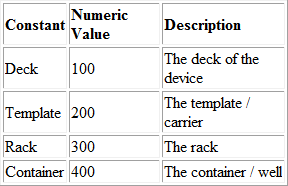
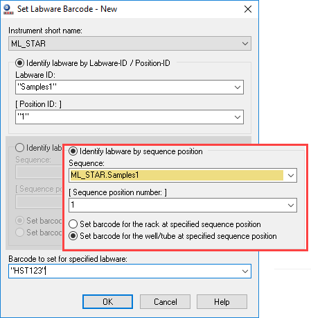

# Navigation Tree

The Navigation Tree displays section controls, the list of experiments in the open document and the sections in each experiment. The Navigation Tree displays to the left of the Workspace when you use the Document view and the Comparison view for a document. The Workflow view displays icons you can drag into the Workspace. See Workspace on page 65.

.jpeg>)

The following icons appear above the Navigation Tree:

.jpeg>). You can override this setting from the .jpeg>) Application menu when you print the

 (1).png>)contents of the document.

* Click to hide the Navigation Tree and increase the Workspace area display. In the Ribbon, use the View tab to hide the Navigation Tree.

### Section Controls

Use the controls in the Navigation Tree to manage the experiments in the document and to manage the sections in the experiments. Sections include Note, Plate, Graph, and Cuvette Set. Experiments can also contain Group sections. A Group section contains a group of plate wells and related formulas. You create Group sections when you configure Plate sections and Cuvette Set sections from the Template Editor dialog. See Template Editor on page 87.

**Note:** If you add an experiment or section to the wrong location in the Navigation Tree, drag and drop experiments within the hierarchy and drag and drop sections within an experiment.

 (1).png>)

To manage experiments:

1. Above the Workspace, select a Document tab. The experiments and the sections in the document display in the Navigation Tree.
2. To add an experiment to the document, select the experiment that most closely resembles the experiment to create and click .jpeg>) **New Experiment**. A duplicate of the experiment you select displays below the experiment. The software duplicates the sections and settings but does not duplicate the data.
3. To add a Note section, Plate section, or Cuvette Set section to an experiment, select the section that most closely resembles the section to create. The software adds the new section below the section you select.

 (1).png>) Click .jpeg>) **New Note** to add a Note section. See Note Sections on page 70.  (1).png>) Click .jpeg>) **New Plate** to add a Plate section. See Plate Sections on page 76.

 (1).png>) Click .jpeg>) **New Cuvette Set** to add a Cuvette Set section. See Cuvette Set Sections on page 80.

1. To add a Graph section, click .jpeg>) **New Graph** to display the New Graph dialog. Set the options for the graph. See Graphing Data on page 212. Click **OK**. The Graph section displays below the section you select. See Graph Sections on page 85.
2. To delete a section, select the section or sections to delete (Ctrl+click to multi-select) or select an experiment to delete an entire experiment, then click .jpeg>) **Delete Selection**.

**Note:** You cannot undo the deletion. When you delete a Plate section, the software also deletes the data from the Plate section.

 (1).png>)

1. To change the sequence of the sections in an experiment, drag the section name and drop it elsewhere in the Navigation Tree. You can move the sections within an experiment. You cannot move sections between experiments.
2. Select a section to display the section content in the Workspace.

### Renaming, Duplicating, Deleting Experiments and Sections

Right-click an experiment or a section to Rename, Duplicate, or Delete the experiment or section.

 (1).png>) When you duplicate an experiment, the software duplicates all sections in the experiment to a new experiment, without data.

.png>) When you duplicate a Note section or a Graph section, the software creates a new section with the contents of the source section.

 When you duplicate a Group section, the software creates a new Group section with the same properties as the source section.

 When you duplicate a Plate section, the software creates a new Plate section with the settings from the source Plate section, without data.
