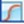

# Graphing Data

Use the Plot Editor dialog to create a graph from the data the software collects.

Use Graph sections to plot information as a scatter plot graph or a bar graph. You can create custom graphs and you can graph the data from Group section tables. You can use columns in a Group section table as the X or Y input for plots on a graph in a Graph section. The Graph section can use data from any Group section in the document and you can create as many Graph sections as you need.

### Creating New Graphs

 (1) (1).jpeg>)

To create a new graph:

1. Click .jpeg>) **New Graph** above the Navigation Tree to display the Plot Editor dialog.
2. In the **Graph Title** field, enter the graph name.
3. Use Plot1 to get started. In the **Plot Name** field, enter the plot name. The Plot List displays the name change.
4. In the **Available Groups** list, select the Group section that contains the data to graph. The columns in the group you select appear in the X-Axis drop-down and the Y-Axis drop- down.
5. In the Data Input area, click the **X-Axis** drop-down and select a Group section column or select **Custom** to assign data to the graph's X-axis. If you select Custom, the Formula Editor dialog displays where you define the formula for the data to appear in the X-axis. See Formula Editor on page 98.
6. Click the **Y-Axis** drop-down and select the Group section column or select **Custom** to assign data to the Y axis. If you select Custom, the Formula Editor dialog displays where you define the formula for the data to appear in the Y-axis.
7. Click the **Error** drop-down and select a column or select **No Error** to define the display of error bars.

**Note:** For scatter plot graphs, you can choose to display error bars for the plot of the data for the X-axis and Y-axis. Error bars are lines that extend outside of a plotted value in either or both directions and graphically represent some error in plotted data.

 (1) (1) (1).png>)

1. In the **Plot Attributes** area:

 (1) (1).png>) Click the **Symbol Style** drop-down and select the symbol to use to mark each data point in a scatter plot graph.

 (1) (1).png>) Click the **Symbol Size** drop-down and select the size of the symbol in a scatter plot.

 (1) (1).png>) Click the **Line** drop-down and select the line style to use between data points in a scatter plot.

 (1).png>) Click **Set Color** and select the color of the symbol and the line in a scatter plot or the color of the bar in a bar graph.

1. Click **OK**.

The Graph section displays in the Navigation Tree and the data plots display in theWorkspace. See Workspace on page 65.

### Editing Graphs

Use Graph sections to plot information as a scatter plot graph or a bar graph. You can create custom graphs and you can graph the data from Group section tables. You can use columns in a Group section table as the X or Y input for plots on a graph in a Graph section. The Graph section can use data from any Group section in the document and you can create as many Graph sections as you need.

 (1).png>)

To edit a graph:

1. In the Navigation Tree, select a Graph section.
2. To change the name of the Graph section, right-click the Graph section in the Navigation Tree and select **Rename**. The Rename Section dialog displays.
3. Select the Home tab:

 (1).png>) Click  (1).png>) to display data as a scatter plot graph.  (1).png>) Click .png>) to display data as a bar graph.

1. Click .jpeg>) in the Graph section toolbar or on the Home tab to display the Plot Editor dialog. See below for additional steps.
2. Click .jpeg>) in the Graph section toolbar or on the Home tab to display the Graph Appearance dialog where you define the graph appearance including axis labels. See Graph Appearance on page 219.
3. For scatter plot graphs, use the Category drop-down, Fit drop-down and  to define curve fits. See Curve Fit Settings on page 221.
4. Click  to export the graph data. See Exporting Images of Graph Sections on page 235.

### Plot Editor

Use the Plot Editor dialog to change the plots and the data or plot attributes.

To change plots and plot attributes:

*
  1. In the Navigation Tree, select a Graph section.
  2. Click .jpeg>) in the Graph section toolbar or on the Home tab to display the Plot Editor dialog.
  3. In the **Graph Title** field, enter the graph name.
  4. Above the Plot List, click **Add** to add a plot to the graph. Use Plot1 to get started. Select a plot and click **Delete** to remove a plot from the graph.
  5. In the **Plot List**, select a plot to define its properties on the right side of the dialog. You do the following for each plot in the Plot List.
  6. In the **Plot Name** field, enter the plot name. The Plot List displays the name change.
  7. In the **Available Groups** list, select the Group section that contains the data to graph. The columns in the group you select appear in the X-Axis drop-down and the Y-Axis drop- down.
  8. In the Data Input area, click the **X-Axis** drop-down and select a Group section column or select **Custom** to assign data to the graph's X-axis. If you select Custom, the Formula Editor dialog displays where you define the formula for the data to appear in the X-axis.
  9. Click the **Y-Axis** drop-down and select the Group section column or select **Custom** to assign data to the Y axis. If you select Custom, the Formula Editor dialog displays where you define the formula for the data to appear in the Y-axis.
  10. Click the **Error** drop-down and select the data to display error bars or select **No Error** to not display error bars. Error bars are lines that extend outside of a plotted value in either or both directions and graphically represent some error in plotted data.

**Note:** For scatter plot graphs, you can choose to display error bars for the plot of the data for the X-axis and Y-axis.

 (1).png>)

*
  1. In the **Plot Attributes** area:

 (1).png>) Click the **Symbol Style** drop-down and select the symbol to use to mark each data point in a scatter plot graph.

 (1).png>) Click the **Symbol Size** drop-down and select the size of the symbol in a scatter plot.

&#x20;Click the **Line** drop-down and select the line style to use between data points in a scatter plot.

&#x20;Click **Set Color** and select the color of the symbol and the line in a scatter plot or the color of the bar in a bar graph.

*
  1. Click **OK**.

### Graph Legend

The graph legend for a scatter plot contains information about the contents of the graph. To view or hide the graph legend, click **Curve Fit Results** on the right below the graph. A bar graph does not have a legend.

#### Independent Fits

For each curve fit function:

&#x20;The formulas for the selected curve fits  For each plot:

&#x20;R2 value

&#x20;EC50 value (where applicable)  For each parameter:

&#x20;Estimated Value

&#x20;Standard Error (Std. Error) of the estimate

&#x20;Confidence Interval of the estimate: The confidence interval for a given confidence level is a range such that the true value lies within the range with the desired probability. The confidence level is usually specified as a percentage. The greater the confidence level, the wider the resulting confidence interval.

Calculation of the confidence interval is based on sampling statistics. For example, suppose that many data sets are obtained, and the confidence interval is calculated for each data set based on a chosen statistic. The percentage of the confidence intervals that contain the true value is the specified confidence level. Select the Confidence Interval Method on the Statistics tab in the Curve Fit Settings dialog. See Curve Fit Statistics Tab on page 225.

&#x20;Independence: Parameter _Independence_ is one way to examine the suitability of a given curve fit for the data set. It is a measure of the extent to which the best value of one parameter depends on the best values of the other parameters, and is a number between 0 and 1, with 1 being the ideal. In the graph fit legend, parameter independence has been translated into bars, where 10 bars indicate a high degree of independence. Because only very small values indicate a problem, a nonlinear transformation is used for this translation. If one or more parameters have few bars or no bars, the curve fit might not be a good fit for the data set.

For example, if the data set is sigmoidal with clear lower and upper asymptotes, 4-parameter fits should be applicable with many bars for all parameters.

However, if one or both asymptotes is missing, the A or the D parameter will have few bars, indicating that reliable values cannot be deduced from the data set.

#### Global Fits

&#x20;The formula for the selected curve fit  For each plot:

&#x20;Estimated Relative Potency (Estimated Rel. Pot.)  Standard Error (Std. Error) of the estimate

&#x20;Confidence Interval of the estimate (see above)  Independence (see above)

&#x20;EC50 value (where applicable)  The list of weighting formulas

&#x20;R2 value

&#x20;Chi-Squared (sum of squared errors)

&#x20;F-Stat (the F-statistic comparing the parallel and unconstrained models)  F-Prob (the probability associated with F-Stat)

&#x20;For each parameter:  Estimated Value

&#x20;Standard Error (Std. Error) of the estimate  Confidence Interval of the estimate

&#x20;Independence

### Graph Appearance 

Use the Graph Appearance dialog to specify labels, styles, and graphic-display options.

To change a graph appearance:

1. In the Navigation Tree, select a Graph section.
2. Click  in the section toolbar or on the Home tab to display the Graph Appearance dialog.
3. In the Axis Labels area, **X-Axis Label** field, enter the label to display for the x-axis. Axis labels use the font you specify in the Font Styles area.
4. In the **Y-Axis Label** field, enter label to display for the y-axis.
5. In the Font Styles area, click **Set** next to **Graph Title** to display the Font Style dialog where you select the font, font size, bold, and italics for the graph title display.
6. Click **Set** next to **Axis Labels** to display the Font Style dialog where you select the font, font size, bold, and italics for the axis label display.
7. In the Scales area, either:

&#x20;Select the **Auto Scale** check box for the **X-Axis** and/ or **Y-Axis** to automatically scale one or both axes.

OR

&#x20;Enter the **Minimum** and **Maximum** scaling values and then select either **Linear** or

**Log** for the display of each axis.

1. In the Grid Lines area, select the **Major** and/or **Minor** check boxes to display the major and/or minor grid lines for the **X-Axis** and the **Y-Axis**.
2. The Plot Options area for a scatter plot graph provides the following options:

&#x20;Select the **Plot Symbols** check box to display the symbol you define for each data point in the Plot Editor dialog. See Editing Graphs on page 213.

&#x20;Select the **Connect Points** check box to display a line that connects the data points.

&#x20;Select the **Show Data Coordinates** check box to display the coordinates when you hover the cursor over a data point.

1. The Plot Options area for a bar graph provides the following options:  Click the **X-Axis Type** drop-down:

&#x20;Select **Evenly Spaced Axis** to evenly space the axis.  Select **Separated Axis** to separate the axis.

&#x20;Select **X Value Positioned** and then select the **Show All Labels** check box to display all the labels for the defined interval. Clear the **Show All Labels** check box to display labels only for the bars that have data.

&#x20;Select the **Bar Values Show** check box to display the data values above each bar and then select either **Vertical** or **Horizontal**. Click the **Significant Figures** drop-down and select the number of significant figures to display.

&#x20;Click the **X-Axis Label Orientation** drop-down and select **Horizontal**, **Vertical**, or

**Inclined**. For **Inclined**, enter a value in the **Angle** field.

&#x20;Select the **Enable X-Axis Custom Labels** check box allow users to double-click the label in the Graph section to edit the label. Clear this check box to lock the labels to the labels you define in the Graph Appearance dialog.

**Note:** When you select the Enable X-Axis Custom Labels check box, the X-Axis Label Orientation is set to Horizontal. After you edit the labels, you can change the X-Axis Label Orientation to Vertical or Inclined.

### Curve Fit Settings 

For scatter plot graphs, use the Curve Fit Settings dialog to define the graph's curve fit. When you create a graph, the data does not have a related fit. Use the Graph section tool bar Category drop-down to filter the list of fits that appear in the Fit drop-down list. After you select a fit type, the software determines the parameter values that best fit the data. The function with these parameters is drawn on the graph.

**Note:** Ideally, the type of fit you use is determined by the underlying chemistry of the assay and can be set before data is read.

Generally, a standard curve refers to the curve fitted to the plot of concentration compared to the mean value for the Standard group. When a fit is done, the parameter values are tabulated in the legend at the bottom of the graph. The parameter table also contains information regarding the uncertainty of the parameters, specifically standard errors and (optionally) confidence intervals.

The software includes many curve fits and allows you to create custom curve fits, if needed. See Custom Curve Fit Settings on page 227.

To define a curve fit for the plots in a graph, click  in the Graph section toolbar or on the Home tab to display the Curve Fit Settings dialog.

&#x20;Select the **Curve Fit** tab to apply a curve fit to each graph plot.

&#x20;Select the **Weighting** tab to specify whether the data should be weighted and the weighting formula. See Curve Fit Weighting Tab on page 224.

&#x20;Select the **Statistics** tab to specify the statistics display, the method of confidence, and the level of confidence. See Curve Fit Statistics Tab on page 225.

### Curve Fit Tab

Use the Curve Fit tab to select a plot from the graph and a curve fit to apply to that plot.

You can independently define the fit for each plot or you can combine all plots into one data set and globally define the fit for all plots on a graph.

&#x20;Select **Independent Fits** to fit each plot independently.

&#x20;Select **Global Fit (PLA)** to combine all plots into one data set.

### Independent Fits

To independently fit a curve fit function to each plot in a graph:

1. Select **Independent Fits** option.
2. Click the **Plot** drop-down and select a plot.
3. Click the **Category** drop-down and select a category to filter the list of curve fits.
4. Click the **Fit** drop-down and select the curve fit function to apply to the plot.
5. For each parameter, click the **Formula Role** drop-down:  Select **None** to not assign a formula role.

&#x20;Select **Fixed** to fix the parameter value. Use the Formula Editor dialog to define the fixed curve fit formula for the parameter. Click  to display the Formula Editor dialog where you edit the formula. See Formula Editor on page 98.

&#x20;Select **Seed** to start the curve fit algorithm search. Use the Formula Editor dialog to define the curve fit formula for the parameter. Click  to display the Formula Editor dialog where you edit the formula.

1. For each parameter, select the **Confidence Interval** check box to calculate a confidence interval for the parameter. Leave clear to not calculate a confidence interval.
2. Repeat for each plot.

**Note:** For independent fits (and global to a limited extent), you can fix values. Curve fit parameter values can either be fixed, or "manually seeded" to start the curve fit algorithm search.

After you select a fit type, the software determines the parameter values that best fit the data. The function with these parameters is drawn on the graph.

&#x20;For linear fits, parameters can be fixed at specified values.

&#x20;For nonlinear fits, an initial value can be specified for each parameter. This can be designated as an initial estimate (the seed value), or as the fixed value.

You can specify whether a Confidence Interval should be calculated for each parameter.

The confidence interval for a given confidence level is a range such that the true value lies within the range with the desired probability. The confidence level is usually specified as a percentage. The greater the confidence level, the wider the resulting confidence interval. Calculation of the confidence interval is based on sampling statistics. For example, suppose that many data sets are obtained, and the confidence interval is calculated for each data set based on a chosen statistic. The percentage of the confidence intervals that contain the true value is the specified confidence level.

### Global Fit (PLA)

To globally fit the curve fit function to all the plots in a graph:

*
  1. Select the **Global Fit (PLA)** option.
  2. Click the **Parallel Line Analysis** drop-down and select an option to filter the list that appears in the Fit drop-down. See below for details.
  3. Click the **Fit** drop-down and select the curve fit function to use.
  4. Click the **Reference Plot** drop-down and select the plot to use as the reference.
  5. For each parameter, click the **Formula Role** drop-down:  Select **None** to not assign a formula role.

&#x20;Select **Fixed** to fix the parameter value. Use the Formula Editor dialog to define the fixed curve fit formula for the parameter. Click  to display the Formula Editor dialog to edit the formula.

&#x20;Select **Seed** to start the curve fit algorithm search. Use the Formula Editor dialog to define the curve fit formula for the parameter. Click  to display the Formula Editor dialog to edit the formula.

*
  1. For each parameter, select the **Confidence Interval** check box to calculate a confidence interval for the parameter. Leave clear to not calculate a confidence interval.
  2. Select the **Relative Potency Confidence Interval** check box to. Leave clear to.

### Parallel Line Analysis

Determining parallelism between a standard and test compound, and subsequent estimation of relative potency, are fundamentals of bioassay use in biopharmaceutical development and testing. For linear data, parallelism can be evaluated by examining the similarity between the slopes of straight lines.

Bioassay data and immunoassays in particular, have been demonstrated to fit well with a sigmoidal shape defined by a 4-parameter or 5-parameter curve fit. The basic question of whether a curve with a specified shape can fit both standard and test data sets when shifted along the X-axis can be addressed following a method detailed by Gottschalk and Dunn (Journal of Biopharmaceutical Statistics, 15:437- 463, 2005).

The parameters are those for the fit function, plus a relative potency factor for each data set relative to one designated as a reference. Below the graph are displayed their values, standard errors, and (optionally) confidence intervals.

Function operators are included with the software that can be used to summarize this information in a Notes section. For more details, see the _SoftMax Pro Formula Reference Guide_.

### Judge a Good Curve Fit

Visual inspection is always useful to evaluate a curve fit. The legend at the bottom of the graph contains information that summarizes the numerical output of the fit. This includes

the coefficient of determination R , a traditional measure of goodness of fit. R is the fraction

2

2

of the variance of the y-values explained by the fit and is 1 for a perfect fit. You should not use this to determine the statistical significance of the fit, or to compare the suitability of different curve fit functions. For such purposes, you can use statistics such as chi-squared or Fisher-F. These statistics can be obtained from the formula system.

Even for a good fit, as judged by eye or R , some parameters might have high uncertainty.

2

A good discussion of curve fitting appears in “Data Analysis and Quality Control of Assays: A Practical Primer” by R. P. Channing Rogers in _Practical Immuno Assay_, edited by Wilfrid R.Butt (published by Marcel Dekker, Inc., New York, 1984).

### Curve Fit Weighting Tab

Use the Weighting tab in the Curve Fit Settings dialog to define the independent weighting of individual plots within a Graph section. Least-squares fitting assumes that errors are normally distributed. If the variance of each point in the fit is known, or can be estimated by some means, its inverse should be specified as the weight for the point. If the variances are not known but are believed to be non-uniform across the data, that is, a known function of y, then a weighting function should be used to reflect this information. If a formula for the weighting is not provided, then all points have equal weight.

For each plot, specify whether the data should be weighted and, if so, the applicable weighting formula, which must evaluate to an array of numbers.

To define curve fit weighting:

1. Click  in the Graph section toolbar or on the Home tab to display the Curve Fit Settings dialog.
2. Select the **Weighting** tab.
3. Click the **Weighting** drop-down and select a plot.
4. Select the **Apply Weighting** check box and then click  to display the Formula Editor dialog where you define the weighting formula. See Formula Editor on page 98. Clear the check box to make all points have equal weight.
5. Select the **Weights are Inverse Variances** check box if the defined weighting is the inverse of the data variance. When you select this check box, and apply weighting, the confidence interval method based on the chi-squared distribution becomes available.
6. Repeat for each plot to weigh.

**Note:** If you select both check boxes for each plot, the Profile Method (Chi-Squared Distribution) option is available on the Statistics tab. See Curve Fit Statistics Tab on page 225.

### Curve Fit Statistics Tab 

Use the Statistics tab in the Curve Fit Settings dialog to specify the statistics display.

Choose the method by which confidence intervals are calculated and a level of confidence.

The confidence interval for a given confidence level is a range such that the true value lies within the range with the desired probability. The confidence level is usually specified as a percentage. The greater the confidence level, the wider the resulting confidence interval. Calculation of the confidence interval is based on sampling statistics. For example, suppose that many data sets are obtained, and the confidence interval is calculated for each data set based on a chosen statistic. The percentage of the confidence intervals that contain the true value is the specified confidence level.

To define curve fit statistics:

1. Click the **Confidence Interval Method** drop-down:

&#x20;Select **Asymptotic Approximation** to calculate Wald confidence interval, which is simply related to the standard error.

&#x20;Select **Profile Method (F Distribution)** to calculate based on model comparison with F-statistic.

&#x20;Select **Profile Method (Chi-Squared Distribution)** to calculate based on model comparison with chi-squared-statistic. This option is available when you select the Apply Weighting check box and the Weights are Inverse Variances check box on the Weighting tab on the Weighting tab for each plot.

&#x20;Select **Profile Method (t Distribution)** to calculate based on T-profile function.

**Note:** Profile methods require more computation than the asymptotic approximation but are generally more accurate.

1. In the Confidence Level field, enter the percentage for how likely the interval is to contain the parameter is determined. Increase the confidence level to widen the confidence interval.
2. Select the **Calculate Parameter Dependencies** check box to calculate dependencies between parameters. With this option selected, the graphical representation in the graph legend represents the parameter independence of the curve fit.
3. Select the **Calculate Confidence Band** check box to allow calculation and display of the confidence band for each curve fit. The confidence band is a region bounded by lower and upper curves and is constructed such that the probability that it contains the true curve is approximately the specified confidence level. This calculation is available for all curve fits except Point-to-Point, Cubic Spline, and Log-Logit.
4. Select the **Calculate Prediction Band** check box to allow calculation and display of the prediction band for each curve fit. The prediction band is a region bounded by lower and upper curves and is constructed such that the probability that it contains all data points is approximately the specified confidence level. This calculation is available for all curve fits except Point-to-Point, Cubic Spline, and Log-Logit.

Parameter _Independence_ is one way to examine the suitability of a given curve fit for the data set. It is a measure of the extent to which the best value of one parameter depends on the best values of the other parameters, and is a number between 0 and 1, with 1 being the ideal. In the graph fit legend, parameter independence has been translated into bars, where 10 bars indicate a high degree of independence. Because only very small values indicate a problem, a nonlinear transformation is used for this translation. If one or more parameters have few bars or no bars, the curve fit might not be a good fit for the data set.

For example, if the data set is sigmoidal with clear lower and upper asymptotes, 4-parameter fits should be applicable with many bars for all parameters. However, if one or both asymptotes is missing, the A or the D parameter will have few bars, indicating that reliablevalues cannot be deduced from the data set.

### Custom Curve Fit Settings

Use the Function Editor dialog to specify functions for custom curve fits. These functions are functions of a single independent variable, x, and a set of parameters denoted A, B, C, D, G, H, I, J. They supplement the curve fits that are included with the software and you can use custom curve fits anywhere within the protocol in which they are defined.

**Note:** The equation images that display for the curve fits that are included in the software do not appear for custom curve fit functions.

A custom function is available to fit data in any graph section in the protocol in which it is defined. In the list of curve fits options, the curve fits you create in the Function Editor display in the Custom category. You must assign initial parameter values in the Curve Fit Settings dialog. This is in contrast to the built-in functions for which initial values may be specified but are not required. Initial parameter values are formulas and may contain document references. A parameter may be fixed at its initial value. After you assign the initial parameter value, the software stores the initial value formulas in the protocol.

**Note:** Parameter names display in upper case in the curve fit legend (below the graph), even if you define the name in lower case in the Function Editor dialog.

Use the three tabs in the Function Editor dialog to define custom curve fits:

&#x20;**Explicit** - Use to create an explicit function that is defined by an explicit formula _f(x,p)_, where p represents any subset of the parameters.

&#x20;**Implicit** - Use to create an implicit function that is defined by an implicit equation _f(x,y,p)_

_= 0_. The value of the function is the value of y which satisfies this equation for a given value of x and set of parameters p. See Custom Implicit Curve Fits on page 229.

&#x20;**Differential** - Use to create a differential function that is defined as a component in a system of first-order differential equations. Up to eight components are allowed and are denoted _fi (i = 1 to 8)_, with some particular fi being the reference component that defines the function value. See Custom Differential Curve Fits on page 230.

For information about the curve fit functions that are included in the software, see Curve Fit Functions on page 366.

### Explicit Tab

Use the Explicit Fit tab to create an explicit function that is defined by an explicit formula f (x,p), where p represents any subset of the parameters.

To define a custom curve fit for the plots in a graph:

1. Select the Operations tab and click **Function Editor** to display the Function Editor dialog.
2. Click **Add** to get started. Function1 appears in the function list and in the Name field.  Click **Delete** to remove the function you select from the list.

&#x20;Click **Duplicate** to make a copy of the function you select in the list.

1. In the **Name** field, update the function name. As you change the Name field the list displays the updates you make.
2. Select the **Derivatives** check box to specify the derivative of the function with respect to any parameter. The software numerically estimates any derivative that you do not specify. You should provide derivative formulas to improve the accuracy of curve fitting results. The derivative of each component may be a function of the parameters and of the components.
3. In the **f(x)** field, enter the formula. The syntax of the formulas is the same as that of the formula system, except that document references such as accessors, Summary formulas, and operators referencing plots are not allowed. Parameter names are case insensitive.
4. Click **Check Syntax** to check the syntax of the formula. This checks only the formula syntax not the mathematical correctness of the formula.
5. Click **Add** to add additional functions to the curve fit.
6. Click **OK**. The custom curve fit appears in the list of curve fits available from Graphsections.

#### Custom Implicit Curve Fits

Use the Implicit tab in the Function Editor dialog to create an implicit function that is defined by an implicit equation _f(x,y,p) = 0_. The value of the function is the value of y which satisfies the equation for a given value of x and set of parameters p. See Custom Curve Fit Settings on page 227.

**Note:** Parameter names display in upper case in the curve fit legend (below the graph), even if you define the name in lower case in the Function Editor dialog.

The equation images that display for the curve fits that are included in the software do not appear for custom curve fit functions.

To independently fit a curve fit function to each plot in a graph:

1. Select the Operations tab and click **Function Editor** to display the Function Editor dialog.
2. Select the **Implicit** tab.
3. Click **Add** to get started. Function1 appears in the function list and in the Name field.  Click **Delete** to remove the function you select from the list.

&#x20;Click **Duplicate** to make a copy of the function you select in the list.

1. In the **f(x)** field, enter the formula. The syntax of the formulas is the same as that of the formula system, except that document references such as accessors, Summary formulas, and operators referencing plots are not allowed. Parameter names are case insensitive.
2. Click **Check Syntax** to check the syntax of the formula. This checks only the formula syntax not the mathematical correctness of the formula.
3. Click **Add** to add additional functions to the curve fit.
4. Click **OK**. The custom curve fit appears in the list of curve fits available from Graphsections.

#### Custom Differential Curve Fits

Use the Differential tab in the Function Editor dialog to create a differential function. A differential function is defined as a component in a system of first-order differential equations. Up to eight components are allowed and are denoted fi (i = 1 to 8), with some particular fi being the reference component that defines the function value. See Custom Curve Fit Settings on page 227.

**Note:** The equation images that display for the curve fits that are included in the software do not appear for custom curve fit functions. Parameter names display in upper case in the curve fit legend (below the graph), even if you define the name in lower case in the Function Editor dialog.

**Note:** For systems requiring stiff integration, the Jacobian matrix must be specified.

To define a Differential custom curve fit:

*
  1. Select the Operations tab and click **Function Editor** to display the Function Editor dialog.
  2. Select the **Differential** tab.
  3. Click **Add** to get started. Function1 appears in the function list and in the Name field.  Click **Delete** to remove the function you select from the list.

&#x20;Click **Duplicate** to make a copy of the function you select in the list.

*
  1. Click the **Components** drop-down and select the number of components to include. Each component is denoted _fi (i = 1 to 8)_. You will select the **Reference** check box for the fi that you want to be the reference component that defines the function value.
  2. In the x0 field enter
  3. Click the **f\<i>** drop-down and select the component to define.
  4. In the **f\<i>(x0)** field, enter
  5. In the **df\<i>/dx** field, enter the formula. The syntax of the formulas is the same as that of the formula system, except that document references such as accessors, Summary formulas, and operators referencing plots are not allowed. Parameter names are case insensitive.
  6. Click **Check Syntax** to check the syntax of the formula. This checks only the formula syntax not the mathematical correctness of the formula.
  7. Repeat for each Component and remember to select the Reference check box for the fi that you want to be the reference component that defines the function value.
  8. Click **Add** to add additional functions to the curve fit.
  9. Click **OK**. The custom curve fit appears in the list of curve fits available from Graph sections.

The initial value of x and each component must be specified and may be a function of the parameters. The derivative of each component may be a function of the parameters and of the components. For example, this two component system defines a compartment model as used in pharmacokinetics (Bates, D.M., and Watts, D.G. (1988), Nonlinear Regression Analysis and Its Applications, John. Wiley & Sons, New York):

### Confidence Interval Calculations

The following is a description of the calculation of confidence intervals for curve fit parameter estimates. Assuming normally distributed error in the data, a maximum likelihood parameter estimate, p, is obtained by least-squares regression. Given a required confidence level (typically but not necessarily 95%, corresponding to significance α = 0.05), a confidence interval for the estimate may be constructed.

Two important points:

&#x20;Such an interval should not be construed to mean that there is a 95% probability that the true parameter value falls in the interval, which would be meaningless because the true value is not a statistic. Rather it implies that the interval has been calculated by a method such that it has a probability of 95% of containing the true value.

&#x20;For a function with P parameters, least squares regression implies a P-dimensional confidence region, not a set of P confidence intervals. Therefore, reported confidence intervals are actually the limits of the confidence region along each dimension.

The software implements various methods for the construction of confidence intervals, which are discussed in the following sections.

### Asymptotic Approximation

This method is based on the formula relating confidence interval to the standard error of the mean of a normally distributed variable. The standard error is given by

where Variance is the variance of the parameter as determined by the regression calculation, SSE is the minimum sum-of-squared errors, N the number of data points and P the number of variable parameters. The end points of the confidence interval are then

where t(N-P,α) is the value of the inverse Student's t distribution for degrees of freedom N - P and specified significance α. Note that the interval is symmetrical about the best fit value, pbest.

### Profile t Method

This method is a generalization of the asymptotic approximation which is more appropriate for nonlinear regression \[1]. The confidence interval is defined by the two solutions for p to the equation:

where SSE(p) is the sum-of-squared errors for parameter value p with all other parameters varied to minimize SSE(p). For general linear regression this equation may be solved analytically, the result being equal to the asymptotic approximation described above.

However, for nonlinear regression numerical solution is required. The resulting interval is not in general symmetrical about the parameter estimate, and there is no guarantee that a solution exists. This method is illustrated below for parameter B in a four-parameter logistic fit. The function SSE(B) is shown in red, and the right-hand-side of the above equation is shown in green. The points of intersection, hollow green circles, define the confidence interval. For comparison, the asymptotic confidence interval is defined by the filled green circles, obtained by the asymptotic approximation to SSE(B), shown in blue.

### Profile F Method

This method is based on model comparison between a set of parameters and the best fit parameters, using extra sum-of-squares ANOVA \[1,2]. The confidence interval is defined by the two solutions for p to the equation:

where SSE(p) is the sum-of-squared errors for parameter value p with all other parameters varied to minimize SSE(p), and F(P,N-P,a) is the inverse of the Fisher F distribution with the specified degrees of freedom factors P, N-P and significance α. As with the profile t method, numerical solution is required, and the interval is asymmetric and not guaranteed to exist.

### Profile Chi-Squared Method

This method \[3] is similar to the other profile methods but is applicable only if the sum-of- squared errors has the chi-squared distribution, which follows if data points are weighted with their inverse variances in forming the sum. The end points of the interval are defined by the equation:

where 2(1,α) is the critical value of the chi-squared distribution with one degree of freedom and significance α. As with the other profile methods numerical solution is required.

References

1. Douglas M. Bates and Donald G. Watts, Nonlinear Regression Analysis and Its Applications, Wiley, 1988.
2. H.J. Motulsky and A Christopoulos, Fitting models to biological data using linear and nonlinear regression. A practical guide to curve fitting. 2003, GraphPad. Software Inc.
3. W.H. Press, S.A. Teukolsky, W.T. Vetterling, and B.P. Flannery, Numerical Recipes: The Artof Scientific Computing, Third Edition, Cambridge University Press, 2007.

### Exporting Images of Graph Sections

Use the Home tab to export a 300 DPI image of a Graph section for use in another program.

You can also right-click anywhere on the Graph section and select **Copy** to then paste an image of the section directly into a word processor or spreadsheet program.

**Note:** The 300 DPI image might appear very large in the program into which you import or paste. You might need to scale or resize the image in that program after you import or paste the Graph section image.

To export a graph image:

1. In the Navigation Tree, select a Graph section.
2. Select the Home tab and click  to display the Save As dialog.
3. Navigate the computer file hierarchy to the file location where you want to save the .png file.
4. In the **File Name** field, enter a name for the file.
5. Click **Save**.

### Viewing Data in 3D Graphs

Use the 3D Graph dialog to view a three-dimensional graphical representation of reduced plate data.

In the Navigation Tree, select a Plate section and click  in the section toolbar or on the Home tab to display the 3D Graph dialog.

To rotate the 3D graph:

&#x20;To rotate the 3D graph vertically, drag the vertical scroll bar located to the right of the 3D graph.

&#x20;To rotate the 3D graph horizontally, drag the horizontal scroll bar located below the 3D graph.

&#x20;To start or stop a continuous animated horizontal rotation of the 3D graph, double-click the 3D graph.

Drag a side or a corner of the dialog to resize the 3D Graph dialog. Right-click on the 3D graph for additional options:

&#x20;Select **Viewing Style** and then select the viewing styles. The options you select display a check mark in the list.

&#x20;Select **Border Style** and then select: **No Border**, **Thin Line**, **Shadow**, or **Inset**.  Select **Font Size** and then select: **Large**, **Medium**, or **Small**.

&#x20;Select **Grid Options** and then select: **Show X and Y Axis Grid Lines**, **Show Y-Axis Grid Lines**, **Show X-Axis Grid Lines**, or **Hide Grid Lines**.

&#x20;Select **Bounding Box** and then select: **While Rotating**, **Always**, or **Never**.

&#x20;Select **Rotation Animation** to have the image rotate continuously. Double-click the image to stop the rotation.

&#x20;Select **Rotation Increment** and then select the speed and direction of rotation. Values closer to zero rotate slower, while values farther from zero rotate faster. To rotate counter-clockwise, select a negative value.

&#x20;Select **Rotation Detail** and then select: **Wire Frame**, **Plotting Style**, or **Full Detail**.

&#x20;Select **Plotting Method** and then select: **Wire Frame**, **Surface**, or **Surface With Shading**.  Select **Shading Style** and then select: **White** or **Color**.

&#x20;Select **Maximize** to display the 3D graph in full screen mode. Pres **Esc** to shrink the image back.

&#x20;Select **Customization Dialog** to display the Customization dialog where you define the above settings and more. See Customizing 3D Graphs on page 237.

&#x20;Select **Export Dialog** to display the Export Control dialog where you define settings toexport the 3D graph. See Exporting 3D Graphs on page 239.

### Customizing 3D Graphs

Use the five tabs in the Customization dialog to customize a 3D graph.

Most of the following options are available when you right-click the 3D graph. Right-click a 3D graph and select Customization Dialog to display the Customization dialog.

### General Tab

The following options appear on the General tab:

&#x20;**Main Title**: Enter the text for the graph title.

&#x20;**Sub Title**: Enter the text to display below the graph title.

&#x20;**Show Annotations**: Select this check box to display notes. Not available if there are no notes available.

&#x20;**Border Style**: Select **Line**, **Shadow**, or **3D Inset** to define the outside image border or select **No Border** to not display a border.

&#x20;**Viewing Style**: Select **Color**, **Monochrome**, or **Monochrome + Symbols** to define the image background.

&#x20;**Font Size**: Select **Large**, **Med**, or **Small** to define the text font size.

&#x20;**Grid Lines**: Select **Both**, X, or Y to display the x-axis and/or y-axis grid lines or select **None**

to not display grid lines.

&#x20;**Rotation Animation**: Select this check box to continuously rotate the graph.

&#x20;**Show Bounding Box**: Select **While Rotating** or **Always** to display a wire-frame box around the graph or select **Never** to not display a wire frame.

### More Tab

The following options appear on the More tab:

&#x20;**Rotation Detail**: To change the display style when the graph rotates, select **Wireframe** to display only the outlines of the 3D graph, **Plotting Method** to display the data plot in full 3D while displaying only outlines for the grid, or **Full** to display the entire graph in full 3D during rotation.

&#x20;**Rotation Increment**: Select an increment to control the speed and direction of the animated rotation. Values closer to zero rotate slower, while values farther from zero rotate faster. To rotate counter-clockwise, select a negative value.

&#x20;**Shading Style**: Select **White** or **Color** to change the shading. This option has no effect on the display if there is no shading.

&#x20;**Plotting Method**: Select **Wire Frame**, **Surface**, or **Surface with Shading** to change the data plot display.

### Font Tab

The following options appear on the Font tab:

&#x20;**Main Title**: Select the font for the graph title and then select to add **Bold**, **Italic**, and

**Underline** styles.

&#x20;**Sub-Title**: Select the font for the text directly below the graph title and then select to add

**Bold**, **Italic**, and **Underline** styles.

&#x20;**Subset/Point/Axis Labels**: Select the font for all other text in the graph and then select to add **Bold**, **Italic**, and **Underline** styles.

### Color Tab

The following options appear on the Color tab.

Select a **Graph Attribute** option on the left to define color settings for that attribute and then repeat for all other attributes.

&#x20;**Desk Foreground**: Select to define the color of the text of the graph title and subtitle.

&#x20;**Desk Background**: Select to define the color of the area behind the graph title and subtitle.

&#x20;**Shadow Color**: Select to define the color of the border shadowing when you select Shadow for the Border Style on the General tab.

&#x20;**Graph Foreground**: Select to define the color of all text except the title and subtitle, and the border around the graph.

&#x20;**Graph Background**: Select to define the color of the area within the border and behind the graph.

**X and Z Axis Plane**: Select to define the color of the graph floor.

&#x20;**Y Axis Plane**: Select to define the color of the graph walls.

Select a color from the color pallet. In the **Quick Styles** area:

&#x20;Select the **Bitmap/Gradient Styles** check box to add texture to the graph.

&#x20;Select one option for the **Inset**, **Shadow**, **Line**, and **No Border** from the **Light**, **Medium**, or **Dark** columns.

### Style Tab

The options that appear on the Style tab are dependent on the selections on the other tabs, and on the type of data.

Select an item in the list and then click the color for your selection.

### Exporting 3D Graphs

Use the Export Control dialog to export an image of a 3D graph and to export the data from a 3D graph. Before you export an image of a 3D graph, make sure to define all customization options including the rotation increment. See Customizing 3D Graphs on page 237.

To export 3D graphs:

1. From the 3D Graph dialog, right-click the graph and select **Export Dialog** to display the Export Control dialog.
2. In the **Export** area, select the image file format or select **Text/Data** to export the data without the image.
3. In the Export Destination area, select the location to where you want to export the image or data:

&#x20;Select **Clip Board** to export the image or data to the computer clipboard to paste into a word processor program or a spreadsheet.

&#x20;Select **File** to save the image or data as a file on your computer or network. Click

**Browse** to choose the destination and name the file.

&#x20;Select **Printer** to export the image or data directly to a printer. After you click **Print**

you can select the printer and printer options.

1. In the Export Size area, options are dependent on your previous selections:  Select **Full Page** to print to a full page. (Export Destination = Printer)

&#x20;Select **No Specific Size** to have the export operation set the image size. (Export = WMF and Export Destination = Clipboard or File)

&#x20;Select **Pixels** to define the number of pixels. (Export = BMP, JPG, or PNG and Export Destination = Clipboard or File)

&#x20;Select **Millimeters**, **Inches**, or **Points** and then enter the **Width** and **Height** of the image. (Export = EMF or WMF all Export Destination and all Export options when Export Destination = Printer)

&#x20;Click the **DPI** drop-down and select the number of dots per inch (Export = EMF, BMP, JPG, or PNG and Export Destination = Clipboard or File).

&#x20;Select the **Large Font** check box to increase the size of the text. (Export Destination = Clipboard or File).

1. When you finish your export options, click **Export** or **Print**.
2. If you export the data as text, then the Export dialog displays with more options to format the export data.

### Exporting Text/Data

Use the Export dialog to define the format for data you export from a 3D graph.

1. In the Export Control dialog, select the **Text/Data** Export option , complete the other options described above and then click **Export** to display the Export dialog.
2. In the **Select Subsets and Points** area:  Select **All Data** to export all data.

&#x20;Select **Selected Data** and then use the Subsets to Export fields to select the number that corresponds to each columns of data and the letter that corresponds to each data point. To multi-select **Shift** click or **CTRL**.

1. In the **Export What** area select to export just the **Data** or the **Data and Labels**.
2. When multiple values are available, select an option in the **Data to Export** area.
3. In the **Export Style** area:

&#x20;Select **List** and then select **Tab** or **Comma** as the delimiter. The delimiter must match the requirements of the program to where the data will export.

&#x20;Select **Table** and then select **Subsets/Points** to place the data from the plate column numbers into the rows of the table and the data from the plate row letter into the columns of the table, or select **Point/Subsets** to place the data from the plate row letters into the rows of the table and the data from the plate column numbers into the columns of the table.

1. In the **Numeric Precision** area:

&#x20;Select **Current Precision** to export the data using the rounding defined in the graph.  Select **Maximum Precision** to export the rounding available in the document.

1. Click **Export**. If you export the data to the computer clipboard, immediately open the program where you want to use the data and paste the data into that program.
