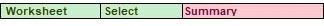

# Changing Passwords

Use the Change Password dialog to change your password. The GxP Admin Software administrator can define rules to require password changes and password strength.

.jpeg>)

To change your password:

1. In the Ribbon, select the **GxP** tab.
2. Click .png>) **Change Password** to display the Change Password dialog.
3. In the **\<Password>** field, enter your current password.
4. In the **\<New Password>** field, enter your new password.
5. In the **\<Confirm Password>** field, enter your new password again to confirm it.
6. Click **OK**.

**Document Workflow**

The document life-cycle in a compliant lab consists of multiple different development and review steps and requires a system to indicate the document state. The status system allows a Project team to track and approve documents while the document moves through the pipeline of development, review, release and usage in a controlled environment.

**Document Statuses**

The SoftMax Pro 7.1.1 GxP Compliance Software Suite installation includes three default Roles; Scientist, Lab Technician, and Lab Manager. The default permissions for these Roles correspond to the document statuses that are present in the SoftMax Pro GxP Software. You can modify the default Role permissions, if needed. See Default Roles on page 259.

.png>) In Work

.png>) Review Pending .png>) Reviewed

.png>) Released

.png>) In Progress

.png>) Approval Pending .png>) Approved

.png>) Outdated .png>) Canceled

The following document workflow corresponds to the default Roles. Your laboratory can define Roles and document workflows that meet your needs.

### In Work Document Status - Scientist Role

The scientist opens and saves a new data document. They define the instrument settings in Plate sections and define data analysis settings. The software assigns a new document the status In Work. The scientist adds statements to the document to provide communication to the other users responsible for the document. The scientist signs the first statement to prevent further edits and sets the document status to Review Pending.

### Review Pending Document Status - Lab Manager Role

The lab manager reviews the data document with the status Review Pending, signs the second statement, and sets the document status to Reviewed.

### Reviewed Document Status - Release Protocol - Lab Manager Role

If the data document with the status Reviewed is correct, the lab manager then releases the document as a protocol. The software saves the protocol with the status Released for reuse.

If the document has a newer iteration or is incorrect, the lab manager can set a document that has the status Released to the Outdated status.

### In Progress Document Status - Lab Technician Role

The lab technician opens a protocol with the Released status and the software prompts the lab technician to save the protocol as a data document before they can run the experiments. Because the Lab Technician Role has the Generate Compliance Data permission, the software sets the data document status to In Progress and removes the two signed statements. This allows the lab technician to run the experiments and generate the compliance data.

When the lab technician finishes their work, they sign a statement to prevent further changes and set the document status to Approval Pending.

### Approval Pending Document Status - Lab Manager Role

The lab manager confirms that the document with the Approval Pending status meets regulatory requirements, signs a statement, and sets the document status to Approved.

### Canceled Document Status

Users with appropriate permissions can set the document status to Canceled at theapplicable points in the document workflow.

### Default Roles

Use the GxP Admin Software default Roles to assign users permissions to perform the tasks that correspond to each document status. You can create your own Roles and you can edit the default Roles.

**Default Role Permissions**

| **Permission**                         | **Lab Manager**                                                              | **Lab Technician**                                                          | **Scientist**                                                                |
| -------------------------------------- | ---------------------------------------------------------------------------- | --------------------------------------------------------------------------- | ---------------------------------------------------------------------------- |
| Add/Delete Groups                      |                                                                              |                                                                             |  |
| Add Folder                             |  |                                                                             |  |
| Add/Modify Statements                  |                                                                              |                                                                             |  |
| Assign Plate Layouts                   |                                                                              |  |   |
| Change Auto Export Settings            |                                                                              |                                                                             |  |
| Change Auto Save Settings              |                                                                              |                                                                             |   |
| Create/Save As Data Document           |   |                                                                             | 3TLjhKfDE57V                                                                 |
| Create/Save As Protocol                |                                                                              |                                                                             | UbZNfCieZZMM                                                                 |
| Delete Document                        | SGsN2l28oOIH                                                                 |                                                                             | ifIeip15UQMO                                                                 |
| Delete Empty Folder                    | oJm1KIfLLrfD                                                                 |                                                                             | oIDk4idAFNBR                                                                 |
| Edit Formulas                          |                                                                              |                                                                             | I5TJTNVtSOD3                                                                 |
| Edit Graphs, Summaries, and Reductions |                                                                              |                                                                             | uu5brBukCF0L                                                                 |

**Default Role Permissions (continued)**

| **Permission**                    | **Lab Manager** | **Lab Technician** | **Scientist** |
| --------------------------------- | --------------- | ------------------ | ------------- |
| Edit Notes Text                   |                 | euaNQIU2dYL8       | uzZiUkz5ncIl  |
| Edit Print Options                |                 |                    | kFZJmFikTJRD  |
| Edit Reader Settings              |                 |                    | fHpbnx1USKAo  |
| Edit Sample and Group Information |                 | sJOOHaVZ4wzz       | M8YxL7Y5FeAg  |
| Export Documents                  | 68WeaImrjBPj    | oQNdprt8IZTH       | TUVPQgZa3Oo3  |
| Function Editor                   |                 |                    | uwZQVqB6Bzpk  |
| Generate Compliance Data          |                 | nF9zjINl8vpp       |               |
| Hide/Unhide Folder                | BJ0Pzkwhk8Q4    |                    | UGCsjgoBR8GW  |
| Import Documents                  |                 |                    | b0hZaPsI1rbf  |
| Instrument Simulator              |                 |                    | P4nNmx16x8yj  |
| Lock/Unlock Instrument            | crP8HLxAGfem    |                    | xE0HRbc6a4Jz  |
| Lock/Unlock Sections              |                 |                    | tkAqyT77Jn8I  |
| Mask/Unmask Wells                 |                 | JItwcFhEXv9X       | OdgkBIDZ9qoE  |
| Move Document                     | zR9AJzOGAXPi    |                    | 1jmbitWF3aKu  |
| Move Folder                       | IsZqdoFsrACt    |                    | uL38g9NQgGsT  |
| Open Approval Pending             | IkLM6IFjU5xy    |                    | GyNfJdSARYur  |
| Open Approved                     | 4fkcoqDNxGbt    |                    | uYzE0cI2id8y  |
| Open Canceled                     | y78lNQmbIsPC    |                    | Tr7jgv7qNwPv  |
| Open Imported                     |                 |                    | m4JuUDn3pggf  |
| Open In Progress                  |                 | 0bMIAKBBfu3z       |               |
| Open In Work                      |                 |                    | vp9IyZ03wiEX  |
| Open Outdated                     | E1l4HumgflEu    |                    | UzqbfCJ8yU9w  |
| Open Released                     | LpPzLEvEqWfg    | sVKBDlmAbKhu       | hPf83s3T9sQR  |
| Open Review Pending               | 6Nco5ptM41ut    |                    |               |
| Open Reviewed                     | guMjQvbnHhqW    |                    | Pf6OvJuXuRgG  |
| Overwrite Plate/Cuvette Data      |                 |                    | HQCWK7VzdAis  |
| Read Empty Plates/Cuvettes        |                 | 07ddHtLWc5rx       | wlIM4V6n977r  |
| Release Protocol                  | f1qPTvKZG4Ji    |                    |               |
| Rename Document                   | TVRscsHE1fb4    |                    | eOW3ZuZLEy9Z  |

**Default Role Permissions (continued)**

| **Permission**       | **Lab Manager** | **Lab Technician** | **Scientist** |
| -------------------- | --------------- | ------------------ | ------------- |
| Rename Folder        | 2cVzR5PAV5Pm    |                    | Zj2420kmX1II  |
| Revoke Any Signature |                 |                    |               |
| Revoke Own Signature | aIzbRI7vG7SQ    | dOD7Ym2X0tIO       | 4TkRHsjyksYK  |
| Set Approval Pending |                 | gn7rYcYNntxp       |               |
| Set Approved         | xuoj6SX0iKiy    |                    |               |
| Set Canceled         | z79kgFq53Cxm    | xpVw6v0K4IXo       | 8vF5E2zr9kJO  |
| Set Outdated         | t2pQVs1nPNlE    |                    |               |
| Set Review Pending   |                 |                    | hQtEnlhE1Dw3  |
| Set Reviewed         | uCG9Y8ULs0BT    |                    |               |
| Sign Statements      | 8ZUn2WWOBeyb    | Z8K21pLUzfIO       | wzUH7jWBvExo  |
| Unlock Document      | o0b7SB0XyYlW    |                    |               |

### Saving Documents

Use the Save dialog to save a document to the database. The Save dialog displays the folders and documents that are included in the Project you select when you log on.

When you open a new document, the software prompts you to save the document before you do any additional work.

To save a document:

1. Save vs. Save As

&#x20;Click  in the Quick Access toolbar or click  to open the Applications menu and select  **Save** to update the currently open document with updated information in the same location with the same name. The document saves with no further steps required.

&#x20;Click  in the Quick Access toolbar or click  to open the Applications menu and select  **Save As** to rename a document, to save a protocol as a data document, to save a data document as a protocol, to move a document to a different location in the database, or to give a new document a name. The Save As dialog displays.

1. Navigate to where you want to save the document.
2. In the **Name** field, enter the document name.
3. Click the **Save As Type** drop-down.

&#x20;Select **Protocol Documents** to save the document as a protocol.

&#x20;Select **Data Documents** to save the document as a data document.

1. Click **Save**.

### More Information

The left side contains the folder hierarchy similar to the folder hierarchy in any other computer application. The top level folder is the name of the Project you select when you log on and you have access only to the documents for that project.

The toolbar contains the following icons:

&#x20; **Add** - Click to add a folder subordinate to the folder you select in the hierarchy.

&#x20; **Rename** - Click to rename the folder you select in the hierarchy.

&#x20; **Delete** - Click to delete the folder you select in the hierarchy.

&#x20; **Unhide** - Click to unhide the hidden folder you select in the hierarchy.

&#x20; **Hide** - Click to hide the folder you select in the hierarchy.

&#x20; **Cut** - Click to copy the folder or document you select to the computer clipboard for the first step in moving the folder or document to a different location in the database.

&#x20; **Paste** - Click to paste the folder or document from the computer clipboard to the location you select to move the folder or document in the database.

**Rename** - Click to rename the document you select in the document list.

&#x20;**Delete** - Click to delete the document you select in the document list.

&#x20; **Unlock** - Click to unlock a locked document.

The right side displays the documents in the folder you select along with the following information:

&#x20;**Name** - Displays the document name.

&#x20;**User** - Displays the full name of the user who last touched the document.

&#x20;**Size** - Displays the size of the document.

&#x20;**Last Access** - Displays the date and time the document was most recently accessed.

&#x20;**Locked** - Displays a check mark if the document is open by another user and is therefore locked to users who do not have the Unlock Files permission.

&#x20;**Status** - Displays the document status.

&#x20;**S/S Data** - Displays the number of statements and the number of signed statements.

### Opening Documents

Use the Open dialog to open a document from the database. The Open dialog displays the folders and documents that are included in the Project you select when you log on.

To open an existing document:

1. Click  in the Quick Access toolbar or click  to open the Application menu and select  **Open** to display the Open dialog.
2. Click the **Open Type** drop-down:

&#x20;Select **Data Documents** to open a data document.  Select **Protocol Documents** to open a protocol.

1. Navigate to the document and select it.
2. Click **Open**.

### More Information

The left side contains the folder hierarchy similar to the folder hierarchy in any other computer application. The top level folder is the name of the Project you selected when you logged on and you have access only to the documents for that project.

The dialog toolbar contains the following icons:

&#x20; **Add** - Click to add a folder subordinate to the folder you select in the hierarchy.

&#x20; **Rename** - Click to rename the folder you select in the hierarchy.

&#x20; **Delete** - Click to delete the folder you select in the hierarchy.

&#x20; **Unhide** - Click to unhide the hidden folder you select in the hierarchy.

&#x20; **Hide** - Click to hide the folder you select in the hierarchy.

&#x20; **Cut** - Click to copy the folder or document you select to the computer clipboard for the first step in moving the folder or document to a different location in the database.

&#x20; **Paste** - Click to paste the folder or document from the computer clipboard to the location you select to move the folder or document in the database.

**Rename** - Click to rename the document you select in the document list.

&#x20; **Delete** - Click to delete the document you select in the document list.

&#x20; **Unlock** - Click to unlock a locked document.

The right side displays the documents in the folder you select along with the following information:

&#x20;**Name** - Displays the document name.

&#x20;**User** - Displays the full name of the user who last touched the document.

&#x20;**Size** - Displays the size of the document.

&#x20;**Last Access** - Displays the date and time the document was most recently accessed.

&#x20;**Locked** - Displays a check mark if the document is open by another user and is therefore locked to users who do not have the Unlock Files permission.

&#x20;**Status** - Displays the document status.

&#x20;**S/S Data** - Displays the number of statements and the number of signed statements.

### Document Status

Use the Document Status dialog to change the status of a document to move the document through the document workflow.

The permissions granted to your Role determine what document statuses are available to you.

To change a document status:

1. Select the **GxP** tab and click  **Document Status** or click the status indicator above the

right side of the Workspace to display the Document Status dialog.

1. Click the **Set Document Status To** drop-down and select a document status.
2. Click **OK**.
