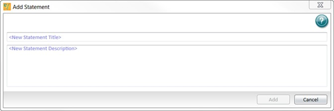

# Releasing Protocols

Use the Release a Protocol dialog to take a data document with the Reviewed status and release the document as a protocol with the Released status.

 (1).jpeg>)

To release a protocol:

1. Open a document with the status Reviewed.
2. Select the **GxP** tab and click .jpeg>) **Release Protocol** to display the Release a Protocol dialog.
3. Click **Browse** to display the Save dialog. See Saving Documents on page 261.
4. Navigate to the folder into which to save the document.
5. In the **Name** field, enter the name of the protocol.
6. Click **Save** to display the Release a Protocol dialog. The Browse For Protocol Name field displays the path and protocol name.
7. Click **Release Protocol**.

### GxP Statements

Use the Statements dialog to manage statements. Use statements to communicate and get sign off for a document. You use statements in conjunction with the document status to indicate who created the document, reviewed the document, ran the assay, and approved the results.

Each document can have multiple statements. Each statement can have one signature so if the document requires multiple signatures, you need to add the corresponding number of statements. Each user can sign only one statement. After a statement is signed you cannot edit the document or add new statements so you should add all the required statements before you start getting signatures.

The following user permissions pertain to statements:

 (1) (1) (1).png>) **Add/Modify Statements** - Grants the user permission to add or modify statements. See Adding Statements on page 269.

 (1).png>) **Sign Statements** - Grants the user permission to sign statements. See Signing Statements on page 271.

 (1).png>) **Revoke Any Signature** - Grants the user permission to revoke any signature from statements. See Revoking Signatures from Statements on page 272.

 (1).png>) **Revoke Own Signature** - Grants the user permission to revoke only their own signatures from statements.

.jpeg>)

Click .jpeg>) above the right side of the Workspace or select the **GxP** tab and click **Statements** to display the Statements dialog.

 (1).jpeg>).jpeg>)After you add statements and after you sign statements, the button reflects the changes made to the statements for the document.

The first time you access the Statements dialog you need to add a statement before the icons in the dialog toolbar are available.

.jpeg>)Use the following icons in the Statements dialog toolbar to manage statements.

.jpeg>)You cannot delete an individual statement.

*

 (1).png>) .png>) and .jpeg>) - Click to include or exclude the statement from the printed version of the document. Statements also print when you print the document audit trail. See Printing on page 27.

.png>)  and  - Click to lock or unlock statements to permit or prevent the ability to edit and manage the statement. You cannot lock signed statements.

Click **Close** to close the Statements dialog.

### Adding Statements

Use the Add Statement dialog to add a statement to a document. Each statement can have one signature so if the document requires multiple signatures, you need to add the corresponding number of statements. After a statement is signed you cannot edit the document or add new statements so you should add all the required statements before you start getting signatures.

To add a statement:

1. Select the **GxP** tab and click **Statements** to display the Statements dialog.
2. If the document has no statements, complete the following two fields and then click **Add**. If the document has statements, select the statement above where you want to add the new statement and then click .jpeg>) in the Statements dialog toolbar to display the Add Statement dialog.
3. In the **New Statement Title** field, enter the statement title.
4. In the **New Statement Description** field, enter the statement content.
5. Click **Add**.

### Editing Statements

Use the Edit Statement dialog to edit a statement. After any statement for a document is signed, you cannot edit the document or the statements associated with the document.

.jpeg>)

To edit a statement:

1. Select the **GxP** tab and click **Statements** to display the Statements dialog.
2. Select the statement to edit.
3. Click  in the Statements dialog toolbar to display the Edit Statement dialog.
4. In the upper field, edit the statement title.
5. In the lower field, edit the statement content.
6. Click **Save**.

### Signing Statements 

Use the Sign Statement dialog to apply an electronic signature to a statement. Each statement can have one signature. After you sign a statement, the document is locked to prevent further changes and you cannot add additional statements. Remember to add as many statements as the document requires before you get any statements signed. You must revoke all signatures from all statements to unlock the document.

To sign a statement:

*
  1. Select the **GxP** tab and click **Statements** to display the Statements dialog.
  2. Select the statement to sign.
  3. Click  in the Statements dialog toolbar to display the Sign Statement dialog.
  4. In the **Note** field, enter a note.
  5. Click **Sign** to display the User Verification dialog.
*
  1. In the **Password** field, enter your password.
  2. Click **Verify**.
