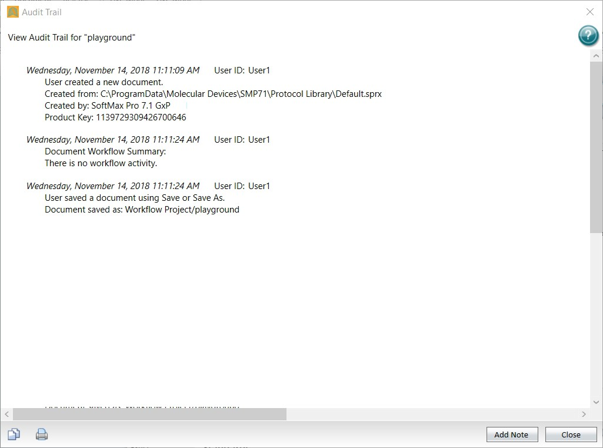

# Revoking Signatures from Statements

Use the Revoke Signature dialog to revoke the signature from the statement you select.

.jpeg>)

To revoke the signature from a statement:

1. Select the **GxP** tab and click **Statements** to display the Statements dialog.
2. Select the statement from which to revoke the signature.
3. Click .jpeg>) in the dialog toolbar to display a confirmation message.
4. Click **OK** to display the Revoke Signature dialog.

**CAUTION!** There is no undo for this. After you revoke all signatures, the document is unlocked and can be changed.

.png>).png>)

1. In the **Note** field, enter the reason for the signature removal.
2. Click **Revoke** to display the User Verification dialog.
3. In the **Password** field, enter your password.
4. Click **Verify**.

**Audit Trail**

The GxP Admin Software and the SoftMax Pro Software - GxP edition generate audit trails that record the events that user actions trigger. For each event instance, the audit trail records the date and time, the username of the person who was logged on, and the event action. Users cannot alter the audit trail, nor can they edit or delete audit trail entries.

### GxP Admin Software Events

The GxP Admin Software saves the audit trail to the database and you view the System Audit Trail in the GxP Admin Portal. For a list of events that are saved to the system audit trail, see the _GxP Admin Software User Guide_.

### SoftMax Pro Software - GxP Edition Events

In addition to the GxP Admin Software System Audit Trail, the SoftMax Pro Software - GxP edition records document-specific events to an audit trail for the document. You view the document-specific audit trail in the SoftMax Pro Software - GxP edition.

.png>) For protocols, the SoftMax Pro Software - GxP edition does not retain an audit trail. The GxP Admin Software System Audit Trail records applicable protocol event information.

.png>) For data documents, the SoftMax Pro Software - GxP edition audit trail records events that pertain to the document that is active in the Workspace and saves the document- specific events with the data document. Additionally, the document-specific audit trail includes general activities such as log in and log out when a document is open during those events.

The audit trail for each Plate section in a data document includes the following information: .png>) The name of the user who logged in when the read began.

.png>) The instrument type used to do the read and the instrument ROM version number. For the SpectraMax® i3x Multi-Mode Microplate Reader and the SpectraMax® Paradigm® Multi-Mode Microplate Reader, the audit trail also includes the serial number of the detection cartridge.

### Document Audit Trail

Use the Audit Trail dialog to view the audit trail for the open document. You can add a note to the audit trail but you cannot edit the content of the audit trail.

For a list of the events that are included in the document audit trail, see the _GxP Admin Software User Guide_.

Select the **GxP** tab and click .png>) **Audit Trail** to display the Audit Trail dialog.

.jpeg>)Each entry in the audit trail has a time-and-date stamp and identifies the user who performed the task.

\- Click to copy the content of the entire audit trail to the computer clipboard. You can then paste the audit trail into a text editor software application.

.png>) .png>) and .jpeg>) - Click to include or exclude the audit trail in the printed version of the document. See Printing on page 27.

.png>) **Add Note** - Click to display the Add a Note dialog where you add a note to the audit trail. .png>) Click **Close**.
