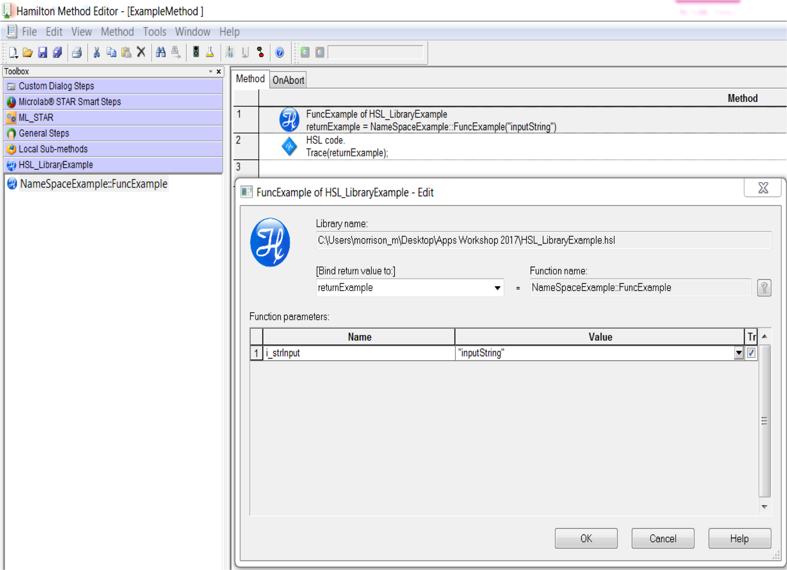

# HSL and DLLs - How to link HSL to external code

## HSL Libraries


<figure><figcaption></figcaption></figure>

An HSL library is a “collection” of functions written in HSL code and available for use in Venus software HSL Libraries are written in the HSL Method editor found in C:\Program Files (x86)\HAMILTON\Bin


### Why create an HSL library

* HSL libraries can be used to link outside code to Venus
* Make complex or redundant code reusable
* Extend functionality of Venus
* Link Venus function to external code

### Customizing the Library

Adding an Icon

* Simply add a .bmp with same file name as .hsl file

Help File

* .chm file extension
* Use \[LibraryName].chm
* Create using HTML Help Workshop


## HSL Code

### **THE NAME SPACE**

HSL libraries begin with a namespace

Tdhe enamcelsapacreamtusitobenunique from all other libraries

All library functions go between opening and closing brackets { }

```csharp
////////////////////Define namespace in HSL
namespace NameSpaceExample
{
    ///Functions go here!!
}   //end NameSpaceExample
```


#### FUNCTION DECLARATION

Defines inputs and return type

```csharp
///Function declaration in HSL
function FuncExample(variable i_strInput) variable
{
    //Do stuff here
    strCurrentDate = GetDate("");
    
    return(strCurrentDate);
} //end function FuncExample
```


## HSL C# Integration

* Can link Venus to powerful APIs
* Communication with devices
* Back Bone of Venus Software
* SILA Drivers written in C#
* Requires compiled C#/DLL library creation to link C# code with HSL

### WHAT IS A DLL

Stands for "Dynamic Link Library." A DLL (.dll) file contains a library of functions and other information that can be accessed by a Windows program. When a program is launched, links to the necessary .dll files are created. If a static link is created, the .dll files will be in use as long as the program is active. If a dynamic link is created, the .dll files will only be used when needed. Dynamic links help programs use resources, such as memory and hard drive space, more efficiently.

DLL’s used in ASW Dialog Library


### Example: hslChecksumCalculator




### Create a Visual Studio .NET Project

Create Class Library Project in Visual Studio via the .NET framework



### Modify the CSPROJ to configure the list of included project files and system assembly references

```csharp
<Project Sdk="Microsoft.NET.Sdk">

  <PropertyGroup>
    <TargetFramework>net48</TargetFramework>
    <LangVersion>8.0</LangVersion>
    <ImplicitUsings>disable</ImplicitUsings>
    <Nullable>disable</Nullable>
  </PropertyGroup>

</Project>
```



### Create the C# Code

Below is C# code which we want to integrate with HSL to be able to calculate checksums

```csharp
using System;
using System.Collections.Generic;
using System.Runtime.InteropServices;
using System.Text;

namespace hslChecksumCalculator
{
    public interface IhslChecksum
    {
        string CalculateChecksum(string dataToCalculate);
    }

    [ComVisible(true), ProgId("hslChecksumCalculator.Handle"), ClassInterface(ClassInterfaceType.None)]
    public class hslChecksum : IhslChecksum
    {
        public string CalculateChecksum(string dataToCalculate)
        {
            byte[] byteToCalculate = Encoding.ASCII.GetBytes(dataToCalculate);
            int checksum = 0;
            foreach (byte chData in byteToCalculate)
            {
                checksum += chData;
            }
            checksum &= 0xff;
            return checksum.ToString("X2");
        }
    }
}
```





### Build/Compile the Code

build the code using the Visual Studio .NET builder (keyboard shortcut is control/cmd + Shift + B



### Register the DLL

To be able to use the DLL in a dynamic fassion a registration in the system registry should be performed, this allows the program to be utilized globally on the system, however this does require code to be registered on each computer if deploying the solution elsewhere. Regitering the dll does have distinct advantages and should be the main choice for the project if possible.\
\
The Assembly Registration tool reads the metadata within an assembly and adds the necessary entries to the registry, which allows COM clients to create .NET Framework classes. This will allow C# classes to be accessed by HSL code.

To register your compiled DLL, go to the developer command line for visual studio and run it as an administrator (as this will add registry entries). \
\
Then use the command:


```bash
regasm "C:\Users\milot\Documents\Github\CSharpVenusLibrary\bin\Debug\netX.X\hslChecksumCalculator.dll" /codebase
```


with the path to the dll being the path to your actual DLL. This should register the DLL system-wide.



### Class Instantiation in HSL

Instantiate - Instantiating a class means to create a new instance of the class.

```csharp
namespace hslCheckSum
{
    object comObject;
    variable strReturn;

    function calculateChecksum(string strData) variable
    {
        comObject.CreateObject("hslChecksumCalculator.Handle");
        
        strReturn = comObject.CalculateChecksum(strData);

        return(strReturn);
    }
}
```




