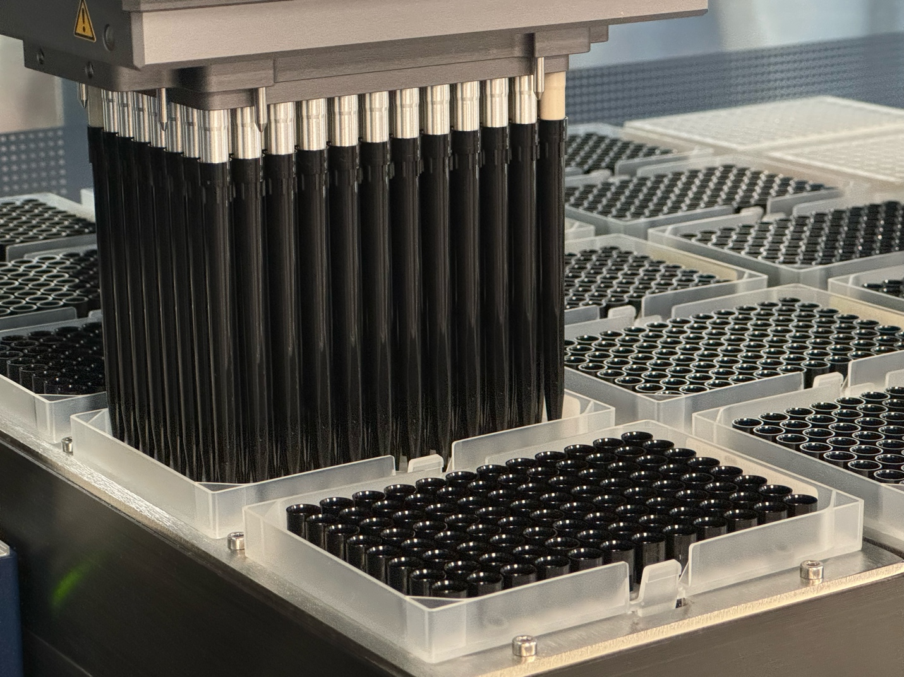

# Tip Type Mismatch Issue

Why ensuring the deck layout is correct is mission critical:

Although the single 1000ul channels can detect differences between the 1000ul tips vs others there is no sensing with the MPH96 or 384.

The 1000ul channels however still cannot detect differences between the 300ul or 50ul tips.

Swapping these two tip types can have severe consequences including robotic damage and care should be used when loading tips. The load and scan option should always be used if possible. Here are some examples of when tip types are incorrect :

 

