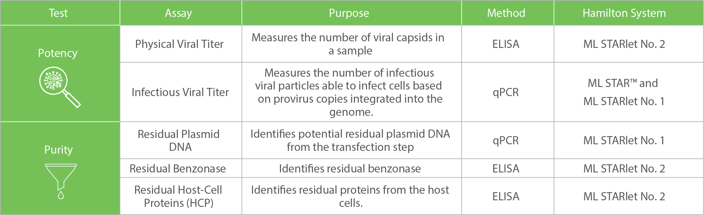
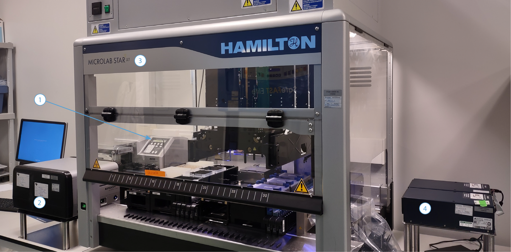
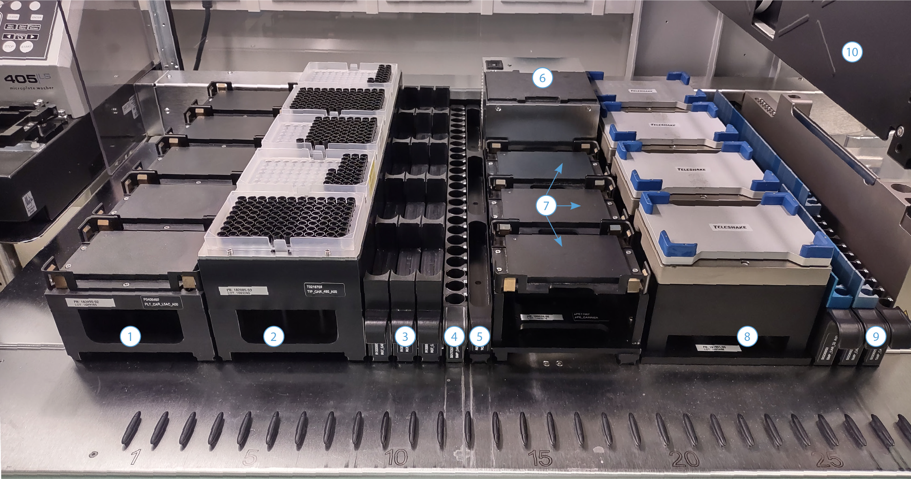
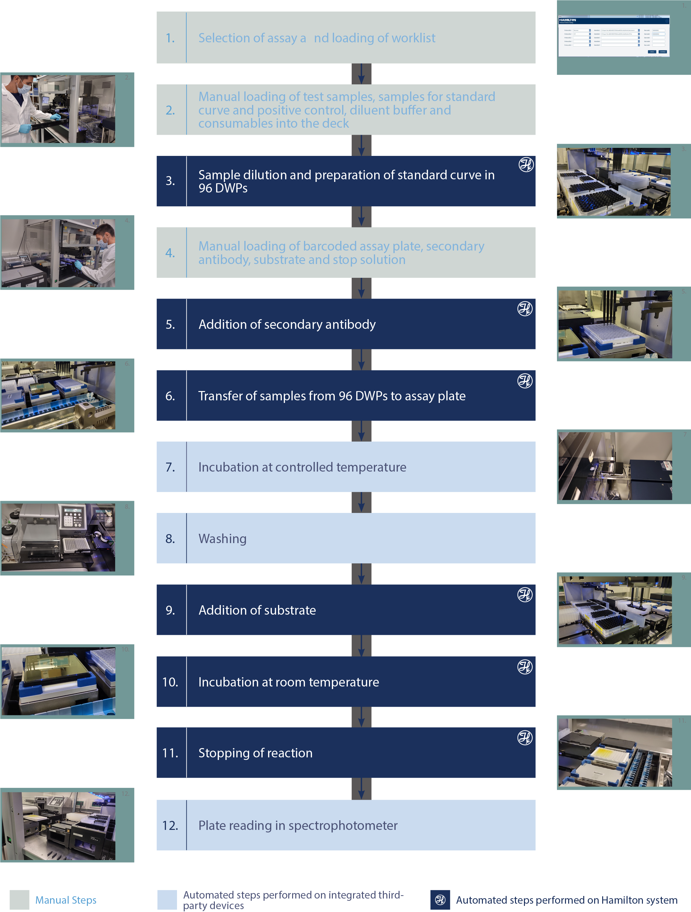
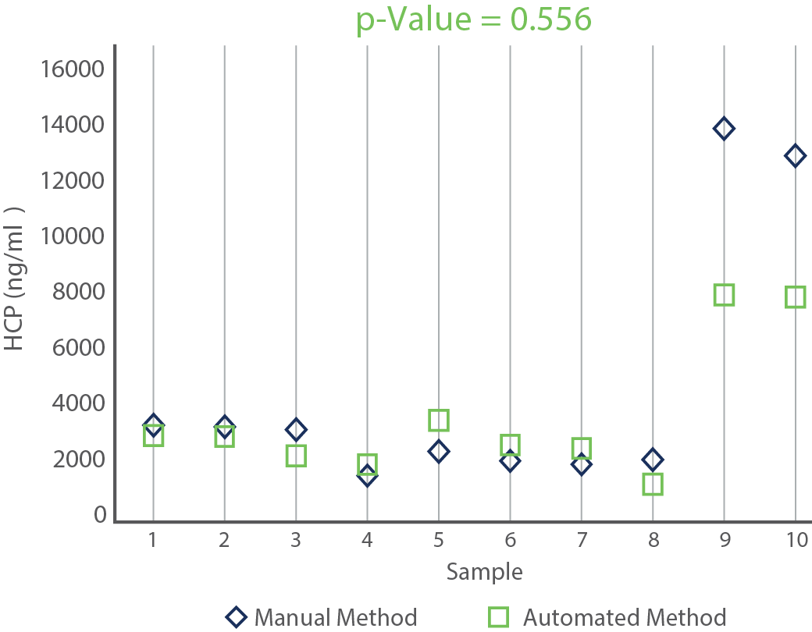
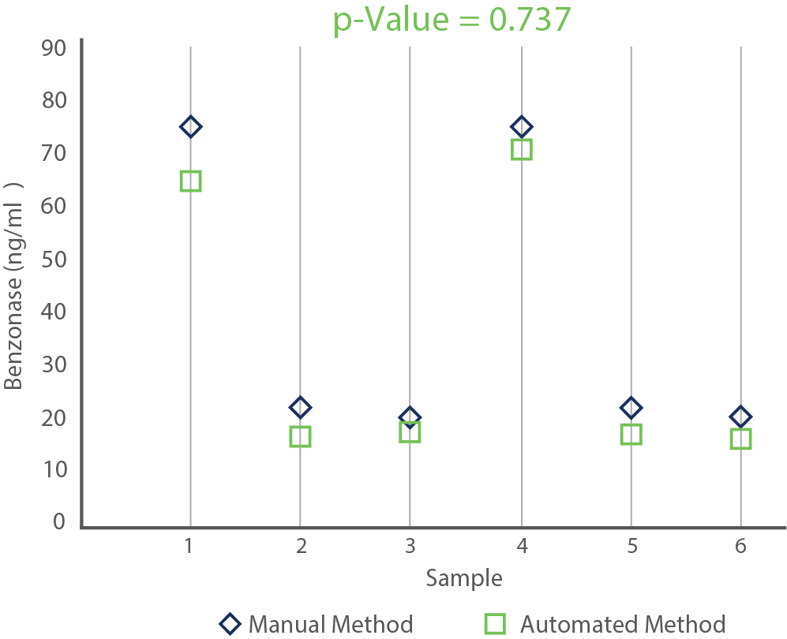
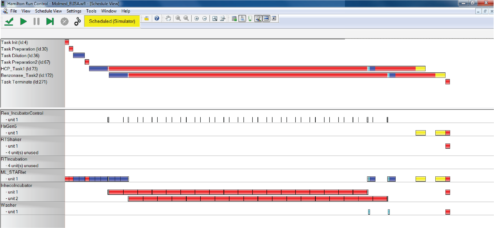

# Automating ELISA-based Assays to Assess the Purity of Therapeutic Viral Vectors

{% embed url="https://files.gitbook.com/v0/b/gitbook-x-prod.appspot.com/o/spaces%2FSJm30951AW7z9xuqm5sS%2Fuploads%2FgtjMFR5h646FpUaR23zX%2FAutomating%20ELISA-based%20Assays%20to%20Assess%20the%20Purity%20of%20Therapeutic%20Viral%20Vectors%20%E2%80%93%20AGC%20Biologics.mp4?alt=media&token=0b4f3652-bb41-4a1e-87ca-13d0057b5513" %}

## Summary&#x20;

AGC Biologics is a global Contract Development and Manufacturing Organization (CDMO) that develops and manufactures protein-based biologics and cell and gene therapies for clinical trials and commercial stages. The Analytical Development group within AGC Biologics Milan is responsible for developing and qualifying an array of analytical methods for characterizing both, the starting material and the final product. In order to increase the sample throughput while also allowing the flexibility to run different methods in parallel using the same sample aliquot, the Analytical Development group has automated five of their assays, using Hamilton systems. In this Case Study, we focus on the automation of two Enzyme- Linked Immunosorbent Assay (ELISA)-based assays to assess the purity of lentiviral vectors.

<figure><figcaption></figcaption></figure>

## About AGC Biologics&#x20;

AGC Biologics is a global CDMO founded in 2018 in Bothell, Washington, United States (US), as a convergence of Asahi Glass Company Bioscience, Biomeva GmbH, and CMC Biologics. Today, the company has seven facilities across three continents (North America, Europe, and Asia) and employs more than 2,500 employees worldwide.&#x20;

AGC Biologics offers a comprehensive range of services to biotech and pharmaceutical companies worldwide that work with protein-based biologics and cell/gene therapy products.&#x20;

The services provided include the full spectrum of the drug product journey, from Product Development (including vector plasmid production) and Process/Analytical Development to Good Manufacturing Practice (GMP) production, Quality Assurance and product release (for clinical and commercial phases). Moreover, the company works across various modalities and substances, including mammalian and microbial-based therapeutic proteins, recombinant DNA, plasmid DNA, messenger RNA, viral vectors, and unmodified and genetically engineered cells. As of 2022, AGC Biologics has supported the development and production of four commercial products worldwide, three of which were supported by AGC Biologics Milan.&#x20;

### AGC Biologics Milan&#x20;

AGC Biologics Milan is the result of the acquisition of MolMed S.p.A. (the first cell and gene therapy site approved in Europe for the GMP manufacturing of clinical and commercial supplies) by AGC Biologics in 2020. The core scientific team at AGC Biologics Milan has over 25 years of combined experience in viral vector-based gene therapy platforms (Lentiviral Vectors (LVV), Retroviral Vectors (RVV) and more recently, Adeno-Associated Viral vectors (AAV)). Furthermore, the company works with virtually any cell type, including Human Mesenchymal Stem Cells (hMSCs), Exosomes, CD34+ cells, T lymphocytes, and Natural Killer (NK) cells.&#x20;

<figure><figcaption></figcaption></figure>

## Analytical Assays at AGC Biologics Milan&#x20;

The development and qualification of analytical methods at AGC Biologics Milan are carried out by the Analytical Development group, one of the four groups belonging to the Development Unit. The methods developed by the Analytical Development group are critical in assessing the therapeutic product’s purity, identity, and potency. Dr. Francesca Rossetti, Analytical Methods Development Manager at AGC Biologics Milan, explains: “The assurance of the expected safety and efficacy profile of gene and cell therapy products relies on the development of precise and robust analytical methods, allowing the characterization of different aspects of the product: identity, functionality, safety and the presence of impurities. Furthermore, these methods must be optimized to comply with GMP rules before they can be transferred to the Quality Control Unit in charge of the final product release.”&#x20;

The Analytical Development group runs most methods (\~95%) in-house. Since 2015, thanks to the automation of five of their assays with Hamilton systems, the group has been able to increase its analytical capacity significantly.&#x20;

## Automation of Analytical Assays&#x20;

Initially, the Analytical Development group at AGC Biologics Milan performed all assays manually. Dr. Marco Rausa, Analytical Methods Development Supervisor at AGC Biologics Milan, explained the motivation to automate their assays: “When we approached automation, we had two main goals: 1) to increase our throughput, including the ability to run methods overnight without operator attendance, and 2) to minimize the number of samples required for testing by using the same sample aliquot in different assays.”&#x20;

Dr. Rausa further explained the selection of Hamilton’s systems for automating their assays: “During the first meetings, Hamilton’s team helped us to better understand our priorities and develop a solution that fit our needs. Hamilton already had some installations in Italy that could perform similar tests to the ones we wanted, and we could visit these locations. It was also a plus that the team responsible for installing and programming the instrument was close to Milan.”&#x20;

<figure><figcaption>
Figure 1. Workflow leading to the five automated analytical methods at AGC Biologics Milan.
</figcaption></figure>

As of today, AGC Biologics Milan has automated five analytical methods, using three Hamilton systems: two Hamilton Microlab® STARlet and one Hamilton Microlab® STAR™ (Figure 1). The five methods (two potency tests and three purity tests) are based on ELISA and quantitative Polymerase Chain Reaction (qPCR) workflows. They are currently only used in a research environment (i.e., not in GMP) (Table I).

<figure><figcaption>
Table I: Automated Hamilton Systems at AGC Biologics Milan *ML = Microlab®
</figcaption></figure>

## ELISA-based Automated Workflows for the Assessment of Viral Purity&#x20;

Purity tests identify potential residuals that remain in the final viral product. Dr. Rossetti explained: “As part of the safety assessment, we monitor the presence of impurities coming from the packaging cells used to produce the vectors and the reagents used during the manufacturing process. Since these residuals are potentially harmful to the patient, we must guarantee that their concentrations in the final product are below the permitted levels (i.e., safety threshold).”&#x20;

In this Case Study, we focus on two of the ELISA-based analytical assays that AGC Biologics Milan uses to assess purity: residual benzonase and residual Host-Cell Proteins (HCP). Both assays are run in the same automated system.&#x20;

## System Overview&#x20;

<figure><figcaption>
Figure 2. System Overview. (1) Biotek ELx405™ Select Deep Well Washer, (2) Biotek Epoch2® Microplate Spectrophotometer, (3) Hamilton Microlab® STARlet, (4) Inheco Single Plate Incubator Shakers
</figcaption></figure>

The system for the ELISA-based purity tests is based on a Hamilton Microlab® STARlet with eight 1000 µl pipetting channels, a CO-RE® Gripper Tool, an iSWAP® Arm, and a HEPA Filter Hood with UV Lamps for deck decontamination. The automated liquid handler is integrated with a Biotek ELx405™ Select Deep Well Washer, a Biotek Epoch2® Microplate Spectrophotometer and two Inheco Single Plate Incubator Shakers (Figure 2). The Microlab® STARlet deck includes a Heating Cooling Module, four Variomag Teleshake Microplate Shakers and a variety of plate, troughs, tubes, and tips carriers (Figure 3).

<figure><figcaption>
Figure 3. Deck Layout of the Customized Microlab® STARlet used for the Purity Tests. (1) Carrier for Deep-Well Plates used as lid parking position, (2) Tip Carrier, (3) 60 ml Trough Carrier, (4) 15 ml Tube Carrier, (5) 120 ml Trough Carrier, (6) Cooling Module, (7) 3X Deep-Well Plate positions, (8) Carrier with 4X Plate Shakers (Variomag), (9) Carrier with adaptors for 1.5 ml tubes, (10) 8X 1000 μl Pipetting Channels.
</figcaption></figure>

## Description of the Workflow&#x20;

The ELISA workflow for both tests, residual benzonase and residual HCP, are similar and can be run in parallel. The overall workflow comprises two main “tasks”: standard curve preparation and ELISA procedure (Figure 4). Both tasks are initiated manually and are guided by the Hamilton VENUS software.&#x20;

Dr. Rausa describes the procedure: “The first step to initiate the workflow is to select it from the list of automated methods (i.e., residual benzonase or residual HCP) and load the worklist and dilution settings file, containing the information about the location of the samples in the assay plate and the required dilution. After this, all the resources for the first step are manually loaded into the Microlab® STARlet: 96 Deep-Well Plates (DWPs), filtered tips, 60 ml reservoirs with diluent buffer, 1.5 ml tubes with sample for standard curve and positive control sample, and 2 ml vials with the undiluted samples to be tested. The operator’s actions during the loading of the deck are guided by a series of software dialog windows that display the precise location where each item should be located. Following this, the system performs all dilutions according to the information in the worklist.&#x20;

After completing this first step, the Microlab® STARlet is re-loaded with the resources necessary for the second step: barcoded ELISA plates coated with primary antibody and three independent reservoirs containing the Horseradish Peroxidase (HRP)-conjugated secondary antibody, substrate, and stop solution.”

Because the reaction is light-sensitive, the ELISA plate is covered with a black lid, and two of the reservoirs are black and covered.&#x20;

Once the instrument is re-loaded, the second task of the automated workflow starts. Dr. Rausa continues with the description: “The secondary antibody is added to the assay plate, then the test samples, positive control and standard curve are transferred from the 96-DWPs to the assay plate, and the latter plate is incubated at a controlled temperature in the off-deck integrated incubator shaker. Once the incubation is finished, the plate is washed in the off-deck integrated washer. After this, the plate is returned to the Microlab® STARlet’s deck, the substrate is added, and the plate is incubated at room temperature on the on-deck plate shaker. Once the incubation time has elapsed, the reaction is stopped by adding the stop solution, and the plate is transferred to the integrated spectrophotometer.”&#x20;

The plate’s movement between the Microlab® STARlet’s deck, the incubator shaker, the washer and the spectrophotometer is performed by the iSWAP, one of the transport tools of the Microlab® STARlet. The iSWAP can move plates in portrait or landscape formats inside and on the periphery of the deck, enabling the off-deck integration of third-party devices.&#x20;

## Comparison of the Manual vs. Automated Assays&#x20;

<figure><figcaption>
Figure 4: ELISA-Based Purity tests workflow at AGC Biologics Milan. DWP - Deep-Well Plate
</figcaption></figure>

Both ELISA assays have been validated according to the ICH Q2(R1) before being transferred into automation. Moreover, the comparability of each assay’s automated and manual methods has been demonstrated (Figures 5 and 6).

<figure><figcaption>
Figure 5: Comparison of the Manual vs. Automated Residual HCP Assay. The graph indicates the results of ten independent samples. The automated residual HCP assay has been fully qualified.
</figcaption></figure>

 

<figure><figcaption>
Figure 6: Comparison of the Manual vs. Automated Residual Benzonase Assay. The graph indicates the results of six independent samples. The automated residual benzonase assay is still in qualification.
</figcaption></figure>

## Benefits of the Automated System&#x20;

### Throughput and Flexibility&#x20;

The automation of the ELISA workflows has allowed the Analytical Development group of AGC Biologics Milan to double the daily number of these tests while significantly reducing the operator’s time. Dr. Rausa comments: “Today, a single operator can load two ELISA plates simultaneously, testing up to 42 samples per day for a residual HCP assay or 46 samples per day for a residual benzonase assay. Furthermore, the current throughput can be increased by integrating additional incubators, which is the bottleneck of the process at the moment.”

Another important benefit of the automated method is its flexibility. The method setup and the VENUS scheduler allow for the running different assays/workflows in parallel and using the same sample aliquot to perform different tests. “Considering that most of the tests are performed on the final purified lentiviral vector, the option of using a single aliquot is a great advantage because it saves the final product volume,” commented Dr. Rausa.

The VENUS scheduler (Figure 7) is a tool that allows for the optimization of the use of resources in parallel assays. This is particularly useful for long workflows that need to be replicated for different plates using the same resources (as in the case of ELISAs).

<figure><figcaption>
Figure 7: Representative Screenshot of the Hamilton VENUS Scheduler. Color-coding of steps: Dark blue: pipetting of samples; Light blue: washing; Yellow: reading; Red: incubation; Gray: Transport with iSWAP.
</figcaption></figure>

Dr. Rausa comments on the flexibility of the software: “The VENUS software allows us to customize our methods, add new ones, and perform multiple runs of the same assay or different assays in parallel. This flexibility, however, comes with a price. Adapting methods on the VENUS software requires training and experience. Luckily, the Hamilton Application Team has always been very fast to provide us with support.”&#x20;

### Sample Traceability and System Connectivity&#x20;

The traceability of the samples in the automated system is guaranteed by 1) the initial worklist and dilution settings file, 2) the reading of the plate barcodes by a manual barcode scanner and 3) the communication between the Hamilton Microlab® STARlet and the integrated devices. It must be highlighted that Hamilton automated systems also have the ability to include an autoload with an automatic barcode scanner.&#x20;

The worklist and dilution settings file supplied at the beginning of any run is the starting point. As previously mentioned, they indicate the position and dilution of the samples, positive control and standard curve in the assay plate. After the run, the Hamilton VENUS Software generates a similar file, mapping the positions and dilutions in the assay plate, which the spectrophotometer software can read. This exchange of information allows the spectrophotometer software to calculate the final concentration of residual benzonase and HCP in the samples directly, after the reading has been finished.

> “The automation of our assays has increased our throughput, freed employee time, and allowed us to save precious sample volume. In addition to our ELISA-based assays, we have also automated PCR-based assays that rely on the integration of Hamilton systems with sealers and PCR Thermocyclers. Furthermore, we recently acquired a new ML STARlet to perform vector dilution, which will increase our capacity to perform infectious viral titer assays”, said Dr. Rossetti.

Dr. Rausa further comments about the security of the data at AGC Milan: “Every file inputted or produced by the automated system is copied and transferred to AGC Biologics’ network. The network has controlled access and is protected from editing and deletions.”

***

For correspondence: mboza-moran@hamilton.ch




