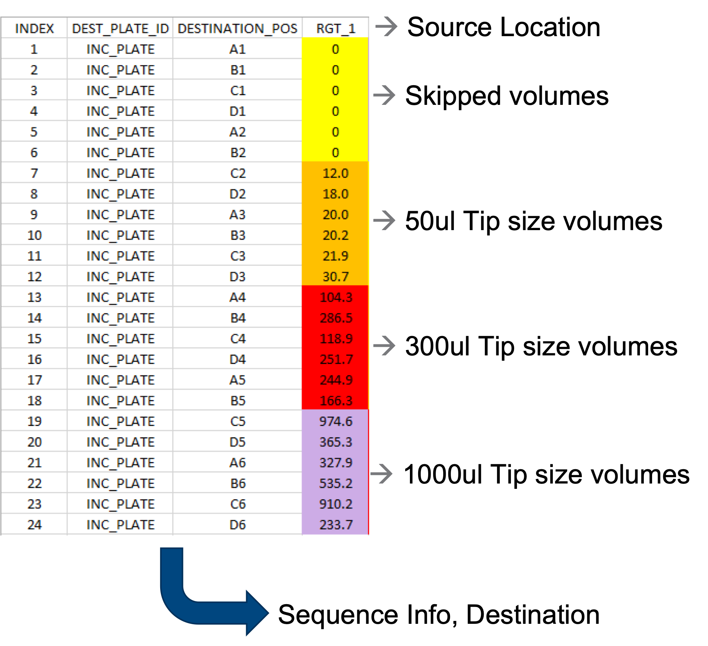
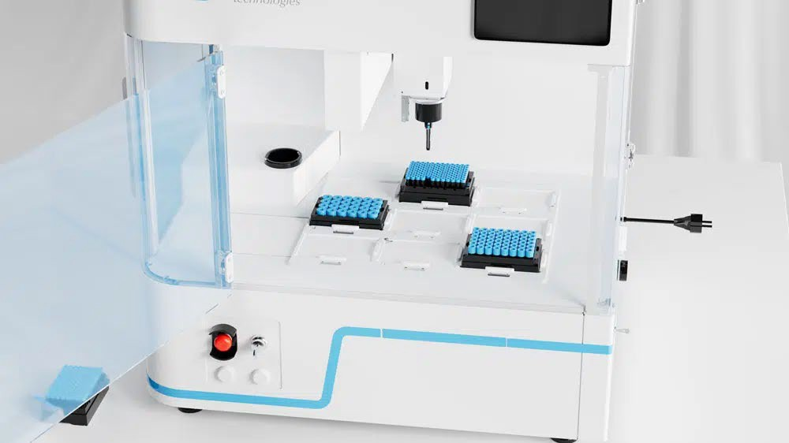
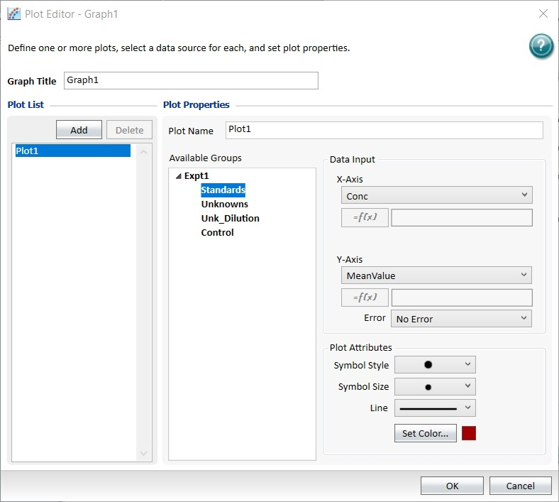

# Sample Management

**PURPOSE**

* .jpeg>)As our utilization of automation in the lab grows, so will our sample throughput
* Text based labeling is one of the first problems in switching to high throughput automation and it is the simplest to solve
* Starting early and with a unified approach to sample labeling and tracking will allow assays to grow and expand without severe bottlenecks, saving time when testing requirements expand
* Adhesive labels and ink based marking are not compatible with solvents needed for proper cell culture nor are they durable enough with long term storage in extreme temperatures

**INTRODUCTION**

* Laboratory samples range from cell culture media to proteins to lyophilized drug products to tissue homogenizes, etc
* Each type of sample with its own unique requirements for storage, including temperature, humidity, material compatibility, and sample storage longevity
* Some samples are required to be available for months and years to come, and some samples just require a couple of days in storage
* Making sure that samples of any type are able to be identified located and viable is of the utmost importance; especially if samples are being handed off to other scientist, other departments or other companies in the case of utilizing CRO’s or external test testing organizations
* Utilizing handwritten labels or even text based printed labels can prove to be cryptic to decipher include acronyms, which are unfamiliar to other individuals and failed to include any necessary, metadata such as sampling date or information about which scientist collected the sample
* When dealing with a small quantity of samples taking the time to label or log or add a barcode identifier to each sample feels like a zero sum game, however, ensuring that necessary information is conveyed for years to come is key in providing the highest quality and most precise/repeatable result

**STANDING ON THE SHOULDERS OF GIANTS**

*
  * Normal laboratory environments, such as liquid nitrogen and -80 and even wet and cold environments such as using wet ice or even using liquid nitrogen, snap freeze samples are already treacherous environments for laboratory containers, and tubes
  * When long term, critical tracking and tracing are of the upmost importance, especially in clinical testing, pharmaceutical manufacturing, blood banking, or even automotive or circuit board manufacturing… barcoding
  * When thinking about setting up science for the future and protecting samples indefinitely, we can take key points and initiatives from these fields: barcoding, reducing adhesive labeling, and increasing permanent laser ablation/etched markings

**WHY IS PROPER SAMPLE LABELING IMPORTANT?**

*
  *

**BENEFITS OF USING BARCODING**

Enables the moving away from adhesive labels which fail under extreme environments Reduce Manual Entry/ Reduce Errors

**Improve Accuracy (Accurately ID)**

**Add Accountability and Chain of Custody Add Sample Traceability**

**Add Lot Control to Consumables**

Improve Customer & Employee Satisfaction

**Improve Productivity Improve Efficiency**

**Improve Safety and Ergonomics**

| 
Sharpie Lab Marker

Paper Label Plastic Label

TubeWriter
 |            | Physical Abrasion | Solvents | Liquid Nitrogen | High Heat | Label Setup Time \[s/tube] | Label Printing Time \[s/tube] | Total Time Per Tube | Touch time for a 3000 tube study | Total Time |
| -------------------------------------------------------------------------- | ---------- | ----------------- | -------- | --------------- | --------- | -------------------------- | ----------------------------- | ------------------- | -------------------------------- | ---------- |
| In-House                                                                   | X          | X                 | ✓        | ✓               | 0         | 10                         | 10                            | 8 FTE Hours         | 8                                |            |
| In-House                                                                   | X          | X/✓               | ✓        | ✓               | 0         | 10                         | 10                            | 8 FTE Hours         | 8                                |            |
| In-House                                                                   | X          | X                 | X        | X/✓             | 2         | 4                          | 6                             | 5 FTE Hours         | 5                                |            |
| In-House                                                                   | X          | X/✓               | X/✓      | X/✓             | 2         | 4                          | 6                             | 5 FTE Hours         | 5                                |            |
| In-House                                                                   | X          | X                 | ✓        | ✓               | 5         | 0.5                        | 5.5                           | 4 FTE Hours         | 4                                |            |
|                                                                            |            |                   |          |                 |           |                            |                               |                     |                                  |            |
| Laser Ablation                                                             | In-House   | ✓                 | ✓        | ✓               | ✓         | 1                          | 0.1                           | 1.1                 | 0.5 FTE Hours                    | 1.5        |
|                                                                            |            |                   |          |                 |           |                            |                               |                     |                                  |            |
| Direct Mark                                                                | Outsourced | ✓                 | ✓        | ✓               | ✓         |                            |                               |                     |                                  |            |

.jpeg>).jpeg>).jpeg>)**WHY IS PROPER SAMPLE LABELING STRATEGY IMPORTANT?**

**BARCODING STRATEGIES**

.png>).png>)

.jpeg>) 

**HOW TO AUTOMATE BARCODE LABELING**

* Traditional barcode labeling involved manual application of barcodes to tubes, vials and plates but this process is tedious and prone to error. In clinical labs, for example, samples may need to be read by many scanners, with increasing risks of error depending on labeling quality. Legacy systems may fail to read correctly if the barcode is not straight, while modern readers can handle barcodes in any orientation, including slanted barcodes.
* Many barcode labeling systems are bench top size and can be used stand-alone or integrated into a sample preparation instrument. Whatever the solution, the lab has full control over the labeling process.

**LABORATORY SAFETY & ERGONOMICS**

**DESIGN A SAFER, MORE COMFORTABLE WORKPLACE BY STREAMLINING PROCESSES.**

* One benefit of automation that likely is not top of mind is improved safety and ergonomics. Main goals in implementing an automated system are likely related to resource allocation, throughput, and consistency.
* While employee safety and comfort may seem like a natural bonus of implementing automation, these benefits also boost efficiency and productivity.
* Prioritizing these factors in the laboratory can help maximize the results of a safer process and environment.

Reduction in Labeling Time: By adopting LVL tubes and leveraging partnerships, the project aims to significantly reduce the time scientists spend on labeling, thus accelerating research workflows.

Eliminating Traditional Labeling System Pain Points: The shift to pre-etched labware addresses common issues with traditional labeling systems, such as label detachment, illegibility, re-labeling and time consumption.

Enhancing Lab Automation: The initiative is designed to enhance lab efficiency, organization, and streamline processes, contributing to a more effective and reliable lab environment.

**AUTOMATED CAPPING AND DE-CAPPING**

.jpeg>)

**CONTAINERIZATION**

**DURABILITY**

* Tube with external thread for lower risk of contamination
* 2-component molded Screw Cap with injected sealing
* IATA Certified Compressed CO2 Tightness Study
* Polycarbonate SBS rack (more stable in ultra low temperature storage)
* Best storage efficiency for storage in automatic systems (ratio of tube size to working volume)
* Communication of the real working volume included
* Additional rack coding options for tube identification in automated storage systems besides Orientation Code
* 12-digit 2D code with letters and numbers
* Flexible customizing options already for small quantities without additional costs (own number range, logo, name etc.)
* Two-sided coding options for the tubes
* Low Retention/Low Binding Virgin Plastic
* Automation friendly storage racks

**DIGITAL TRACEABILITY**

IMPLEMENT TRACKING TO IDENTIFY AND MONITOR INVENTORY, REDUCE IN LABOR HOURS, AND INCREASE EFFICIENCY.

*
  * The main goal of any barcoding and labeling strategy is to store data in a way that is both secure and easy to trace.
  * A few questions you might want to have answers to are:
    * What data points will you be tracking?
    * Barcode #, Lot #, time & date tracking, etc.
    * Where will your data be stored? In what database?
    * How does data move—forwards and backward—between the database and equipment?
    * Where does data end up? What does it look like in its final form? Is it accessible? Easy to interpret?
    * How can we leverage data related to automation?

**SAMPLE TRACKING WITHIN AUTOMATED WORKFLOWS**

A sample should be tracked from inception of experiment, throughout execution and finally associated with data generated. Barcoded plates and tubes are necessary to link the physical world with digital paper trail. Automated processes are essential for reducing human error.

Sample Acquisition

Sample Processing

Sample Data

* ELN generates input worklist for run.
* Samples barcoded and match input worklist.
* Samples scanned and cross-checked with input worklist prior to run execution.
* Samples tracked throughout process.
* Verify successful executions.
* Data generated automatically associated with sample.

**SAMPLE TRACKING WITHIN AUTOMATED WORKFLOWS**

**THE COMPLETE PICTURE**

DESIGNING AN AUTOMATED, BARCODE-OPTIMIZED, DATA-DRIVEN LABORATORY REQUIRES A COMPREHENSIVE AUDIT OF YOUR NEEDS.

*
  * Paint a picture of processes from start to finish and look at it from a strategic perspective—from utilizing bulk labware and reagents to endpoint data delivery. Look for areas in your workflows where things are flowing smoothly and identify any bottlenecks.
  * Think about the effect these areas have on your processes and workflows:
    * Are scientists hand-picking and placing every vial to be labeled?
    * Are scientists visually inspecting every label for identification and readability?
    * What would make a successful implementation to address these pain points?
    * Which stakeholders both internal and external who need to adjust their workflows and processes in order to implement these changes?

**FUTURE + CALL TO ACTION**

Pre-bottom Barcoded Labware: Pre-bottom barcoded labware is crucial for ensuring zero failure rate in labeling, streamlining the tracking process unfortunately just using bottom barcoded labware isn’t enough, the bottom barcodes must be logged and utilized and not ignored. In the current implementation users add stickers to the sides of pre-barcoded tubes and ignore bottom barcoding, leading to barcoding discrepancies and automation failures.

*
  * **Implement** key automation futureproofing by implementing permanently marked labware
  * **Eliminate** paper labels and handwritten sample submissions
  * **Log** barcodes and sample IDs in accessible database locations
  * **Prevent** utilizing barcoded labware without registration
  * **Enact** labware across all teams who provide samples or exchange samples
  * **Establish** color coordination for rapid identification
