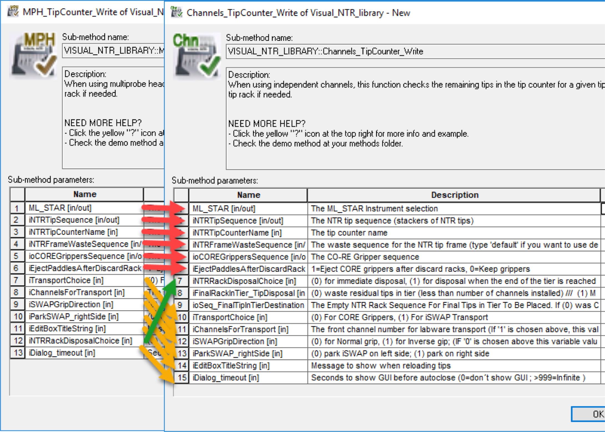

# 3. Venus 4 Installation

## Section 1: Installation Instructions

Note: Administrator privileges are needed to install Venus 4 correctly. Before installation, have IT grant admin privileges or request that IT install the software.

1. Open the Portable WinCDEmu-4.0. application located in the Venus 4 software folder.

.png>)

1. Select yes when prompted to install the Portable WINCDEmu Driver.

.png>)

1. Select mount image, mount the Microlab STAR Software VENUS four base package 4.5.0.5217 and select open.

 (1).png>)

 (1).png>)

1. Close the Portable WinCDEmu. The installation drive is now mounted on your computer. Open the drive and select the Microlab\_Star folder. Right click on the setup application and select run as administrator. (Note: Administrator rights are needed to install the software properly.)

 (1).png>)

 (1).png>)

1. Select yes when prompted to install the SQL database.

 (1).png>)

1. Select next when prompted to start the Venus 4 installation.

 (1).png>)

1. Disable all virus protection software and close all other running applications when prompted and select yes.

 (1).png>)

1. A dialog will them remind you to revalidate your methods. Select yes.

 (1).png>)

1. Choose the location where Venus 4 files will be installed (Hamilton suggests to keep this default) and select yes.

.png>)

1. Select the appropriate instrument.

.png>)

1. Select install to start the installation of Venus 4.

.png>)

1. Enter laboratory name and select next.

1. Select use file checksums to validate files and select next.

1. Select finish to complete the installation of Venus 4 software.

.png>)

1. Deselect and reselect the labware, methods, HSL libraries and service enhancements check boxes and select next. Click install.

.png>)

1. Click Finish to complete the installation of labware, liquid classes and libraries.

Note: If any errors occur during installation, Venus and the SQL database will have to be removed and reinstalled. Hamilton Microlab STAR Software Venus 4 and the Microsoft SQL Server 2014 (64-bit) can be uninstalled through add and remove programs. Before reinstallation, ensure that you have the correct administrator privileges.

## Section 2: Instrument Configuration

1. Open the Hamilton Method Editor, select tools > system configuration editor.

.png>)

1. Select the System Settings tab and mimic the settings below.
2. Select the Error Settings tab and mimic the settings below.
3. Select the Security Settings tab and mimic the settings below.
4. Select Step Selection and set all steps visible for General, Custom Dialog, Data Handling and Microlab STAR Smart Steps.
5. Select the Microlab STAR tab and mimic the settings below.
6. Click the floppy disk in the upper left hand corner and close out of the system configuration editor. Your system is now ready for training.
