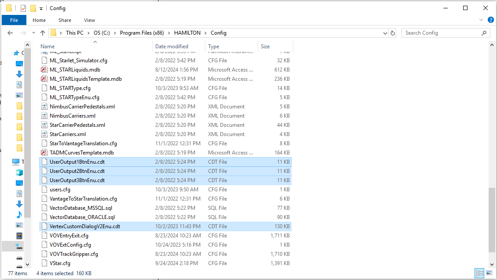

# How to Create Labware Files

If the labware is not pre-defined, custom racks and containers can be defined using the Labware Editor. The custom labware can be used like any other pre-defined labware object from the library. A labware object is a representation of the real physical labware.

To define the new labware:

1.  Select “Tools -> Labware -> Labware Editor …” in the Method Editor, or the “Define Labware” Icon found on the toolbar:\

    <figure><figcaption></figcaption></figure>

2. The Labware Editor with an empty main window will be activated.
3.  To create a new labware, select “File -> New“ from the Labware Editor Menu. The sub-menu offers five choices, which are the different types of labware. This will be explained in the succeeding sub-sections.\

    <figure><figcaption></figcaption></figure>

\

\

