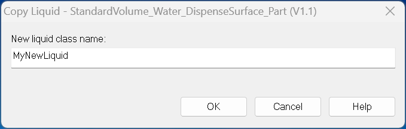
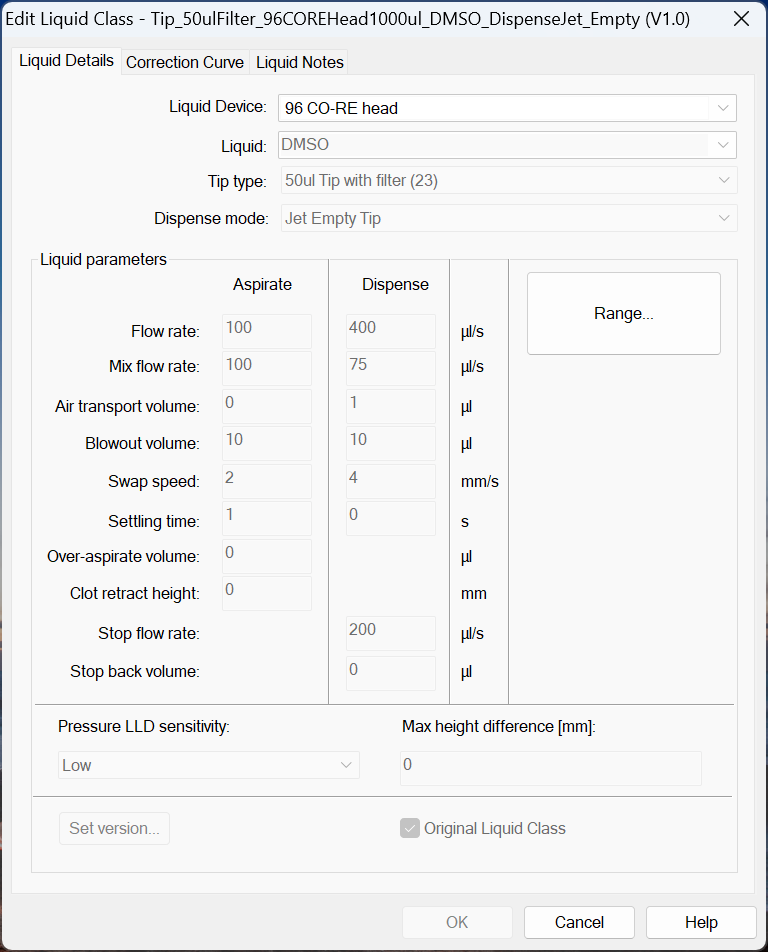

# Configuring Liquid Class Definitions

Liquid classes control how liquids are aspirated and dispensed during pipetting tasks. Each liquid class includes parameters that determine the handling behavior for specific liquids, such as water, DMSO, or biological samples. Pre-defined liquid classes cover many standard applications, but you can also create custom liquid classes for specialized tasks.

Step 1: Look For Existing Predefined Liquid Classes

Before creating a new liquid class, check if an existing one meets your needs. If a new liquid class has to be defined/there is not a liquid class matching the needs of the liquid in question, choose a pre-defined liquid class which most closely matches.\
\
For example, when setting up a liquid class for PCR master mix, starting with the "Water" class may suffice. Similarly, when using an extraction kit, consult the manufacturer to see if they offer predefined classes, as many buffers share properties (e.g., Guanidine Thiocyanate-based binding buffers).

**Actions**:

1. Open the Hamilton Venus software and navigate to the Liquid Class Editor.\
   \
   

<!---->

1. Review the pre-set liquid classes (e.g., Water, DMSO, Glycerol).
2. Compare the properties of your liquid (e.g., viscosity, surface tension) with those in the predefined classes.
3. If a suitable predefined liquid class is found, select it for your method.
4. If a new liquid class needs to be created, select/highlight the closest matching pre-existing liquid class and copy the liquid class by going to **Liquid Class** -> **Create.**\
   \
   \
   

\
To assist in creating a new liquid class, compare properties like vapor pressure, viscosity, surface tension, and capillary action in the Safety Data Sheet (SDS) to find a match.

Step 2: Identify Liquid Properties and Device

Ensure that the liquid class is tailored to the liquid and device being used.\\

**Actions**:

1. Identify the key liquid properties such as viscosity, volatility, and density.
2. Choose the correct pipetting device and tip type (e.g., disposable tips or fixed needles).
3. Select a suitable dispensing mode (e.g., Jet Empty Tip, Surface Part Volume).

**Common Dispense Modes**:

* **Jet Empty Tip**: For dispensing the entire volume with blow-out.
* **Surface Empty Tip**: Controls the dispense via surface tension.
* **Jet Part Volume**: For partial volume dispensing with blow-out.
* **Surface Part Volume**: For partial volume dispensing with surface tension control.\
  \
  

In general, **Jet mode** tends to have higher flow rates, air transport volumes, and blow-out volumes compared to **Surface mode**, reflecting the more aggressive dispensing behavior needed for jet dispensing.\
\
\
The following patterns emerge from the liquid class definitions based on different **Liquids** and **Dispense Mode** combinations:

1. **Pressure LLD Sensitivity**: This parameter tends to remain consistent (typically around 4.0) across most liquid types and dispensing modes.
2. **LLD Max Height Difference**: Consistently set to 0.0, likely indicating uniform behavior across different liquids.
3. **As Flow Rate / Ds Flow Rate**: These rates vary significantly depending on the liquid type and dispense mode. For example:
   * Acetonitril 100% (Jet mode): 175 for As Flow Rate and 175 for Ds FlowRate.
   * Acetonitril/Water 80:20 (Jet mode): 250 for As Flow Rate and 225 for Ds Flow Rate.
4. **As Mix Flow Rate / Ds Mix Flow Rate**: The mix rates follow a similar pattern, with values changing based on the liquid and dispense mode. Higher flow rates tend to have higher mix rates.
5. **As Air Transport Volume / DsAirTransportVolume**: These volumes vary depending on the liquid. For example, Acetonitril 100% has higher values in Jet mode (17.5 and 25.0) compared to Surface mode.
6. **Ds Blow Out Volume**: Blow-out volumes are generally higher for Jet mode (e.g., 30.0 for Acetonitril/Water 80:20) compared to Surface mode.
7. **Ds Stop Flow Rate**: This parameter significantly varies based on the liquid and mode, with higher stop flow rates for faster dispensing liquids, like Acetonitril (225 for Jet mode).

Step 3: Run Test and Visually Inspect Pipetting

Once the predefined liquid class is selected, it’s time to test the liquid transfer on the robot. The predefined liquid class is used as a baseline to speed up the process of testing.

1. Set up the automated liquid handler with the appropriate source and destination labware.
2. Fill the labware with the liquid that you intend to transfer. If the liquid in question is costly or in short supply, use water for initial testing and optimization.
3. In the automated liquid handler’s software, build a simple method to transfer the liquid that will mimic the step in the actual process. Focus on one transfer step in the process before testing the next. Make sure that the method settings are defined as you want them for the actual transfer.
4. Run the method and observe the transfer. Look for the following:\
   — Is the aspirate height or liquid level submerge depth too high/low?\
   — Are there any droplets on the end of the tips after aspiration?\
   — Is the dispense height or liquid level submerge depth too high/low?\
   — Are there any droplets on the end of the tips after dispense?\
   — Are the channels properly following the liquid level during aspiration and dispense? Should following be turned off?

Step 4: Optimize Parameters Until Pipetting Appears Acceptable

Continue to run the simple method, observe the pipetting, and make adjustments based on what you see. The goal is to make sure that the pipetting looks correct. For example, there should be no dripping from the tip and no bubbles on dispense.

Start by making modifications to method settings such as enabling cLLD on the aspirate or adjusting the fixed height.

If the method settings are optimized, but the transfer still appears inconsistent, you can then focus on modifying the liquid class settings to improve performance. Follow these steps to adjust the liquid class:

1. Save the liquid class under another name. Now it can be modified to work for the specific application.
2. Change one liquid class parameter at a time to see its effect on the liquid transfer.
3. Inspect transfers.\
   — Visually inspect for consistent transfers.\
   — Spot check with a handheld pipette to give an indication of consistency and if the transferred volume is short or in excess
4. Once the transfers look consistent, move on to step 5.

Step 5: Verify Volumes and Adjust Correction Curve Accordingly

Once the pipetting appears to be acceptable, the transferred volumes can be quantified to determine the precision and the trueness of the liquid transfers.

Before measuring, it is important to know your application’s pipetting requirements to make sure that the final optimizations meet the need. If the requirements are unknown and you want to minimize the amount of variability that pipetting contributes to your application, you can strive to match the specifications set for the pipetting device you are using.

You might measure volumes gravimetrically to make sure the transfers are both accurate and precise. Then, you can continue to adjust liquid class settings until optimal precision is achieved.

When precision is achieved, the correction curve of the liquid class can be adjusted to ensure trueness of all volumes of interest for your application. For example, if you are transferring a volume of 300 μL, but are measuring a value of 295 μL, then you can increase the corrected value in the liquid class by an additional 5 μL. Continue to adjust until the proper target volume is achieved.

 (1) (1) (1) (1).png>)

Once verification is complete, make sure the updated liquid class is implemented in your method. The liquid class can then be used by lab technicians running liquid transfers for experiments. Periodically check the performance of the liquid transfers to make sure that no changes are needed. Keep in mind that the correction curve for any default liquid classes cannot be modified.

