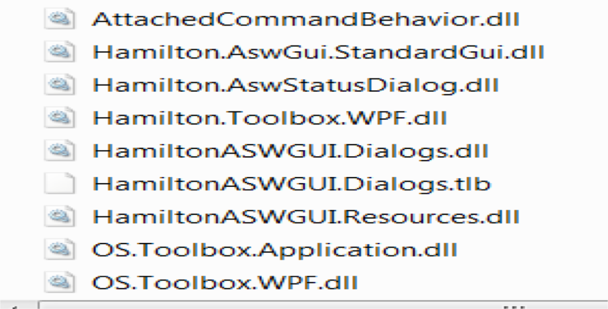
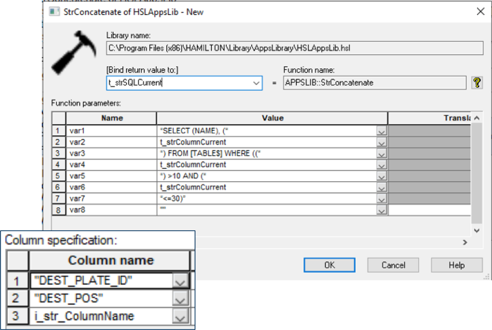
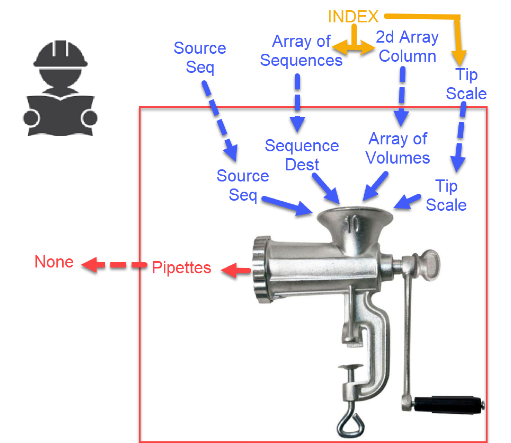
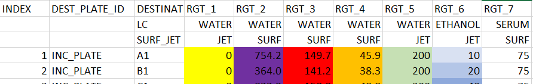
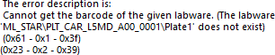

# Deprecated Functions

These Library functions are deprecated since version 3.0:

 GetEnvironment

 SetEnvironment

 GetSetEnvironment

 StackerConfigurationSet

&#x20; GetBarcodeScanHeight

&#x20; SetBarcodeScanHeight

 SetBarcodeReadHandling

 Inventory

 PartialInventory

 ImportPlate

 ExportPlate

 GetShakerStatus&#x20;

 GetShakerSpeed&#x20;

 SetShakerSpeed

 GetMultipleShakerSpeeds&#x20;

 SetMultipleShakerSpeeds&#x20;

 StartShaker

 StopShaker&#x20;

 OpenGate

 CloseGate

 RotateSwapStation

 GetSwapStationState

 SetTransferStationSensorHandling  MoveTransferStation

 GetTransferStationState &#x20;

 ReadDataMemory

 WriteDataMemory &#x20;

 ReadBarcode

 GetConfiguration
