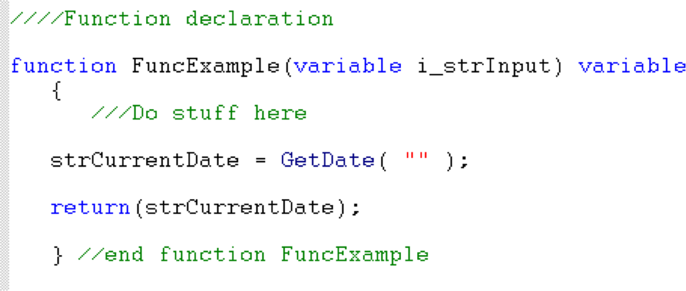

# Chapter 2: Automation Interface

This SoftMax Pro Software automation interface is a Microsoft .NET Framework assembly that you can use with any .NET Language (C#, Visual Basic, etc.).

The following illustrates the automation interface API components.

The .NET assembly SoftMax Pro Automation Client supplies the automation interface that controls the SoftMax Pro Software. This automation interface supports commands that trigger the event handlers to notify the automation interface application of the status of the SoftMax Pro Software, execute queued commands, and display errors. The applications you use to control the SoftMax Pro Software via the automation interface must connect through the Automation Client.

The Automation Client connects to the Automation Server that is included in the SoftMax Pro Software. The Automation Server maintains a queue of commands that are sent through the Automation Client and executes these commands sequentially.

Commands are sent to the SoftMax Pro Software by calling functions in the automation interface (the client). Commands in the automation interface are asynchronous so that the functions return control to the application immediately.

Command results and errors are obtained by subscribing to events on the automation interface. The Automation Server and the Automation Client are both multi-threaded:

 The client sends commands and the server receives the commands on one thread.  The server publishes events and passes the events to the client on a second thread.
