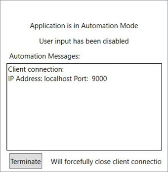
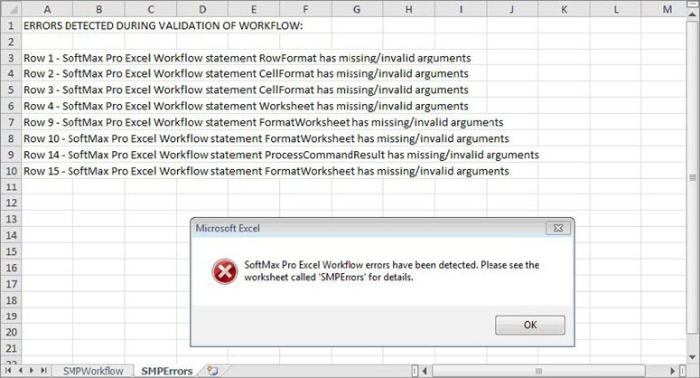

# Troubleshooting Excel Workflows

Do the following to troubleshoot the Excel workflows:

 (1).png>) Make sure the SoftMax Pro Excel Add-In is enabled in Excel.

 (1) (1) (1) (1) (1) (1) (1).png>) Make sure the SoftMax Pro Software is started and the Automation Mode dialog does not display.

 (1) (1) (1) (1) (1) (1).png>) If a formula entered in the workflow evaluates before it is run enter with a single quotation mark prefix.

For example, instead of entering =SUM(A1: A5) enter '=SUM(A1: A5).

**Workflow Errors**

Errors that the workflow detects display in the SMPErrors worksheet.

Check for additional error messages in the SoftMax Pro Software Automation Mode dialog under Automation Messages. This dialog reports errors that the workflow might not report.
