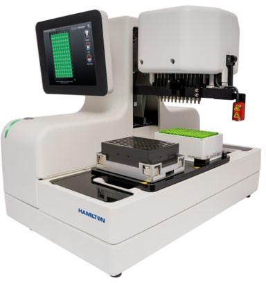

# Workflow Flow Control Statements

Workflow flow control statements allow the workflow to repeat a section of statements or pause until a given condition is satisfied. In the provided example, Workbooks control statements are color coded gray.

 (1) (1).png>) Loop and EndLoop Statements (see below)  (1) (1).png>) Pause Statement, see page 42

 (1) (1).png>) WaitUntil Statement, see page 43

### Loop and EndLoop Statements

The Loop statement and the EndLoop statement allow you to repeat a series of workflow statements a fixed number of times. Loop marks the start of the series and EndLoop marks the end of the series.

.png>)

**Note:** Loop and EndLoop statements should always written in worksheet column A to make them easy to detect. All other statements are written in worksheet column B.

### Arguments

Loop has one argument:

.png>) The number of times the series of statements should be repeated. EndLoop has no arguments.

### Defaults

No default values.

### Example

This example describes the series of statements between Loop and EndLoop repeats five (5) times. The SetTemperature and OpenDrawer statements execute once each.

 (1).jpeg>)

### Pause Statement 

The Pause statement pauses workflow execution for a fixed number of seconds. When the workflow pauses a dialog displays.

.jpeg>)

### Arguments

Pause has one argument:

 (1).png>) The number of seconds the workflow should pause

### Defaults

No default values

### Example

The Pause within the Loop pauses the workflow for 300 seconds (5 minutes) after each read.

.jpeg>)

### WaitUntil Statement 

The WaitUntil statement pauses workflow execution until a given condition has been satisfied. A dialog displays the condition that needs to be satisfied to allow the workflow to continue.

### Arguments

WaitUntil has four arguments:

 (1) (1) (1) (1).png>) Automation Command

This command must return a result that can be tested in combination with the second and third arguments.

.png>) Operator

This can be one of the following values:

.png>) EQ meaning equals .png>) LT meaning less than

.png>) GT meaning greater than

 (1) (1) (1).png>) LE meaning less than or equals

 (1) (1) (1).png>) GE meaning greater than or equals  (1) (1) (1).png>) Target Value

The target value against which the result from argument one is tested.

 (1) (1) (1).png>) Description

This gives the reason the workflow is waiting and displays while the pause is in effect. This optional argument makes the wait reason more descriptive by adding context or using a local language.

### Defaults

If a description argument is not supplied the first three arguments are concatenated into a default description.

### Examples

The following WaitUntil statement pauses until the instrument incubator is equal to, or greater than, 36 degrees.

.jpeg>)

While the workflow pauses the following dialog displays.

The following WaitUntil statement pauses until the instrument drawer closes.

.jpeg>)

While the workflow pauses the following dialog displays.
