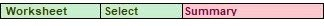
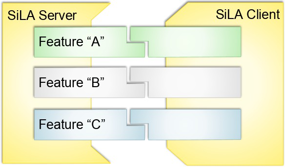

# Worksheet Statement

The Worksheet statement creates a new worksheet and then selects a worksheet. As the workflow adds each worksheet, the new worksheet is automatically selected. Other worksheet formatting statements use the selected worksheet.

### Arguments

Worksheet has two arguments:

.png>) Operation

This is either one of two values:

 (1).png>) Select  (1).png>) Add

.png>) Name (optional)

This is the name of the worksheet to select or add.

### Defaults

If you do not give the Name argument, a new worksheet is added with the name Sheet\<n> where \<n> is the lowest number available to create a new worksheet with a unique name in the workbook.

**Worksheet Statement Examples**

Create a new worksheet named Summary:

Select an existing worksheet named Summary:

Add a new worksheet named Sheet1 in an almost empty workbook:

Add a worksheet named Sheet3 in a workbook that already has worksheets named Sheet1 and Sheet2:

Before the application writes to a worksheet, you must have the workflow define the format in which to write data. There are two statements that enable you to define the write format:

.png>) CellFormat Statement (see below) .png>)RowFormat Statement, see page 36

### CellFormat Statement

The CellFormat statement defines the format in which to write data into one Excel worksheet cell. Use the CellFormat statement in conjunction with the following two workflow statements:

.png>) FormatWorksheet Statement, see page 39

.png>) ProcessCommandResult Statement, see page 40

### Arguments

CellFormat has up to four arguments:

.png>) Format Name - This must be unique within the workflow. Both the FormatWorksheet and ProcessCommandResult statements reference this name.

.png>) Target Worksheet Column - Defines which worksheet column to write into in the following format: worksheet-name:worksheet-column or worksheet-column

If you specify only the worksheet column, the worksheet row to use is determined to be the next empty cell in the column, working down from the top of the target worksheet.

.png>) Row Number (optional) -Allows output to write to a specific row. If omitted, the output writes to the next free row in the target column. This ensures headings are written out only once in discontinuous reads.

&#x20;Cell Content (sometimes not required, see defaults below) - Defines what writes into the worksheet column. When you write an Excel formula (e.g. '=Sum(A1:A5)' you can use the following keywords and this is substituted immediately prior to the formula being written to a worksheet,

&#x20;\#Column - The workflow keeps track of where it writes plate data into a worksheet. You should use this keyword in conjunction with the FormatWorksheet WriteRow statement to apply operations to whole columns of data.

&#x20;\#RowCount - This provides the number of rows that contain data values. As per #Column, you should use this keyword in conjunction with the FormatWorksheet WriteRow statement.

&#x20;\#Worksheet - This references the selected worksheet. You can use this keyword in conjunction with both the FormatWorksheet WriteRow and FormatWorksheet WriteCell statements.

A formula you enter in the workflow evaluates before it runs if you do not enter it with a single quotation mark prefix. For example, instead of entering =SUM(A1: A5) enter '=SUM(A1: A5).

### Defaults

If the you omit worksheet name from the Target Worksheet Column argument, the currently selected worksheet is used as the target for the write. See Worksheet Statement on page 29.

You can omit cell content if the value to be written to the cell is the result from a previously issued automation command. See ProcessCommandResult Statement on page 40.

This example describes how to write the word “Temperature” into cell D1 of the Excel worksheet, that is selected when a subsequent FormatWorksheet statement executes. The name of the format is MyTemperatureHeading.

The output written to Excel is highlighted in red in the following.

This example describes how to perform four Well Scan reads and write one result into each of Sheets 1 through 4. This CellFormat statement puts a reference in the Summary worksheet to the date and time recorded in each of Sheets 1 through 4.

The two most significant CellFormat arguments are interpreted as follows:  Summary:B

Write output to the next free or empty cell in column B of the Summary worksheet.  =#Worksheet!B2

The information that writes into column B where #Worksheet is the name of the active worksheet, for

example, Sheet1.

The output written to Excel is highlighted in red in the following.

This example describes how to perform four Well Scan reads and write one result into each of Sheets 1 through 4. This CellFormat statement puts the calculated mean value of each point in a well, for one read, into the Summary worksheet.

The two most significant CellFormat arguments are interpreted as follows:

&#x20;Summary:B

Start writing write output to the next free or empty row starting in column E of the Summary worksheet.  =Sum(#Column)/#RowCount

The SoftMax Pro Software tracks where acquired data has been written in each worksheet, which

allows the workflow to substitute the #Column and #RowCount with real values that match the active worksheet. The substitution displays in the ‘fx’ cell in the following figure.

The output written to Excel the final time through the loop is highlighted in red in the following.

### CellFormat Statement Example 4

When subsequent ProcessCommandResult statements reference MyTemperature, they write the returned value of the last executed automation command into the first blank cell in Column D of the Excel worksheet that is selected when the ProcessCommandResult executes.

The output written to Excel is highlighted in red in the following figure.

Instead of writing a standard Excel formula to Column C of the selected Excel worksheet, the following statement writes in a call to a custom Visual Basic function called ElapsedTime. See Custom Excel Formulas on page 45.

The output written to Excel is highlighted in red in the following figure.

The RowFormat statement allows you to write a plate of data as a row in an Excel worksheet. It also allows you to write ancillary information related to plate data, such as well names (A1, A2, and so on) and Group Name Assignments (Control, Unknown, and so on). Use the RowFormat statement in conjunction with the following workflow statements:

&#x20;FormatWorksheet Statement, see page 39

&#x20;ProcessCommandResult Statement, see page 40

As the automation command GetDataCopy returns a date followed by the well data, the simplest, default form of this command formats that data. See RowFormat Statement Example 1 on page 37.

### Arguments

RowFormat has a variable number of arguments.  Format Name

This must be unique within the workflow. Both the FormatWorksheet and ProcessCommandResult statements reference this name.

&#x20;Start Column (optional)

RowFormat always writes to the currently selected Excel worksheet.

&#x20;Row Number (optional)

Allows output to always be written to a specific row. If omitted, the output is written to next free row in the target column. This ensures headings are written out only once in discontinuous reads.

&#x20;Row Contents (optional)

The number of subsequent arguments is variable. There are three keywords you can use to control what is written in a row:

&#x20;Date/Time: This causes the Date/Time to be written.

&#x20;Wells: This causes the well related information to be written. For example, 96 columns of data in a 96-well plate.

&#x20;Blank: This leaves a column in the row blank, typically to be populated with a CellFormat related entry such as temperature or elapsed time.

### Defaults

If no Start Column is given, then the row starts to write in Column A.

If no Row Contents are given, then the default is Date/Time followed by Wells.

For a full workflow that uses default RowFormat values, see RowFormat Statement Example 1 on page 37.

This example displays the simplest definition of a RowFormat statement where all default values are taken. The worksheet heading line (row 1) and the data itself (rows 2 through 10) use the same row format.

This complete workflow creates the following Excel worksheet data file from one nine-point well scan read that uses the instrument simulator.

This example describes how the RowFormat statement starts writing rows of data in column C and leaves a blank column between the date/time and the well data.

This complete workflow creates the following Excel worksheet data file from five endpoint reads that use the instrument simulator.

After you have the workflow define the write format, the following statements allow you to have the workflow write the data to the worksheet. The section describes how to write fixed values, calculated values, and acquired data to a worksheet.

When writing into an Excel worksheet there are two types of write statements:  FormatWorksheet Statement (see below)

ProcessCommandResult Statement, see page 40

### FormatWorksheet Statement

The FormatWorksheet statement writes fixed or calculated values to a worksheet. The running instance of the SoftMax Pro Software does not directly provide data for this type of write.

Examples include writing worksheet column headings and writing Excel formulas into worksheet cells.

### Arguments

FormatWorksheet has two arguments:

&#x20;Type of Write

This is either one of two values:

&#x20;WriteCell  WriteRow

&#x20;Name of Format

&#x20;If the first argument specifies WriteCell this argument must reference a previously defined CellFormat.

&#x20;If the first argument specifies WriteRow this argument usually references a previously defined RowFormat. The exception is when a formula that uses keywords appears in a CellFormat. See CellFormat Statement Example 3 on page 33.

### Defaults

No default values

### Examples

See CellFormat Statement on page 30 and RowFormat Statement on page 36.

### ProcessCommandResult Statement 

The ProcessCommandResult statement takes data that is returned from a SoftMax Pro Software Automation API command and writes it into a worksheet.

Examples of commands which return data are GetTemperature, GetGroupNameAssignments, and GetDataCopy.

The last automated command that executes prior to the ProcessCommandResult statement is the command that is processed.

For descriptions of and parameters for the automation commands, see SoftMax Pro Automation Commands on page 49.

### Arguments

ProcessCommandResult has two arguments:

&#x20;Type of Write

This is either one of two values:

&#x20;WriteCell  WriteRow

&#x20;Name of Format

&#x20;If the first argument specifies WriteCell this argument must reference a previously defined CellFormat.

&#x20;If the first argument specifies WriteRow this argument this must reference a previously defined RowFormat.

### Defaults

No default values

### Examples

See CellFormat Statement on page 30 and RowFormat Statement on page 36.
