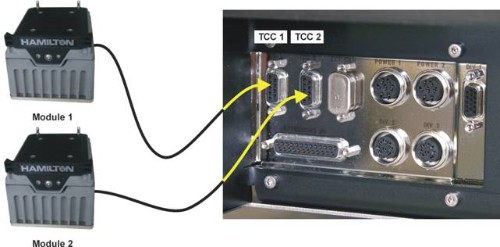

# Venus Advanced Module 1 Device Error Handling rev2022.04.28

### Device Types

.png>)

* FIRST PARTY – Provided/Branded by Hamilton
  * Typically, but not always OEM (Original Equipment Manufacturer)
* SECOND PARTY – Client’s named/branded product
* THIRD PARTY – product not made by either Hamilton or Client
* First Party devices are always provided with drivers, for 2nd or 3rd, drivers may already be available already, or could be developed (may involve sales)

## Installation Considerations

### Drivers and Firmware

.png>)

*
  * Device Drivers _generally_ need to be installed for the OS to communicate
  * Importing/Exporting methods will copy the library functions, but will cause errors if the driver is not installed. <_**Invalid class string>**_ is common.
  * Save all installations in the Hamilton folder, backup and be ready for system re-build
  * Drivers/Libraries may be tied to the FIRMWARE of the device

### Hardware Installation

.png>)

* Always read manuals and Help files provided **first**
* NEVER change cabling when instrument or device power is on!
* If device has DIP switch, ensure proper setting before final installation.
* Use Windows Device Manager to check or reassign USB Com ports if needed
  * Be careful of USB : Serial converters – identical converters in use may swap forced port #’s
  * Check **USB power settings** to make sure the ports remain on during inactivity.
* _Both the device itself and COM PORT may contribute to the device address_
* TCC (Serial) Ports on the left side of the STAR series
* Never connect to these ports with the STAR powered on!!

* If the device has movement/inertia, make sure it is suitably fixed to the deck
  * Example: Integration hardware on a Multiflex 7T Carrier

.png>)

## Parameters & Return Values

### Library Functions

* INPUT parameters
  * Instrument / Device ID / Com Port Generally needed
  * Conditions (processing time, temperature)
  * **Read Help Files**: parameters of the wrong type (integer instead of float), may trigger an error message
* OUTPUT parameters
  * Depending on library structure, may not be present
  * Where Return Value = Success Pass/Fail or code, provides “Get” style info
* Return Values
  * Where Pass/Fail/code returns are **not** used, often provides the result of the function (Observed Temp, status, etc.)

### Example: HHS Create USB Device

.png>)

* Command to Connect and Initialize an HHS
* INPUT parameters
  * **\[1]** Com Port (**int**)
* OUTPUT parameters
  * **\[2]** Generated device number - used in subsequent commands to control this device
* Return Values
  * Returns an error code

### Example: HHS Start Temperature Control

.png>)

* INPUT parameters
  * **\[1] deviceNumber** from the create USB command
  * **\[2] temperature** desired
  * **\[3]** Wait for Temp
    * 0 = don’t wait
    * 1 = wait
* OUTPUT parameters
  * None
* Return Values
  * Returns an error code

### Example: HHC Connect

.png>)

* Command to Connect to one or multiple HHCs
* INPUT parameters
  * **\[1]** Com Port (str)
  * **\[2]** Time to maintain settings after disconnect
* OUTPUT parameters
  * **\[3]** Device Index
  * **\[4]** Array of Device Serial Numbers (Used in subsequent commands to control individual devices)
* Return Values
  * Boolean pass/fail return

### Example: HHC Set Temperature

.png>)

* INPUT parameters
  * **\[1]** Individual device serial number
  * **\[2/3]** Min and max temperature range
  * **\[4]** Target temperature
  * **\[5]** Wait for temperature yes/no
  * **\[6]** Time (sec) to wait for temp
* OUTPUT parameters
  * None
* Return Values
  * Boolean pass/fail return

## Error Responses

* **Return** and **Output** values
  * May not even be traced within the library!
  * Little to no consistency – “0” or “1” = Pass? Fail? Specific code?
* **Conditional statements** – IF the return value reports an error, what should be done? Repeat? Wait? Inform the Operator?
* Sub-Methods and SMT’s
  * Useful for interpreting Device Codes, and providing User Dialogs where needed
  * Can be used to isolate a repeated function (repeated calls / infinite loop)

### Exit Considerations - Device Monitoring and Retries

* Some tasks take **TIME**
  * Processing condition reached (temperature equilibration, centrifuge wind-down)
  * Extra applications may slow down COM speed
* **STATE LOSS** – may occur for some errors:
  * Instrument jams, presence check failed, lost communication
  * Unable to process additional commands (may mask underlying errors)
  * May require user interaction
  * Often requires re-initialization

#### Loop Monitoring

* Count off retry attempts
* Monitor parameters for trend (heating/static)
* “Close enough” conditions (within -5°C target temperature)

### Exit Considerations - Device Error Handling Testing

.png>)

* Use “SIM” mode of driver if available, if not, exclusion of steps may be needed
* Insert “**Dev testing**” logic
  * IF in a loop, generate “fake” error code on Loop counter 1 only
  * Remember to remove these errors! Put in labeled Groupings that are searchable

### Example Structure - MPE Error Handling for Unknown Conditions

.png>)

* MPE applies a uniform air pressure across plate to push samples through a filter, either to waste or collection, for a given time and pressure (Control Point, CP)
* Device can tell when wells are still blocked (Usually)
* Client’s Project had wildly different CP needs per well – high error rate for complete processing
* Sub-Methods used for most commands

### Device Test Methods

Creating a Device Test Method

.png>)

* Good Programming practices suggest having a **test method** dedicated to each device, independently
* Use to determine issues with main (usually complicated) production method
* If required, “fill out” the test method with ranges of inputs, generate outputs and use as a device operational check used during **periodic maintenance**
