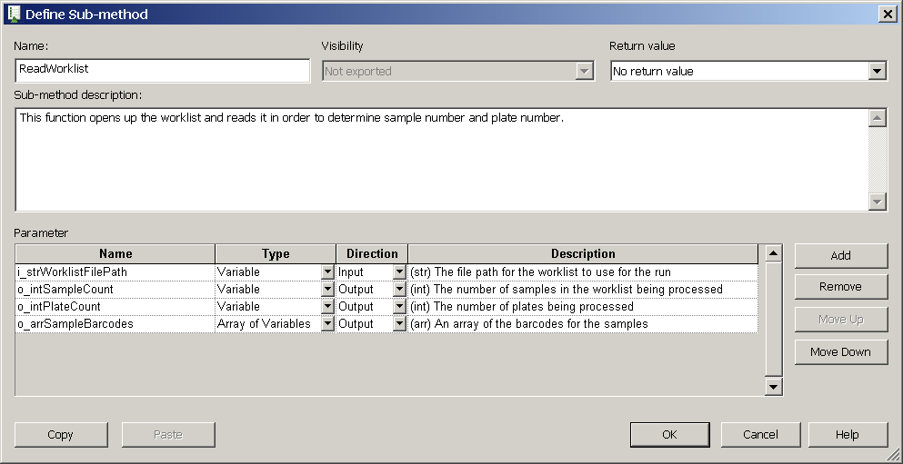
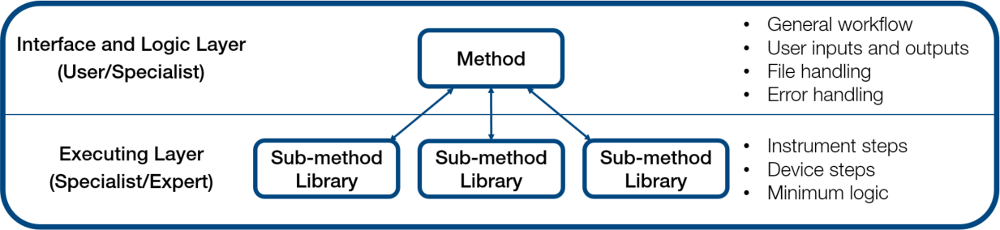
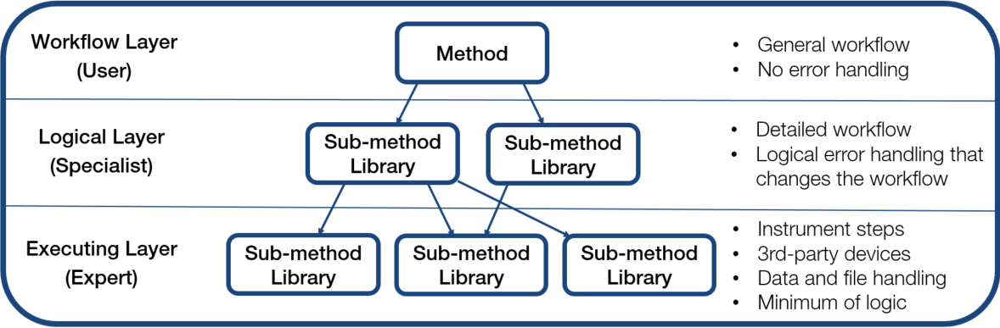

# Guidelines for Programing a Venus Method

<table data-header-hidden><thead><tr><th width="145"></th><th></th></tr></thead><tbody><tr><td></td><td>
NOTE

Each programmed method has to be validated by the programmer.

Note that the methods developed for one particular instrument and configuration do not automatically fit to another instrument or configuration. It might be necessary to make adaptations due to differences in hardware. Please validate imported methods on the target instrument as well.
</td></tr></tbody></table>

## 1. Keep it Simple

**Refrain from adding more than what the workflow requires.** Every additional feature adds complexity and test effort, which increases the scope of the project and its risk of possible error.

To aid in the simplicity of coding, **Standard Libraries** offer additional functionality without the use of multiple steps in your method, utilizing these libraries can enhance the capabilities of your method while retaining simplicity:

Standard Libraries

**When libraries are required, begin by using default libraries included with the software.** If additional functionality is needed, then utilize Application Software (ASW) and Hamilton Standard Language (HSL) Extension libraries. If necessary, user-created libraries that have been vetted and posted on knowledge bases may also be used.

**Refrain from using personal or custom libraries.** If any existing libraries are missing features, consult with management and colleagues to include these features in future revisions or new libraries. Test any new libraries thoroughly and create a help file for the library before Implementing into methods or distributing.

**Refrain from developing libraries that deviate from the Vector development environment.** Libraries that use a batch file, Python script, Microsoft Excel VBA, or other external formats to perform data or sequence manipulation should be used only when necessary. Methods that use these libraries must be documented using comments and help files.

**Limit the use of libraries that require a separate installer.** Using such libraries, while sometimes unavoidable, can complicate sharing methods via the default export function, since the additional installers must also be shared and run before using the method.

For most small projects, the use of a “one-layer” structure (a method with sub-methods) is enough to organize a method. Functions like grouping and commenting are still recommended for one-layer methods.

For more complex projects, adding sub-method libraries or additional layers might be required to keep the method organized:

Sub-Methods

One way to organize methods with multiple lengthy transfer steps is to separate sections into sub-methods. This approach allows for better readability and clarity of the method.

Refrain from creating sub-methods with lots of parameters. In general, sub-methods and sub-method library functions should be limited to a maximum of 8 input/output parameters. Sub-method libraries should also be limited to 20 functions. Sub-methods should be annotated with descriptions and include acceptable expected input ranges and output values.

Sub-method libraries should include a return value to indicate success/fail. The return could be a Boolean value for success/fail or an error code value if the function is for a device command.

As with variables, use a short description in Pascal case to name each sub-method. In general, use no more than four words to keep the name concise.

Refrain from using underscores unless needed to interrupt the order that the sub-methods are arranged.

.png>)

All sub-methods should implement and trace the name of the sub-method and indicate the start and end of the function. See below for example code that can be re-used for any sub-method:

Example code to include at the start of the sub-method:

.png>)

Example code to include at the end of the sub-method:

.png>)

In rare cases, a three-layer structure may be required: a workflow layer with the method that is visible to the user, a logical layer with sub- method libraries visible to the specialist, and an executing layer of the low-level commands for control that are visible to the expert.



<figure><figcaption></figcaption></figure>



<figure><figcaption></figcaption></figure>



***

## 2. Avoid Copy/Paste Programming

Copying and pasting repeated steps can lead to lengthy methods with improper settings. If steps must be repeated, consider using loops or sub-methods instead.

***

## 3. Manage Data Programatically

Introduce programing concepts such as Variables, Timers, and Input/Outputs:



Variables are necessary for making a dynamic and user-friendly program. However, variables should only be used for values that are repeated or that can change. Otherwise, fixed values should be used.

* Variables should be defined at the beginning of the method or in a local sub-method for quick access.
* Once a variable is declared, refrain from typing it out in all other parameter input fields. Instead, select the variable from the drop-down menu. This approach helps prevent the addition of mistyped variables.
* Do not use the Variable window to set starting values. This window is not visible by default when starting VENUS, which can cause confusion when it contains variable assignments.
* The scope of variables should be as small as possible. Avoid using global variables. Exceptions may include sub-method libraries and scheduler methods.
* The scope of a variable indicates its visibility and usage in or across methods and sub-methods. There are three main scope types:

<table data-header-hidden data-full-width="false"><thead><tr><th></th><th></th></tr></thead><tbody><tr><td>Task-Local</td><td>The variable is visible in the main method and its sub-methods</td></tr><tr><td>Local</td><td>The variable is visible only within the sub-method where it was defined.</td></tr><tr><td>Global</td><td>The variable is visible across methods and is used by the Scheduler software and other programs.</td></tr></tbody></table>



**When implementing timers in a method during development, avoid enabling the stoppable timer option.** If left enabled, it could allow for the possibility of human error during an actual run. Instead, enable timers with a short value of 1 second when in development or simulation mode. The timer value can be conditionally assigned with a variable. This approach allows for the verification of set and wait for timer functions without having to incur the actual wait time required for the process step.\

<figure><figcaption></figcaption></figure>



Custom dialogs can greatly improve the appearance and usability of the method. The use of some visual libraries may be required for ease of use and advanced functionality.

The standard Hamilton template is a useful starting point. Use the default icons to identify alerts and statuses to the user. Adjust the dialog and font size as necessary for clarity and use the Group Box function to call out inputs and outputs more clearly.

<figure><figcaption></figcaption></figure>

When the method contains several custom dialogs in succession, include an option to allow the user to go back to previous dialogs. Allowing a user to do so improves usability, as it allows the user to correct their inputs without having to restart the method.

ASW Standard Dialogs may be used as an alternative under certain circumstances:

* The desired functionality is not available through normal custom dialogs
* The method requires a high level of standardization (such as when the method will be widely distributed)

The ASW Status Dialog can be helpful for lengthy methods with many steps and sections. The dialog provides runtime updates immediately to the user. Including this function requires more effort, but it can help with the adoption and usage of the method.

<figure><figcaption></figcaption></figure>



**Make a copy of any input files and work from the copy instead of the original file.** Working from the copy can prevent errors that could occur if the user manipulates the original file during runtime.

**Make sure that folders for any output files have suitable access rights.** The Hamilton\Logfiles folder is a good default, since the VENUS software must have read/write access to that folder to function properly. If the output file must go to a network or other location, save the file to the Logfiles folder first, then make the copy to the destination folder. This approach helps ensure the original copy will always be created and recovered in case the copy command encounters a conflict.

**When using default File handling commands in VENUS, incorporate the Error Handling by the User function to capture any error that results in a type cancel.** The use of this function allows the programmer to provide a more informative and clear user output upon error and the ability to try again.



***

## 4. Make it Robust

* **Error Handling**: Implement comprehensive error detection and handling mechanisms for each sub-method. This ensures that if a specific sub-method fails, the system can manage it gracefully without affecting the entire workflow. This can include try-catch blocks, proper logging of errors, and user notifications where necessary.
  * **Avoid Out-of-Bound Inputs:** Be careful with user inputs for values that could cause errors like volume exceptions or number of samples exceptions. Use confirmation checks and set ranges for variables whenever possible prevent overage and errors.
  * **Be Mindful of the Method Settings:** Be mindful of the values used for settings like cLLD and fixed height. Refer to the Liquid Handling Reference Guide for detailed descriptions of these settings and best practices when using them.
* **Modularity**: Emphasize the importance of making each sub-method modular. This will allow you to update or replace specific components without impacting the rest of the system. By ensuring each module performs only one function, debugging and updates become simpler.
* **Validation at Each Step**: In addition to final system testing, include validation checks after each step of the process. This ensures that all intermediate outputs are correct before moving to the next stage, preventing compounded errors later on.
* **User Feedback Loop**: Add mechanisms for providing real-time feedback to users, such as progress bars, notifications, or logging updates. This will help users track the program’s progress and understand where a task might be taking more time or encountering issues..

***

## ‌5. Make it Readable

Make sure the method can be easily read and interpreted by others. Use clear and concise language so that it is easily understood and meaningful to other users.

#### Naming Conventions

Variables and Labware Sequence Naming Convention

* The name of the variable should describe what it contains, along with its scope and type. For consistency, all variable names should follow a set format:\
  \
  **`[scope]_[type]VariableName`**

<!---->

*   A scope prefix is used to readily identify the scope of the variable. Local scope variables that are used as input and output parameters for functions have their own specific prefix.

    | Scope                     | Prefix |
    | ------------------------- | ------ |
    | Task-local                | t\_    |
    | Local                     | l\_    |
    | Global                    | g\_    |
    | Function input parameter  | i\_    |
    | Function output parameter | o\_    |
* A scope prefix is used to readily identify the scope of the variable. Local scope variables that are used as input and output parameters for functions have their own specific prefix.
*   **The variable type is also indicated using a prefix.**

    | Variable Type                 | Prefix |
    | ----------------------------- | ------ |
    | Integer                       | int    |
    | String                        | str    |
    | Float                         | flt    |
    | Boolean                       | bln    |
    | Object                        | obj    |
    | Array                         | arr    |
    | Pipetting Sequence            | seq    |
    | Transport Sequence            | trp    |
    | File, timer, or device handle | hdl    |
    | Other variable types          | var    |

    **For the actual name, use a short description in Pascal case (no spaces or other characters, capitalize each word). In general, use one or two words to keep the names concise)**
* Examples:
  * t\_intProcessedSamples: Task-local, integer
  * l\_strFilePath; Local, string
    * i\_fltPipettingVolume: function input, float
  * o\_arrSampleBarcodes: function output, array
  * io\_seqTips: function input and output, sequence
  * gWorkflow\_blnSimulateShaker: global, Boolean

Labware Naming Convention

* The default names for labware added to a deck are unclear, and sometimes inaccurate. Changing these names makes them more identifiable both in the method and in log files, since only the name in the deck layout is traced.

<!---->

* For example, instead of a default name like “Cos96Rd\_0001”, a name like “SourcePlate96\_01” can be used. This approach allows for easier changes to labware.

#### Code Structuring

Comments

* Using comments is a basic requirement for providing organization and clarity to a method. Use comments to separate and explain each section in the method. The function of each section should be clear to a non-programmer who reads the comments.
* Make the comments more visible by customizing the color and adding a “frame” of special characters. The color helps to visually separate the sections in the method, and the frame is helpful for separating the sections in log files.

.png>)

* Use a comment to track all version changes for a method or sub-method library that includes a short description and its version history.

.png>)

* Most comments should be traced to the log file, especially comments that separate different sections in a method or sub-method. Comments that are used to explain steps to other users do not need to be traced. For example, include untraced comments for math operations, sequence manipulation, and complex file handling.\
  .png>)

Group Related Steps

* Grouping helps organize methods by collapsing sections of related steps. Use grouping to hide complex sections or long lists of variables.

.png>)

* Differentiate groups by assigning different icons from those available in the Hamilton\Graphic folder. For example, use the assignment icon for groups of variables, or the barcode icon for barcode matching logic.
* Keep in mind that grouping is not a substitute for comments. Use comments in addition to grouping to clearly indicate and trace different sections of the method.

#### Code Traceability

Tracing Using Output Logging

* Using trace commands is a basic requirement for easier support and troubleshooting.
* Each instrument automatically traces some instrument functions, but many programming tasks are not traced by default. To ensure a complete record of the program’s execution, trace functions must be manually added.
* In general, always trace the following:
  * Variables
  * Comments
  * Sequences made or sorted during runtime
  * Arrays
  * Sub-method function name

<!---->

*   Make the traces more visible by tracing multiple variables in one command and by inserting special characters:\

    <figure><figcaption></figcaption></figure>

<!---->

* Use different trace modes when necessary. For example, certain trace functions provide a debugging mode which produces a lot of entries in the log file. This level of detail is helpful for troubleshooting, but not necessary for routine use.

There are multiple trace libraries, some of which are included with the software by default. It is recommended to use the ASW Trace Level Library as it offers the most robust functionality.

#### Clutter Clean-Up

Reducing Variable Definition Clutter

* Delete any unused variables from the Variable window to avoid confusion while programming. Enabling Delete Unused Variables in the Method Editor also facilitates this function.\
  \
  .png>)

Clean Up Labware Sequence Definition Clutter

Remove unused sequences to avoid clutter and confusion during programming. ‌

***

## 6. Develop the End User Experience

Hamilton’s VENUS software is not intuitive to navigate on its own. The editors provide little direction once they are opened, and existing files are saved by default to directories that can be difficult to find. The use of a graphic user interface (GUI) can help organize method files and provide a more intuitive interface for the user.

Several GUIs are available, such as the Hamilton Method Manager 2 and the Application Launcher. These GUIs require their own installers, which are located in the online Resource Center. For methods used with a formal product, a formally released and version-controlled GUI software must be used.

#### Method Manager 2

Hamilton Method Manager is a desktop application that is intuitively designed to simplify user interactions with VENUS. This latest version allows one to launch and organize methods, access editors and folders, and manage log files more effectively. This version has more modern Hamilton branding and support for full/widescreen views and touch screens.

<figure><figcaption></figcaption></figure>

#### Application Launcher

The Application Launcher is a program that offers a list of shortcuts to run VENUS methods for the STAR, NIMBUS, or Microlab VANTAGE. Pre-set and customizable icons can be configured for each method. Different command line options can be set to control the execution of the called program.

<figure><figcaption></figcaption></figure>

When using NTRs, plate stacking, or specific plate or tip mapping, consider using Visual libraries. These libraries include a GUI component during runtime, but also offer advanced functionality to control and manage labware and sequences.

<figure><figcaption></figcaption></figure>

***

## 7. Choosing the Right Tool For the Job: Pipetting Precision&#x20;

Depending on your application and method requirements, different tips might be needed for different volumes. Each tip and volume must be matched for precision and accuracy/trueness while maintaining the constraints of the method.

### Pipetting Specifications of Disposable Tips for the STAR Line

<table><thead><tr><th width="226">Disposable Tip Size</th><th width="106">Dispense</th><th width="90">Volume</th><th width="158">Trueness (IRI %)</th><th>Precision (CV %)</th></tr></thead><tbody><tr><td>10µl</td><td>Surface</td><td>0.5µl</td><td>10.0%</td><td>6.0%</td></tr><tr><td></td><td>Surface</td><td>1µl</td><td>5.0%</td><td>4.0%</td></tr><tr><td></td><td>Surface</td><td>5µl</td><td>2.5%</td><td>1.5%</td></tr><tr><td></td><td>Surface</td><td>10µl</td><td>1.5%</td><td>1.0%</td></tr><tr><td>50µl</td><td>Surface</td><td>0.5µl</td><td>10.0%</td><td>6.0%</td></tr><tr><td></td><td>Surface</td><td>1µl</td><td>5.0%</td><td>4.0%</td></tr><tr><td></td><td>Surface</td><td>5µl</td><td>2.5%</td><td>1.5%</td></tr><tr><td></td><td>Jet</td><td>50µl</td><td>2.0%</td><td>0.75%</td></tr><tr><td>300µl</td><td>Surface</td><td>10µl</td><td>5.0%</td><td>2.0%</td></tr><tr><td></td><td>Jet</td><td>50µl</td><td>2.0%</td><td>0.75%</td></tr><tr><td></td><td>Jet</td><td>200µl</td><td>1.0%</td><td>0.75%</td></tr><tr><td>1000µl</td><td>Surface</td><td>10µl</td><td>7.5%</td><td>3.5%</td></tr><tr><td></td><td>Jet</td><td>100µl</td><td>2.0%</td><td>0.75%</td></tr><tr><td></td><td>Jet</td><td>1000µl</td><td>1.0%</td><td>0.75%</td></tr></tbody></table>

***

## 8. Quality Control and Water Runs

The testing phase is a crucial step in developing any liquid handler method, especially for Hamilton Venus liquid handlers, as it ensures the reliability and accuracy of the entire protocol. Conducting water runs—test runs using water instead of reagents—is an essential component of this phase. These runs allow you to validate all aspects of the protocol in a controlled environment, significantly reducing the risks of wasting reagents, damaging equipment, or producing inaccurate results. Below are the key aspects of testing and how they ensure a robust method:

1. **Verification of Liquid Transfer Volumes**:\
   One of the primary objectives during testing is to ensure that the liquid handler is accurately transferring the intended volumes. Water runs allow you to observe whether the system is aspirating and dispensing the correct volumes, particularly when working with critical reagents that could affect experiment outcomes. The transferred volumes should match the specified protocol requirements to ensure that no under- or over-delivery occurs, which could lead to skewed data or failed assays.
2. **Validation of Liquid Classes**:\
   Liquid classes in Hamilton Venus define how different types of liquids behave in the system, such as viscosity, surface tension, and aspiration speed. Testing ensures that the liquid classes are properly defined for the various reagents, solvents, or water being handled. This is critical because incorrect liquid class parameters can result in incomplete transfers, bubbles, or even cross-contamination. Water runs should simulate the behavior of actual reagents to verify that the parameters are appropriate for each class.
3. **Prevention of Crashes and Fatal Errors**:\
   Testing also involves running full simulations of the protocol to check for potential robotic crashes or fatal errors that could occur during method execution. This includes ensuring that all labware positions are accurately defined and that pipetting and movement paths are clear. Robotic crashes, whether from misaligned labware or improper liquid level detection, can lead to downtime, equipment damage, and loss of samples. By carefully observing water runs, you can prevent such crashes by making adjustments to the coordinates or liquid handling parameters.
4. **Liquid Level Detection**:\
   Proper implementation of liquid level detection is critical to prevent bottoming out on labware or causing robotic crashes. During water runs, this feature can be tested and optimized to ensure that the pipette tip detects the liquid surface accurately without plunging too far into the liquid. Poor liquid level detection can lead to over-aspiration, insufficient volume pickup, or physical damage to the pipette tip and labware. Additionally, testing should ensure that the liquid handler adapts to varying liquid levels in different containers, especially when liquid volumes decrease during aspirates and dispenses.
5. **Tracking and Error Logging**:\
   During water runs, it is essential to implement error logging and tracking mechanisms to capture any anomalies or deviations from the expected behavior. This includes logging missed aspirations, pipette tip crashes, or discrepancies in liquid levels. Error logs provide valuable insights for diagnosing issues and ensuring the method runs smoothly in a real scenario. Regular review and analysis of these logs can help refine the method and address potential problems proactively.
6. **Robustness Across Different Labware**:\
   The versatility of the Hamilton liquid handler allows for the use of a variety of labware types. Therefore, it is important to test the protocol on multiple labware configurations, ensuring that volumes are transferred correctly and liquid levels are detected consistently regardless of the type or size of labware being used. This reduces the risk of method failure due to incompatibility with specific labware configurations.
7. **Simulation of Real-World Scenarios**:\
   Water runs should also simulate real-world conditions, such as multiple transfers, pauses between steps, and handling different types of liquids (via modified liquid classes). By introducing these variables, you can anticipate potential errors in the method’s operation and adjust the protocol accordingly before moving on to the actual reagents. This will ensure the method’s robustness across a range of operational conditions and laboratory environments.

***

## 9. Version Control

Following a naming convention schema ensures proper sorting and readability while tracking version history across the development lifecycle.

#### Naming Convention Structure:

`YYYYMMDD_programName_X.Y.Z-Phase`

#### **Date Format (YYYYMMDD)**:

* Every version name will begin with the date in **YYYYMMDD** format, corresponding to the first date of the change at the Y level.
* This ensures that files are easily sortable by date.

#### **Program Name Formatting**:

* The program name should be **lowercase first word** followed by **second word capitalized**.
  * Example: `liquidHandlerControl`

#### **Versioning (X.Y.Z)**:

* **X (Major Version)**: Significant overhaul or specification changes.
* **Y (Minor Version)**: Features, modifications, and incremental updates. A new date is assigned for each new Y version.
* **Z (Patch Version)**: Bug fixes or small corrections.

#### **Development Phases (Dev, Alpha, Beta, Prod)**:

* Each version will include the appropriate development stage suffix (`-DEV`, `-ALPHA`, `-BETA`, `-PROD`).

#### Example Schema:

1. **YYYYMMDD\_programName\_X.Y.Z-Phase**
   * `20240918_liquidHandlerControl_2.1.0-DEV`: A new feature was added on September 18, 2024, in the development phase.
   * `20240918_liquidHandlerControl_2.1.0-BETA`: The same version, now in the beta phase.
   * `20240925_liquidHandlerControl_2.2.0-DEV`: A new feature added on September 25, 2024, with a new minor version (Y incremented).

#### Versioning and Date Example:

<table><thead><tr><th width="386">Version</th><th width="125">Date</th><th width="156">Description</th><th>Phase</th></tr></thead><tbody><tr><td>20240918_liquidHandlerControl_2.0.0-DEV</td><td>2024-09-18</td><td>Major overhaul of the workflow structure.</td><td>DEV</td></tr><tr><td>20240918_liquidHandlerControl_2.0.0-BETA</td><td>2024-09-18</td><td>In beta testing phase for new workflow.</td><td>BETA</td></tr><tr><td>20240918_liquidHandlerControl_2.0.0-PROD</td><td>2024-09-18</td><td>Released for production use.</td><td>PROD</td></tr><tr><td>20240925_liquidHandlerControl_2.1.0-DEV</td><td>2024-09-25</td><td>New feature added to handle liquid classes.</td><td>DEV</td></tr><tr><td>20240925_liquidHandlerControl_2.1.0-BETA</td><td>2024-09-25</td><td>Beta testing of the new liquid class feature.</td><td>BETA</td></tr><tr><td>20240925_liquidHandlerControl_2.2.0-DEV</td><td>2024-09-25</td><td>Additional feature added to workflow.</td><td>DEV</td></tr></tbody></table>

***

## 10. Document, Document, Document

Always include a sub-method which includes changes made in each new version. These documents should be concise but also include all needed information on all changes made and the locations of the changes made.

This stage is MISSION CRITICAL as errors when programing do happen, when they occur if the changes were properly documented these changes which cased any failures can be remedied quickly.
