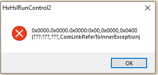

# Connect Method

Allows a connection to the Vantage CAP

## Syntax

```
function Connect(
	variable ipAddress,
	variable port
) variable
```

AddLanguageTabSet("ID0EACA");

## **Parameters**

| Name      | Type                                                                                                                                               | Description                    |
| --------- | -------------------------------------------------------------------------------------------------------------------------------------------------- | ------------------------------ |
| ipAddress | [System. AddLanguageSpecificTextSet("LST421301E3\_0?cs=.\|vb=.\|cpp=::\|nu=.\|fs=."); String](https://docs.microsoft.com/dotnet/api/system.string) | IP address of the Vantage CAP  |
| port      | [System. AddLanguageSpecificTextSet("LST421301E3\_1?cs=.\|vb=.\|cpp=::\|nu=.\|fs=."); Int32](https://docs.microsoft.com/dotnet/api/system.int32)   | Port number of the Vantage CAP |

## **Return Value**

[Int32](https://docs.microsoft.com/dotnet/api/system.int32)\
0 on success, 1 otherwise

Example

<figure><figcaption></figcaption></figure>

