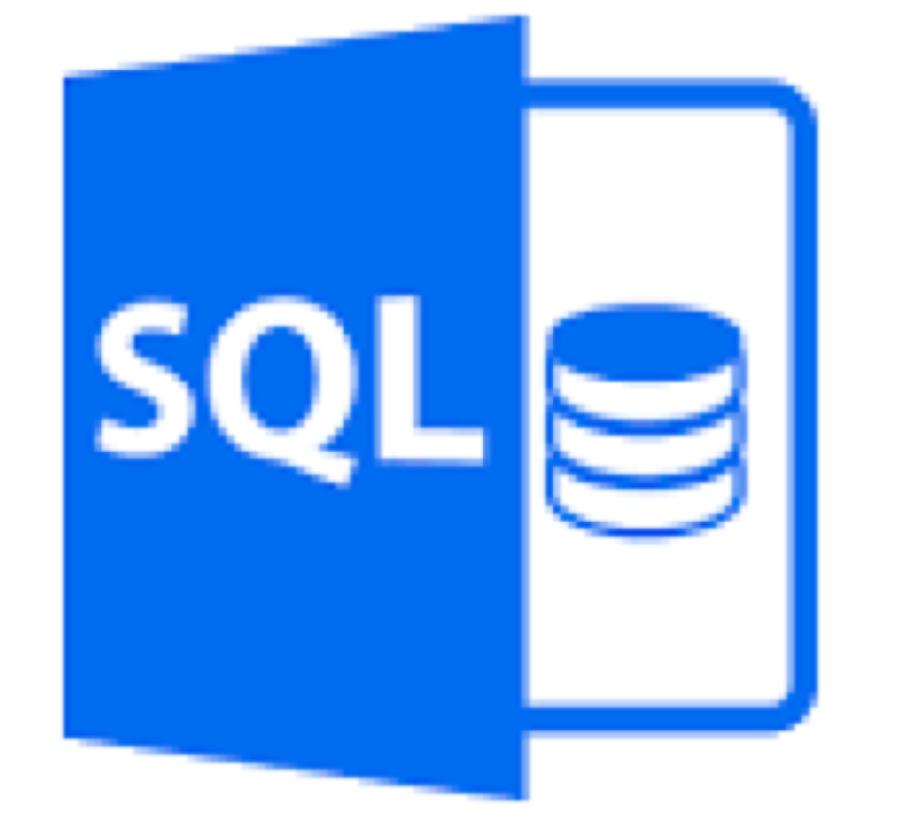
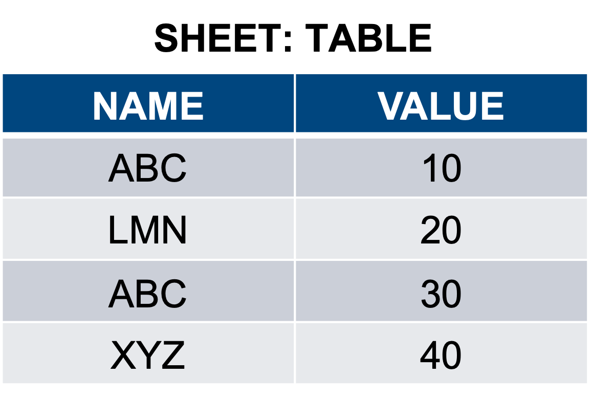
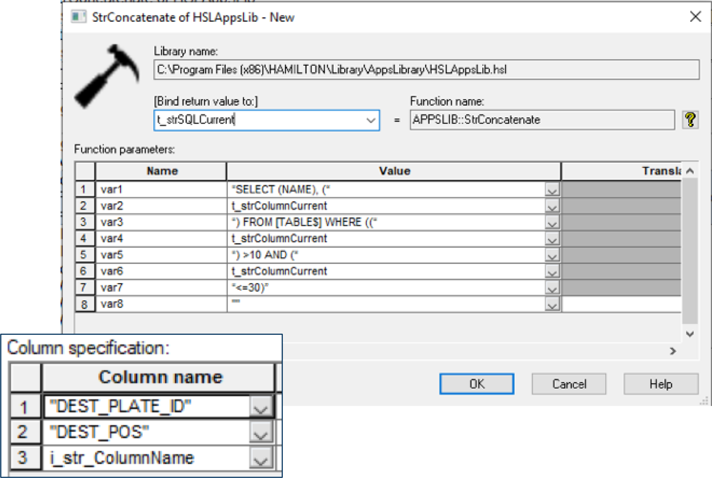
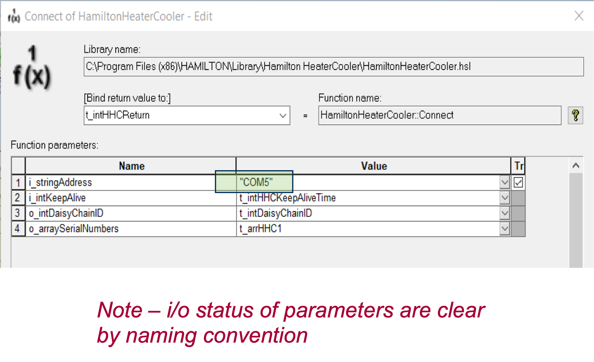
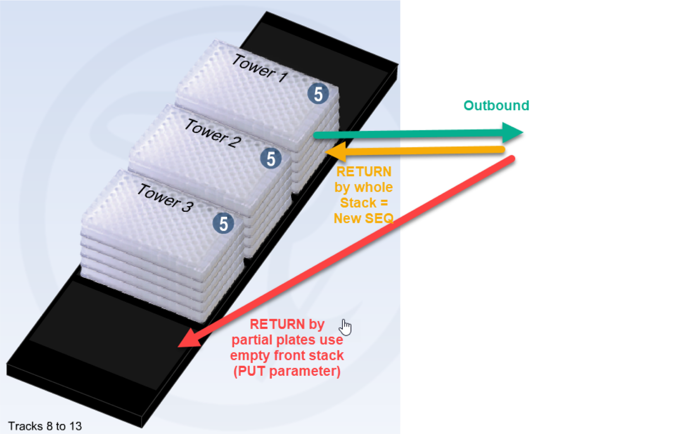

# Importing and Exporting Methods

‌Overview

Importing and exporting methods is a way of archiving and sharing methods programmed in the Hamilton VENUS software. The export process creates a compressed package file that includes the method file and associated files such as the system deck, labware, libraries, etc.

‌How to export a method

1. Open the Hamilton Method Editor
2. Open the method to be exported
3.  From the File menu, select File and select Export

    \

    
4.  Enable the checkbox “Export original Hamilton files” then select the “…”

    \

    
5.  Browse to the desired output file path and enter a name for the Package File. It is recommended to export the file to a local drive instead of a network drive.

    \

    
6. Select Save and then select Finish and the \*pkg file will be created. An output window will be displayed during the export process. When completed, select Close. The \*pkg file has been created and can be found in the specified file path.

\

‌How to import a method

1. Open the Hamilton Method Editor
2. From the File menu, select File and select Import
3.  Select the “…” under the Import Method / Library / Workflow section

    \

    
4. Select the \*.pkg file you want to import and Select Next
5. Select “Recovery” and enable the checkbox to “Import original Hamilton files”

\

7\. Select Finish and the \*pkg file will be imported. An output window will be displayed during the import process. For any file conflict, select Yes or No depending on which file needs to be overwritten. When completed, select Close. The files have been imported and can be located in the same file path as they were on the export system.

\

