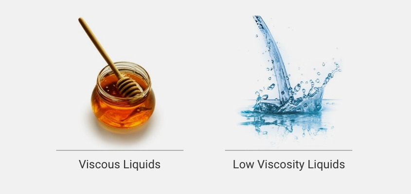
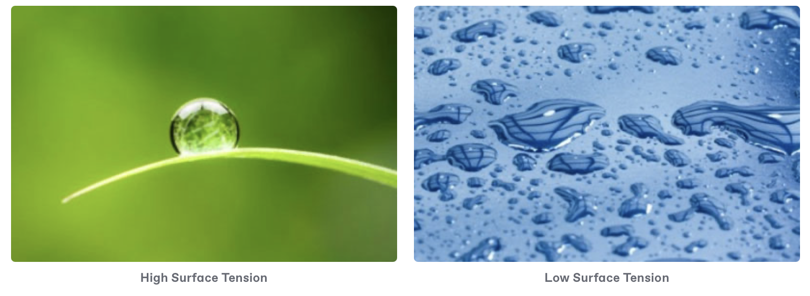

# Liquid Class Selection and Definition

## Pipetting Mechanics

<figure><figcaption></figcaption></figure>

**Under ideal conditions**

$$P_1 V_1 = P_2 V_2$$ at constant temperature.

* $$P_1$$ = initial atmospheric pressure
* $$V_1$$ = initial desired volume
* $$P_2$$ = final pressure
* $$V_2$$ = final actual volume

**Under real conditions**

Additional volume may need to be aspirated to offset the pressure head in the tip.

* Low volume pipetting

## **Know your physical properties of your liquid**



Liquid’s resistance to flow:

* Dependent upon temperature
  * As temperature increases, viscosity decreases
  * Some fluids change as much as a 10-12% cP/°C

<figure><figcaption></figcaption></figure>

**Viscous liquids** are those liquids that are less fluid-like and have a slow flow (e.g., glycerol).

* Use a lower flow rate. If you try to aspirate too quickly, suction in the tip prevents the fluid from entering the tip, resulting in inaccurate volumes.&#x20;
* Use a surface dispense mode. Jet dispensing isn’t as effective with high viscosity liquids.

**Low viscosity** liquids are those that have thin rapid flow like water.

* Use a higher flow rate. The goal is to get the liquid into the tip as fast and effectively as possible. Low viscosity liquids don’t resist entering the tip, so the flow rate can be higher.



Defining cohesive forces between liquid molecules:

* Based on capillary action
* Responsible for the shape of a droplet
* Dependent upon temperature
  * Surface tension of water decreases significantly as temperature increases

<figure><figcaption></figcaption></figure>

#### High Surface Tension Liquid

* Use a lower air transport volume.&#x20;
* Liquids with high surface tension stay in the tip and don’t require a large air buffer to hold the liquid in.&#x20;
* Use a high [**swap speed**](broken-reference) (the speed at which the system exchanges air with liquid during aspiration or dispensing) to break the connection between the liquid in the well or tube and the tip.&#x20;
* Use side touch or minimize the distance from the end of the tip and the labware to allow the liquid to be more easily removed from the tip.

#### Low Surface Tension Liquid

* Increase the air transport volume. Since the liquid wants to leave the tip, increasing the transport volume provides a greater air buffer in the tip.&#x20;
* Decrease the settling time to minimize the amount of time the tip is in contact with the liquid and prevent time for droplet formation.&#x20;
* **Low surface tension liquids** require more air buffer after aspiration to keep the liquid in the tip (e.g., ethanol).&#x20;



* Temperature changes of the pipettor and sample can affect pipetting accuracy
* 2nd largest source of error in this study
* As temperature increased, dispense volume decreased

<figure><figcaption></figcaption></figure>



* Humidity changes can affect pipetting accuracy
* If humidity increases from 20% - 80%, the pipetted volume decreases 0.3 - 2.0% for 200 uL
  * For larger volumes, error increases
* Issue with DMSO
  * Will absorb water from air
  * Changes liquid properties



**Know how your liquid interacts with tips**

* Wicking issue
* DNA sticks to tips (low binding tips)

## Pipetting Technique Properties: Mix & Prewet Tips

* **Do you need to mix?**
  * Depends on your reagent/solution
  * Mixing using the prior to aspirating liquid will prewet the tips
    * minimum volume = sample volume
* **Do you need to prewet your tips?**
  * Pre-wetting the tip for 3 times improves both accuracy and precision
  * Ensures that surface tension does not cause variations in the volumes you aspirate
  * Increases the humidity within the tips, reducing the amount of loss due to sample evaporation

