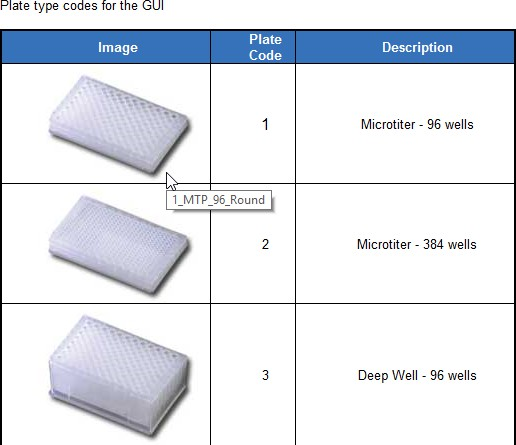
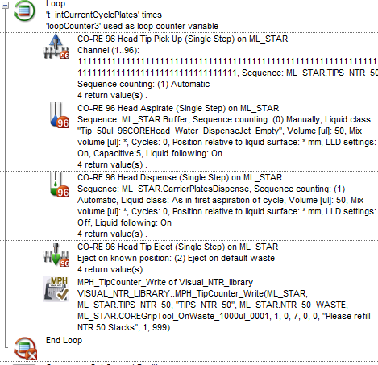
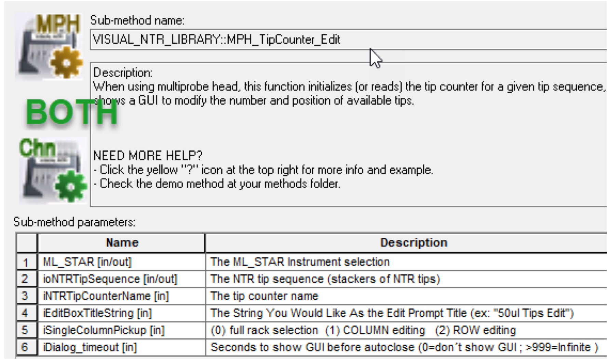
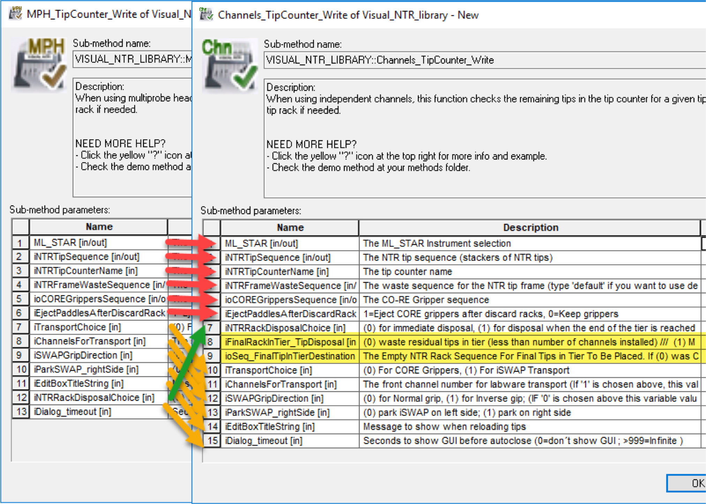
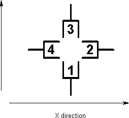

# Venus Advanced Module 7 Stacking and NTRs REV2020.01.27

## Transport Steps

### Sequence Definitions for Transport Steps

* Transport steps consume/count by **consecutive labwares** in a sequence.
* Efficient transport sequences only require **1 position per labware** and can span across multiple labwares (such as a stack of plates).
* When selecting **single positions** across a **carrier**, use the **single position selector.**

 (1) (1).png>) (1) (1).png>)

### **Stacks**

* Special labware objects – stacking parameters are part of labware definitions.
* Right click a labware to add or remove from a stack – the stack contains a sequence for each level. _Watch for Z-height warnings._
* When selecting **single positions** within a **stack**, use the **rubber band tool** - it will “drill” through a stack and pick all identical X-Y positions.

## VISUAL\_PLATESTACK\_LIBRARY

### Simplifying Sequence Orders - Edit Function Uses

1. Allow the **user** to **visually** determine what plates are should be used within the program
2. Can be used for display only
3. Typically used at program start or when user interaction is needed

 (1) (1).png>)

### Functions- Edit\_PlateStack

 (1).png>)

1. Incoming sequence of the **plate stack**.
   * **trp** style if transport only
   * **Full** sequences if **pipetting** to stack
2. The instrument
3.  Stack or Tier?

     

    1. Tiers
       * Fewer collision opportunities for MPH or iSwap
       * Fewer transports if pipetting to stack
       * Possible user error in stack counts
    2. Stacks
       * More space efficient if Source = Destination transports
4.  Controls Graphic in GUI – see help menu for options\

    <figure><figcaption></figcaption></figure>
5. The number of plates that will be visible in the GUI – tie via variable into some current counter, or if setting at the beginning the max #.
6.  The Edit command can either SHOW a stack (0) or let the user MODIFY the stacks available.

     (1).png>) 

    <figure><figcaption></figcaption></figure>
7. Last Stack Empty?
   * Stacks = GET only -> NO
   * **Stacks = GET and PUT**
     * **WHOLE** stacks -> NO
     * **Partial ->** YES
8. GUI text header
9. **GET** sequence **(trp) –** use for picking up plates – will have been edited vs. #1 to pickup from the top rear, and only as many plates as User indicated
10. **PUT** sequence **(trp)** – **always** puts closest stack at start of sequence

     (1).png>)
11. Outputs the NUMBER of plates the user selected – very useful for keeping track of processed items outside of sequence positions

    <figure><figcaption></figcaption></figure>
12. Timeout for the operator

### Other uses!

* With proper parameters can display locations of plates on a non-stacked carrier

### ShowOnly\_PlateOnStackers

* Redundant to EDIT step with parameter #6 (editble) set to OFF
* _2020-01-24 – will not show <=2 plates_

### SetMaxPlatesInSequence

* Redundant to EDIT step with parameter #5 and a timeout of 0sec
* _2020-01-24 – requires 2seq pos per plate (rubberband A1:B1)_

## Visual\_NTR\_library

### Labware Considerations

* NTR stacks DO NOT have **system managed sequences** – stack sequences must be manually created
* Tip stacks are created in the same manner as plate stacks
* Prevents tip sequence position from crossing Z-heights, and colliding with the tip frame
* An NTR labware must be placed at the waste for frame drop-off

<figure><figcaption></figcaption></figure>

### Library Use

* **EDIT** used to initially set tip sequence/rack positions (GUI)
* **WRITE** commands MUST be used prior to **every** tip pickup
  * Either immediately before the tip pickup
  * OR after the pickup/process steps before continuing on.
* **WRITE** steps, if needed, will call on a transport (CORE grip or iSwap) to move empty\*\* frames if needed. If the last rack is wasted, **triggers a re-load gui.**
* **SortSeq** can be used to find empty tip racks
* **Reset** may be used to reset a sequence back to the first position by tip counter reference
* **EDIT** used to initially set tip sequence/rack positions (GUI)
* **WRITE** commands MUST be used prior to **every** tip pickup
  * Either immediately before the tip pickup
  * OR after the pickup/process steps before continuing on with the program
* **WRITE** steps, if needed, will call on a transport (CORE grip or iSwap) to move empty\*\* frames if needed. If the last rack is wasted, **triggers a reload gui.**

_**Be deliberate with the Write command – rack wastes could interfere with critically timed events!**_ Consider moving an appropriate number of tips to an FTR if necessary.

### MPH vs Channel Edit steps

Both are the mostly the same!

1. The instrument (one choice)
2. The sequence created over the NTR stacks
3. Tip counter name often set to the Sequence name (without the MLSTAR. Prefix)
4. GUI interface name
5. **Channels:** Sort by Tier or Stack\
   **MPH:** Sort by Whole rack, Column\*\*, or Row\*\*
6. Timeout for GUI

_\*\* See Module 6 for offset MPH considerations_

CHANNELS

* “Empty” frames may not be empty! If < Channel # of tips remain, rack will be wasted
* Remaining tips on “empty” frames can be salvaged to an empty tip carrier (usually an FTR), thus extra parameters

### CORE Grip Transport

* Preferred for **stack** organization
* NTR’s must be within channel access
* Must provide channels and paddle sequence

### iSwap / IPG Transport

* Preferred for **tier** organization (wrist access can be problematic)
* NTR frames can be outside of channel access (Bump out MPH tip supplies)
* Must provide a grip direction and park position

_Inverse On_

_Inverse Off Default_

## NTR Labware

### Arm Access&#x20;

Channels

* Y (Channel) random access = Extra channels vs NTR placement
* X (Arm) random access = MPH presence / bump-out

MPH

* Lowest tier requires **1 track** space in X
* MPH style may prevent full **stack** access, forcing **tier**

