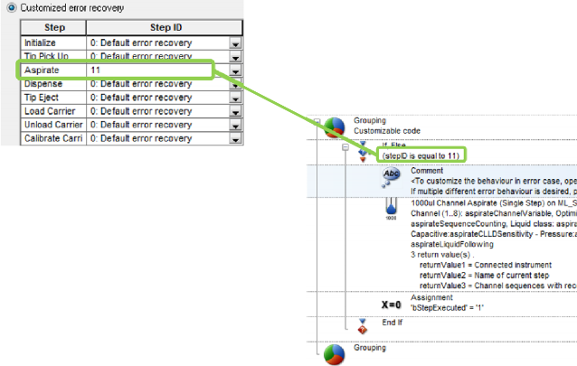

# Customized Error Handling

For various error situations, a defined walk-away error handling which uses predefined default settings can be set. Smart Steps, Easy Steps and Single Steps offer this possibility.

Three different levels of error handling are determined:

Fully manual:

This behavior is the standard error handling.

1. An error dialog will be prompted.
2. The user has to select or indicate a recovery action that will be executed.
3. After doing so, the recovery action dialog has to be closed by the user.

Semi-automated:

1. An error dialog will be prompted.
2. The user has to select or indicate a recovery action that will be executed.
3. The recovery action dialog will appear in a limited time. If the user does not specify an error recovery during the given timeframe, the dialog box closes automatically and will execute the default error handling.

Fully automated (walk away):

1. No error dialog opens on the screen.
2. The first defined recovery action will be executed immediately after an occurrence of an error.
3.  If the first recovery action is unsuccessful, the second defined recovery action will be executed.

    For every instrument-specific easy/single step of the method, an individual error recovery can be defined. The following configurations are possible:

    * Appearance of the error recovery dialogs (which buttons are available)
    * Default procedure
    * Which error is flagged in the trace file
    *   A timeout (the timeframe of the dialog when it will automatically close down) after which the default recovery action will be executed

        To Customize the Settings:

        Disable the “Use Default” and the “Timeout: Infinite” Checkboxes. Only then the other settings become editable. A br‌ief error description is given, followed by the available recovery options. Only one default procedure can be selected.
    *
      1.
         *   Among the choices are:

             \

             | Cancel  | Quits the current step and starts the user defined error handling if specified. If no user defined error handling is present, the method aborts. |
             | ------- | ------------------------------------------------------------------------------------------------------------------------------------------------ |
             | Abort   | Aborts the method                                                                                                                                |
             | Bottom  | Repeat the step at the bottom of the container                                                                                                   |
             | Exclude | Exclude all pipetting channels with this error and continue                                                                                      |
             | Repeat  | Repeat the command                                                                                                                               |
             | Air     | Aspirate air and continue                                                                                                                        |

             \

         * Use the “Visible” Flag to add the appropriate button to the error recovery dialog box.
         * The “Set error flag” will mark an erroneous container in the database.
         * It is also possible to enable walk-away handling of errors (semi- and fully-automated mode):
         * Disable the “Timeout: Infinite” Checkbox. Enter a timeout into the input field. The run time error dialog then pops-up, waits for the specified timeout and closes to continue with the default error recovery chosen for this error. If the timeout is set to 0, no dialog will open: the selected error recovery will be executed automatically.
         * If the user clicks on the error during the timeout, the walk-away will be stopped, and the user has to select a recovery and continue manually.
         *   For a list of all errors and their recovery options, refer to the online-help and the error settings dialog.

             Because of this, every instrument-specific Smart Step, Easy Step or Single Step has an \[Error Settings…] Button. Here is an example of the “1000μl Channel Aspirate” (Single Step):

             *

                 <figure><figcaption></figcaption></figure>
         * Like all the other types of errors found in the list, “Liquid Level Error” is activated with the default settings.

## Error Settings:

<figure><figcaption></figcaption></figure>

| 
The Column <em>Step</em> shows all the individual parts of a Smart Step (what is executed inside a Smart Step) 

The Column <em>Step ID</em> allows the the programmer to select: 

• <em>2 - Abort Method</em> 

• <em>1 - Abort / Cancel Step*</em> 

• <em>0 - Default error recovery</em> 

 

or to pass an ID for a customized behavior in case of an error. 
 |  |
| ----------------------------------------------------------------------------------------------------------------------------------------------------------------------------------------------------------------------------------------------------------------------------------------------------------------------------------------------------------------------------------------------------------- | -------------------------------------------------------------------------- |

\*if an ‘Error handling by the user’ shall be used

| 
Use the <em>Go To</em> column to customize the error handling:  To keep it simple for the programmer, the <em>Go To</em> leads towards the submethod library containing the customizeable error handling.  

Select the part of the step where you want to customize the error handling, and click on the <em>Go To</em> Tab. 
 |  |
| --------------------------------------------------------------------------------------------------------------------------------------------------------------------------------------------------------------------------------------------------------------------------------------------------------------------------------------------------- | -------------------------------------------------------------------------- |

Clicking on Go To, a Submethod Library is opened. This Submethod Library is the interface for the programmer to define customized error handling in Smart Steps.

For every section of the Smart Step, a group with the equivalent single step is shown. Each of these groups has an ID (Code).

<figure><figcaption></figcaption></figure>

This Single Step can now be modified to control the behavior in case of an error, in the same way as on a directly programmed Single Step.

\

<figure><figcaption></figcaption></figure>

 

<figure><figcaption></figcaption></figure>

\

## Import/Export behavior

To make sure the SmartStepCustomErrorHandling Submethod is exported, the flag ‘Export original Hamilton files’ must be checked:

During import, check the flag ‘Import original Hamilton files’.

\

<table data-header-hidden><thead><tr><th width="125"></th><th></th></tr></thead><tbody><tr><td></td><td>
ATTENTION

Please be aware that the imported Submethod Library will overwrite the existing one! If you have added customized code blocks in your existing library, please copy this code before importing and add it after the import.
</td></tr></tbody></table>

| 
-2: ABORT  -1: Abort/Cancel (jump to Error handling by the user) 

0: Default (use the default given in the acc. step) 

1-n: customized error handling code block (example here: 11) 

Any other positive integer number refers to a group in the SmartStepCustomErr orHandling.smt
 | 

 |
| ------------------------------------------------------------------------------------------------------------------------------------------------------------------------------------------------------------------------------------------------------------------------------------------------------------------------- | ----------------------------------------------------------------------- |

As seen, the Single Step in the Submethod Library acts as a ‘container’ for the error behavior. To customize it, just make the desired changes in the error handling of this step.

| <ul><li>In the Smart Step, click on Error settings</li></ul>          |  |
| --------------------------------------------------------------------- | -------------------------------------------------------------------------- |
| <ul><li>Activate the Customized error recovery radio button</li></ul> |  |
| <ul><li>In the line Aspirate, click on Go To</li></ul>                |  |

*   In the Submethod Library, double-click the Aspirate Step

    <figure><figcaption></figcaption></figure>
* In the Aspirate Step, click the Error Settings Tab:\
  .png>)
*

    |                                                                                                                                                                                                                                                                                                                                                                                                                             |                                                                            |
    | --------------------------------------------------------------------------------------------------------------------------------------------------------------------------------------------------------------------------------------------------------------------------------------------------------------------------------------------------------------------------------------------------------------------------- | -------------------------------------------------------------------------- |
    | 
The Error Handling Panel opens: 

• Select the <em>Clot Error</em> line 

• In Timeout, switch to <em>Custom</em> (0) 

• Set the <em>1st</em> recovery to <em>Repeat</em> 

• Set the <em>2nd</em> recovery to <em>Exclude</em> 

• Define the <em>Repetitions</em> for the First Recovery 

• Close this dialog with <em>OK</em> 

• Close the Single Step with <em>OK</em> 
 |  |

*   Keep the StepID in mind – this is the ‘link’ for the Smart Step\

    <figure><figcaption></figcaption></figure>
* Close the Submethod Library
*   Insert the StepID in the Smart Step Aspirate Error definition\
    \

    <figure><figcaption></figcaption></figure>
* Confirm with OK, then close the Smart Step with Finish\
  \

## Adding more Error Blocks with unique Step IDs

If additional error options are needed, simply copy a Customizable code group and change the stepID to a not yet used integer number.

<figure><figcaption></figcaption></figure>

If additional error options are needed, simply copy a Customizable code group and change the stepID to a not yet used integer number.

<figure><figcaption></figcaption></figure>

<figure><figcaption></figcaption></figure>

## ‌Example 1: Error Settings with Easy/ Single Steps‌

This example shows how to configure an Easy Step Aspirate to repeat the aspiration in case of a clot error. If the second aspiration fails as well, the erroneous pipetting channel will be excluded.\

<figure><figcaption></figcaption></figure>

 

<figure><figcaption></figcaption></figure>

\

As seen in the image above, the checkboxes “Use Default” and the “Timeout: Infinite” are not activated.

Subsequently, the first recoveries are activated. In this case, a REPEAT error is selected as the first error handling. It first tries one time to aspirate the sample probe. In case of a clot, the aspirated liquid is dispensed with half speed. Afterwards a second attempt at aspiration occurs. After a failed repeat attempts, this pipetting channel is excluded (second recovery = EXCLUDE).

Based on this principle, the desired error handling can be set for every listed error.

\

## Example 2: Error Handling by the User‌

If none of the pre-defined possibilities in the error setting matches the user’s needs, an individual error handling can be programmed through the step “Error Handling by the User”.

<figure><figcaption></figcaption></figure>

The steps to be observed are programmed in between “Begin Error Handling by the User” and “End Error Handling by the User”.

If any error occurs in such a step, the method proceeds to the steps between “Begin Error Handler” and “End Error Handler”. This is the user defined error handling.

As a result, every desired error handling can be programmed.

<table data-header-hidden><thead><tr><th width="98"></th><th></th></tr></thead><tbody><tr><td></td><td>
NOTE

The error settings of the specific error in the corresponding step have to be set to CANCEL to be able to use the “Error Handling by the User”.
</td></tr></tbody></table>

To make use of the “Error Handling by the User”, the settings listed below must be considered. The example on the previous page shows a “1000μl Channel Aspirate” Step where the clot handling is controlled through the “Error Handling by the User”:

1. Unmark the “Use default” Checkbox
2. Unmark the “Infinite” Checkbox
3. Set the \[Cancel] Radio Button
