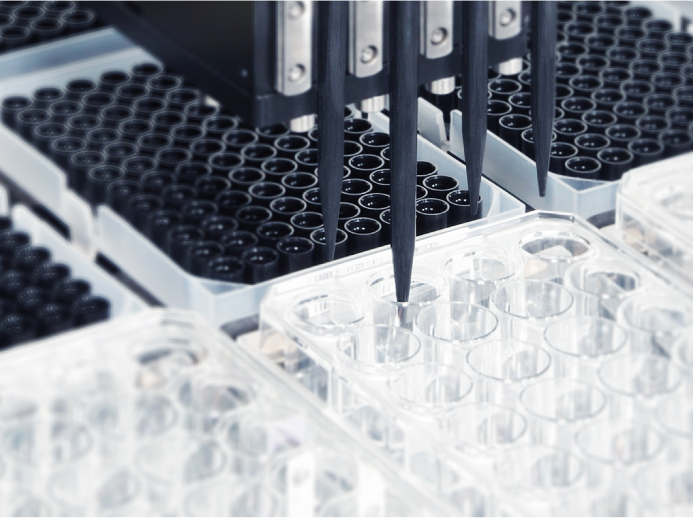

# Custom Dialogs

Custom Dialogs can become more than a fixed piece of information presented to the end user. They can be molded into GUIs that operate an entire method, utilities that act as a control station for various functions, or a variety of other applications.

<figure><figcaption></figcaption></figure>

 

<figure><figcaption></figcaption></figure>

 

<figure><figcaption></figcaption></figure>

Instead of having individual prompts for user input and user output, using the custom dialog step, flowing from left to right, Toolbox -> Workspace -> Properties -> Events, you can create a multi-purpose prompt in a single line.

The new dialog allows the user to scroll over the images and see labware required at each position. By customizing the properties of the dialog elements, and creating events based on various run time triggers, you can produce dynamic user prompts, which creates a user-friendly experience.

<figure><figcaption></figcaption></figure>

