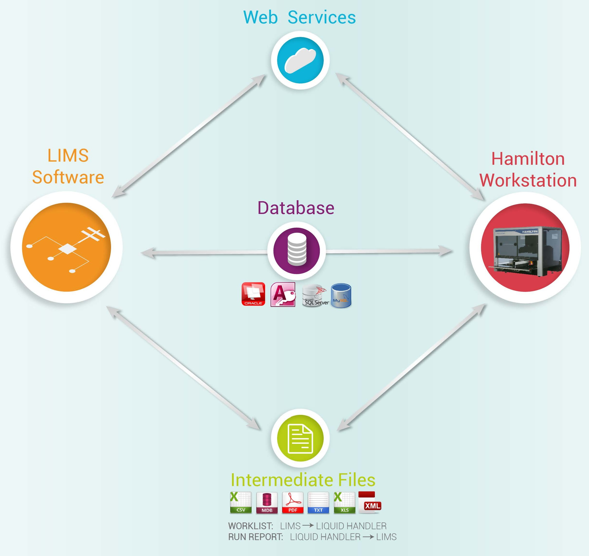

# LIMS Integration/Data Connections

<figure><figcaption></figcaption></figure>

The advances and cost reduction of biomolecular detection and analysis technologies in recent decades have led to an exponential growth of data generated. These developments increase the need for automation in sample processing and data management.

In order to maximize the automation capabilities of your laboratory, Hamilton provides various solutions in the software of our automated liquid handling workstations (VANTAGE Liquid Handling System™, STAR™, NIMBUS®) to generate detailed process reports or interface directly with an existing Laboratory Information Management Software (LIMS) through a network or database.

The type and amount of data generated or processed by the liquid handler will vary depending on each laboratory’s requirements. Hamilton´s software can generate and read data from many different file formats and databases, accommodating practically any existing LIMS on the market today.

\

## What is LIMS?

LIMS software (Laboratory Information Management System) is a tool that manages all the information generated or processed in a laboratory. Some benefits of using a LIMS are:

* Restricted access to data input or visualization
* Automatic validation of data input and output

<figure><figcaption></figcaption></figure>

\
The LIMS is a networking tool and can interact with instruments and operators located in the same building or even in different cities.&#x20;

## LIMS can send data to a Hamilton liquid handler&#x20;

<figure><figcaption></figcaption></figure>

LIMS software can provide the Hamilton software information needed to process the next batch of samples loaded onto the liquid handler by the operator.

<figure><figcaption></figcaption></figure>

Worklist information can contain multiple types of data such as:

* Assay lists
* Samples names or barcodes
* Volumes of samples and reagents
* Source and destination of samples and reagents
* Instructions for integrated 3rd party devices (e.g. reader program, incubation times, washer protocols, etc.)

Information is usually provided by the LIMS in one of three ways:



Worklist files are generated by the LIMS automatically or upon lab operators request. The files are stored in a folder accessible by the Hamilton software on the network or locally on the Hamilton liquid handler’s computer. Common worklist file formats used: XML, XLS, XLSX, CSV, TXT, TAB, ASC, ASCII, MDB, JSON

<figure><figcaption></figcaption></figure>

 

<figure><figcaption></figcaption></figure>

The created worklist file can be saved as a record of the parameters of a run for tracking and validation purposes.



When database access is granted by the LIMS to retrieve information, the Hamilton software can access information directly from the LIMS database without the need for an intermediate worklist file generation.

The flexibility of the functions incorporated in the Hamilton software ensures access to the most commonly used database systems such as:

<figure><figcaption></figcaption></figure>

 

<figure><figcaption></figcaption></figure>

 

<figure><figcaption></figcaption></figure>

 

<figure><figcaption></figcaption></figure>

Optionally, the Hamilton software can generate a worklist file from the information retrieved from the database as a record of the parameters of a run for tracking and validation purposes.



A web service is a communication protocol over a network that allows direct interaction between two computers. This is commonly used when connecting to any website, where a request is sent from a computer to a web server for viewing a particular web page.

The Hamilton software can request a worklist from the LIMS server by using different web service protocols such as HTTP or SOAP.

<figure><figcaption></figcaption></figure>




## Sample tracking

Once a sample enters the Hamilton liquid handler, the software follows each sample from the start to the end of the run. The Hamilton software automatically records every stage of the sample during the process to an internal SQL database file. Information captured in this tracking process includes:

* Volumes transferred of samples and reagents
* Samples location
* Samples and racks identification/barcode
* Action time and Lab Operator logged in
* Errors occurred (hardware, user intervention, barcode reading errors)

### Reporting sample and run information

The Hamilton software can report process information of specified samples on demand at any time during the run. This information can be transferred to the LIMS software in three different ways:



The Hamilton software can generate a file in a folder accessible by the LIMS in the network or locally on the Hamilton liquid handler’s computer. Typically, LIMS continuously watch a specified folder, automatically retrieving and processing any new report files created in the specified location. Similar to worklists, this report file can be generated in various formats such as: XML, XLS, XLSX, CSV, TXT, TAB, ASC, ASCII, MDB, JSON

<figure><figcaption></figcaption></figure>

The flexibility of the software on all Hamilton liquid handling workstations allows full customization of the reports generated in order to fit the LIMS requirements:

<figure><figcaption></figcaption></figure>

 

<figure><figcaption></figcaption></figure>

 

<figure><figcaption></figcaption></figure>

Output reports can also incorporate data from 3rd party devices (incubation time and temperatures, OD results from microplate readers, etc.):

<figure><figcaption></figcaption></figure>

Additionally, custom formatting and printable reports including plate layouts can be created for easy sample identification and result review by the lab operator:

<figure><figcaption></figcaption></figure>



When database access is granted by the LIMS, the Hamilton software can post the run information directly into the LIMS database without the need for an intermediate report file generation.

The flexibility of the functions incorporated in the Hamilton software ensures access to the most commonly used database systems:

<figure><figcaption></figcaption></figure>

 

<figure><figcaption></figcaption></figure>

 

<figure><figcaption></figcaption></figure>

 

<figure><figcaption></figcaption></figure>

Optionally, the Hamilton software can generate a report file from the sample tracking and run information as a record for tracking and validation purposes.



A web service is a communication protocol over a network that allows direct interaction between two computers. This is commonly used when connecting to any website, where a request is sent from a computer to a web server for viewing a particular web page.&#x20;

<figure><figcaption></figcaption></figure>

The Hamilton software can send a run report or process status to the LIMS server by using different web service protocols such as HTTP or SOAP.&#x20;




