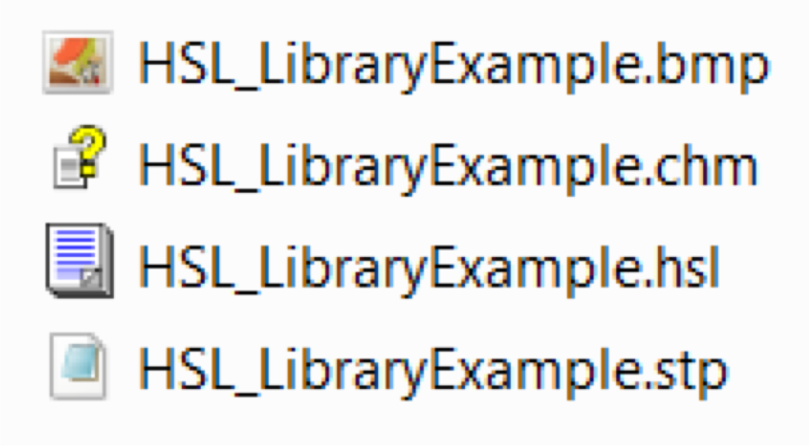
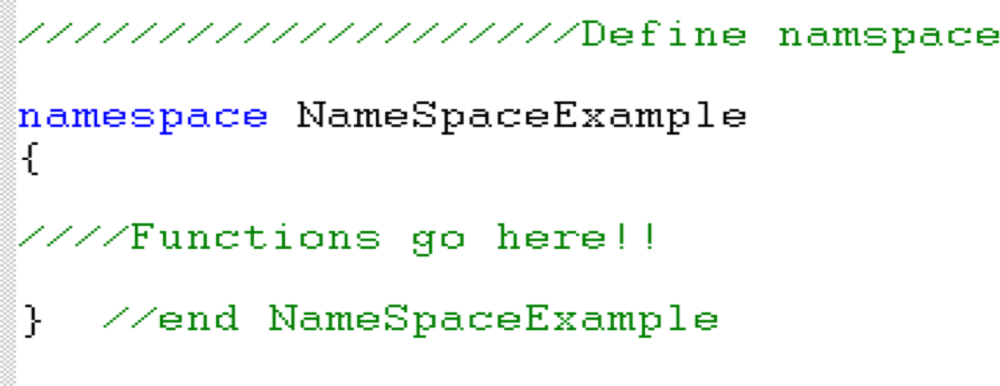
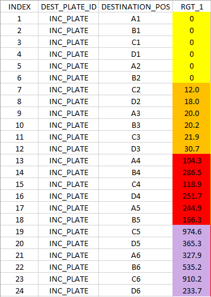
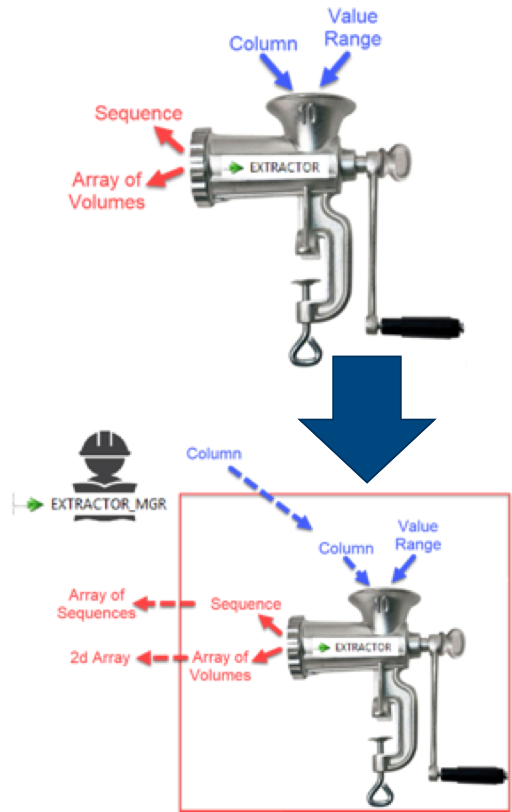
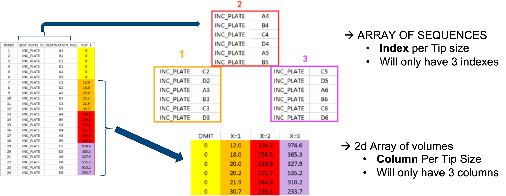
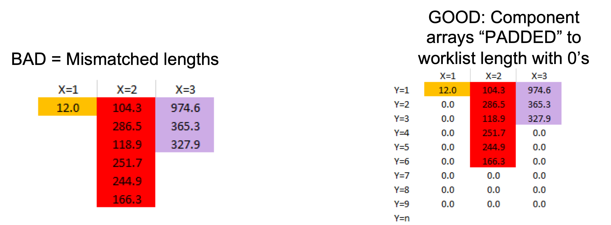

# Venus Advanced Module 2 File Handle SQL rev2021.12.28

### File Handling Best Practices

### Respect the Raw data

* UI input for W/L location
* DIRECTORY library of HSL Extensions
  * **Copy** – Take a source file and create a target file, options to overwrite, and can _rename_ at the same time (great for simplifications)
  * **Rename** files – great for extension changes
  * **Create -** folders for fixed locations, or variable per run
  * **Delete** files or directories when done
  * Coupled with File Handling, powerful tools for collecting information _from an entire directory_

### What is SQL?

### Structured Query Language

* Allows the access and manipulation of databases (and tables)
* Defined in American National Standards Institute (ANSI) and International Organization for Standardization (ISO) in the ‘80’s
* “**Standardized**”, however rules, syntax, and available commands may

**change** from platform to platform

### SQL Concept: Visibility & Views

* **SQL** generally **doesn’t change the source data**
* Data exists as a temporary “view” – data excluded by the view is **not**

visible within Venus

* Files can be **repeatedly** opened and closed using **new** SQL functions

_Using SQL Statements can reduce or eliminate the need for complex logical structures during File Read loops!_

©2019 Hamilton Company 2

### Working With SQL

\- SQL Syntax

### Command String Syntax Rules

**Reserved Namespaces**

All SQL functions/commands reserve a **namespace** – if you use the namespace in the command string, you invoke it’s **function**

**Field/Column** and **Table** Naming rules:

* Cannot Contain **spaces**, **brackets**, or **non-alphanumeric symbols**
* Must be unique from existing **reserved namespaces**
* If the Column or table name **cannot be corrected** to follow these rules, then **BRACKETS**

will allow the entry:

**\[Worklist$]** is acceptable – the $ cannot be removed, as it’s needed to Read from the file

* Most functions will use column names in **(Parenthesis)**

_Try avoid using brackets unnecessarily – it can obfuscate already difficult to read command strings._

©2019 Hamilton Company 3

### Command String

* SQL **Statements** are built from
  * **Clauses**
  * **Expressions**
  * **Predicates**
* The overall statement is called a **command string**
* The SQL **command string** is referenced at the **File: Open** command

*
  * Command strings reference data by:

**Table:** XLS - **Sheetname** or **named** Example: **\[Worklist$]**

CSV – **File Name** Example: **\[Worklist.csv]** or **\[Worklist#csv] Field**: Columns of data

**Record:** Row of data

### Building the Command String – General Functions

* **UPDATE:** use to exchange existing data
* **INSERT INTO:** Add a data record
* **SELECT:** designates that the table will be opened to “read” or **view** data
* **FROM:** Directs a function to a table

| **Statement**                               | **Function**                                                                                                                                                                                                        |
| ------------------------------------------- | ------------------------------------------------------------------------------------------------------------------------------------------------------------------------------------------------------------------- |
| “SELECT \* FROM \[TABLE]”                   | 
Creates a view of <strong>all</strong> (*) data from Table

<em>This can be problematic with large data files, or when dealing with a network based LIMS that’s being appended to by other systems</em>
 |
| “SELECT (CLMN\_1) FROM \[TABLE]”            | 
This creates a view of the Table, but <strong>only</strong>

records in CLMN_1 are visible
                                                                                                              |
| “SELECT (CLMN\_1), (CLMN\_2) FROM \[TABLE]” | 
This makes <strong>two</strong> columns visible. Any additional fields needed can be added with more commas.

©2019 Hamilton Company 4
                                                                  |

### ALIAS – the “AS” function

* Can be used to **simplify** a complex column name for easier reference
* Used in **aggregate functions** to provide a “space” to return the result – the file can be **read a single time** to observe the response!

### Aggregate Functions

**Aggregate** functions work across an entire field:

* **COUNT**(): Count the rows in the selected data of a table
* **MIN**(): Return the minimum value in the selected field
* **MAX**(): Return the maximum number in the selected field
* **SUM**(): Return the sum of all values in the selected field
* **AVG**(): Return the average of values in the selected data
* **STDEV**(): Return the standard deviation of values in selected data

### Example Aggregate Functions

“SELECT COUNT (COLUMN\_1) AS COLUMN\_1 FROM \[TABLE$]”

* **COUNT:** determines the number of Records (rows) in a field (must be in parenthesis)
* **AS:** The final count will be reported explicitly in the field Column\_1 (not in parenthesis)
* **FROM**: provides the source data – here an XLS tab name, unsupported character is present ($) so it must be named in brackets
* **SELECT:** creates the view of the resultant data
* **SQL** executes prior to Venus “seeing” the final view!
* Aggregate functions using the **AS** (alias) command will **replace** the data for that column in a temporary “view”
* A **single read command** is needed

### File Open: Aggregate Functions

* Column for query/alias **must** be opened
* Column Specification helper typically **not** needed – column name is known already, and R/W variable can be named for easy access!

### Conditional Selections

* The **WHERE** function can be used to add a **modifier** to an SQL function – instead of displaying all data, **conditions** can be used to **filter** data!
* **Mathematical Operators**

\= < > <= >= != or <> (not equal)

* **Logical Tests**

**AND OR BETWEEN IS NULL IS NOT NULL**

_Null means a record has NO entry for the field – zero is not null!_

* **LIKE** – used when the selection criteria is **loose**: % = Wildcard!
* **DISTINCT** - Use to find **unique** values in a field
* **Comparison Objects** should be identified within ‘**apostrophes’**

### Conditional Selections - EXAMPLES

“SELECT COUNT (NAME)

AS NAME FROM \[TABLE$]

WHERE NAME = ‘ABC’ “

“SELECT DISTINCT (NAME) AS NAME

FROM \[TABLE$]”

“SELECT (NAME), (VALUE)

FROM \[TABLE$]

WHERE ((VALUE) >10 AND (VALUE)<=30)”

### Building Repetitive and/or Variable Strings

*
  * Introducing **variables** into command strings allows for **responsive** data manipulation
  * Example: **VALUE** appears in three different places in this command string:

“SELECT (NAME), (**VALUE**) FROM \[TABLE$] WHERE ((**VALUE**) >10 AND (**VALUE**)<=30)”

Could alternatively be written as:

“SELECT (NAME), (“

**VALUE**

**“**) FROM \[TABLE$] WHERE ((“

**VALUE**

**“**) >10 AND (“ **VALUE**) “<=30)”

### Gotta’ keep it Concatenated

* **Concatenate Functions** (Apps or String library) can join multiple strings together!
* Unused fragments should be set to “”
* **Consecutive Concatenates** are possible, use the Return from prior concatenate as Var1, and continue adding on strings
* Where a **Column Name** is a variable, the **File:Open** command can reference the same variable!

### SQL Use and format Notes and WARNINGS

* **Mixed Values** (Integers/Strings/Floats) can cause issues for functions like **DISTINCT** – Numeric values can be **invisible** in results
* **Extra whitespaces** (spaces) are not a problem! RunningFunctionsTogether is (see why?)
* **CaPiTaLiZaTiOn** of usage is **not** respected
* Be sure to **Trace** your command string before opening the file – if it fails, you’ll be able to check the syntax in the logfile!
* **Ordinal** errors in the **Read** command mean that a **column can’t be found.** Double check the File:Open against the command string to make sure they align.
* When using **.CSV** files, use the HSLExtensions **GetFileName** or HSLDirectory **Copy** to create an accessible file name suitable for building the command string

### Modular Programming

### Flexible Sub Methods

*
  * Maximize the **range** of the given inputs
    * Handle ‘0’ sized sequences / arrays
    * Sequence counting tends to be LOCAL scope
  * Limit the number of inputs and outputs to only those things that change
    * “Nested” or “Managed” Sub Methods can change the scope or level of inputs, and further define what level of parameters are needed
  * Same considerations as brought up in Module 0 – Submethods
  * From **Venus Basic** you should be able to create a pipetting submethod that will process an **array of volumes** and a **sequence**

©2019 Hamilton Company 7

### File Breakdown

### Visualize

**LOOK AT YOUR WORKLIST**

* If your current process doesn’t have one, mock one up!

### Options for Breaking down

**OPTION 1: PULL**à **PROCESS**à **REPEAT**

**PULL:**

*
  * Worklist is opened with a **current command string**
  * Worklist is read to create **data products** (Arrays, sequences)

**PROCESS:**

*
  * **Data Products** are sent through Pipetting steps (subroutine)

**REPEAT**

*
  * **PULL** new data
  * **Process** new data

**OPTION 2: \[PULL**à **STORE**à **REPEAT]**à**PROCESS STORED DATA**

* _Will discuss after the challenge_

### Modular Programming

### Subbing Subs

*
  * **Functional** subs carry out a process for a given task (probably what you are familiar with!)
  * **Manager** subs tie a functional sub into a higher level of tasks that need to be completed
  * Real World example:
    * A road crew **(functional)–** Put them in front of a hole and they will fill it (technical expertise)
    * Their dispatcher **(manager**, with logistical experience)
      * 1\) Knows how many holes need to be filled for the day
      * 2\) Where the holes are
      * 3\) Where to source asphalt
  * Venus example:
    * **Pipetting Sub** – Transfers from a Trough to a destination sequence using array of volumes
    * **Manager Sub** – Feeds a pipetting sub from an array of sequence destinations _and_ 1d data out of a 2d array of volumes

### Submethod Team Work

*
  * The **manager** and **functional** subs, as a concept, are like a food mill – load up the hopper, and it grinds out product!
  * Example below:
    * **Functional** Sub takes a given Worklist Column, and for a given volume range outputs the volumes that fit in the range, and their respective sequence locations
    * **Manager** Sub _knows_ that the volume ranges should bracket the available tips, so we only need to tell it a column
      * The manager will order the **functional** sub to process the column per range
      * It collects the **functional** subs outputs into a higher level of organization (array of seq. and 2d Array of volumes)

### File Breakdown

### Programming tools

* SQL functions can limit/filter what’s viewable – here the column is broken down by volume range
* **Column names** can be set to variables, limiting the number of RW variables to deal with
* Each COLUMN in worklist has an associated Array of sequences and 2d volume array

* 2d arrays à Write to column needs same size
* Component volumes could be absent completely!
* Fill with a loop that brings to the MAX (W/L length) size
* 0uL volumes will not be aspirated or pipetted when using multiple channel volumes when Pipetting Loop tracks all sequences

### Processing File Products

### Functional and Managing Pipetting Submethods

* Volumes and Sequences now formatted for pipetting from WL handling

#### Functional Sub

*
  * Source (Reagent Trough)
  * Destination (Controlling)
  * Array of Volumes (matches Dest)
  * Tip size (will chose LC and pick tips)
  * Output is liquid transfer

#### Managing Sub

*
  * Unpacks via loop:
    * An array of sequences (destination)
    * and 2d Array
    * LoopCounter = index = Tip scale
  * Source sequence that matches WL demand

### Increased WL Info Density

Parameter Limitations

### Work List Information Density

* Major limitation of resulting method?
  * Pipetting parameters assume all columns are the same (Jet empty, Water)
* Worklists can have multiple Header lines to contain parameter info (strings)
  * Read from source file “n” number of times
  * Capture the strings per ROW (R/W variables) into an array (index becomes column info)
  * NO SQL:
    * Start LOOP when extra headers are done
    * Watch VAR types – may need to open as strings
  * With SQL
    * Extra Header lines are OMITTED when they don’t match criteria!

