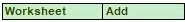

# 11. Scheduling

The Scheduler arranges the methods to be executed on a number of resources and submitted to capacity, time and precedence relations in a way that fulfils the optimality criteria. The methods and its activation criterions are defined in a workflow.

The Schedule process is divided into two phases: scheduling and executing.

<table data-header-hidden><thead><tr><th width="145"></th><th></th></tr></thead><tbody><tr><td>

</td><td>
<strong>NOTE</strong>

The workflows as well as the methods are executed twice. Once for scheduling and once for executing.
</td></tr></tbody></table>

## Schedule Block

Activates the Scheduler at runtime and schedules the statements in this block in the current context.

<table data-header-hidden><thead><tr><th width="145"></th><th></th></tr></thead><tbody><tr><td>

</td><td>
<strong>NOTE</strong>

This is especially useful to activate the <a href="chm://fabaedde895cdd577ddae131a80b2a07/General/Scheduler.htm">Scheduler</a> in an automated environment at runtime at any time to reschedule newly requested workflows.
</td></tr></tbody></table>

## Activate Task

Schedules a previously selected method to become active at a certain time with certain precedence relations.

### Notes:

A method can be selected with the [Select Method step](chm://fabaedde895cdd577ddae131a80b2a07/StepSelectMethod/StepSelectMethod.htm).

### **Method id / task id:**

Defines either the id of a registered method to be activated, or the id of an already activated method (task). The second case is especially useful to introduce an additional precedence relation between two already activated methods (tasks).

It can be a selection out of the given list.

### **Filter method/task handles:**

If this checkbox is checked, the given list for the parameter Method id/task id contains only existing method and task handles. Otherwise, all variables are shown in this list.

&#x20;

### **Task view name:**

Defines the view name of the task to be activated. This name appears in views.

It can be a variable, a string constant or an element out of an array.

&#x20;

### **Bind task id to:**

A unique identifier of the activated method (task) will be returned via this parameter.

It can be a variable or an element out of an array.

&#x20;

### **Filter task handles:**

If this checkbox is checked, the given list for the parameter Bind task id to contains only existing task handles. Otherwise, all variables are shown in this list.

### **Inherit cancel from predecessor tasks:**

Indicates whether the new task inherits the cancel from the predecessor task. If the value of this parameter is not equal to zero, the new task will be cancelled as well, if the predecessor task is cancelled.

It can be a variable, an element out of an array or a selection out of the given list.

### **Activation criterions:**

This table allows to define an arbitrary number of precedence relations for the new task.

### **Relation:**

Three different types of criterions can be defined:

1. Delayed to \<Other Task>

The new task will be activated at the earliest Period seconds after the Other Task has been activated. This relation can also be defined to the start time of scheduling by choosing the \<After startup> option for Other Task.

2. Before \<Other Task>

The Other Task will be activated at the earliest Period seconds after the new task has been finished. &#x20;

3. After \<Other Task>

The new task will be activated at the earliest Period seconds after the Other Task has been finished.

&#x20;

#### **Id of \<Other Task>:**

The id of an already activated method (task), to which the relation has to be made. For the Delay relation can also the option \<After startup> be chosen..

It can be a variable or a selection out of the given list.

#### **Period \[s]:**

Earliest start time of the given method to be activated relative to another already activated method (task) \[s].

It can be an integer, a variable or an element out of an array.

&#x20;

#### **Filter task handles:**

If this checkbox is checked, the given lists in the grid for the parameter Id of \<Other Task> contain only existing task handles. Otherwise, all variables are shown in this list.

&#x20;

## **Activate at:**

Allows to define the earliest start of the method by specifying an absolute activation time.

### **Year, Month, Day:**

Defines the absolute earliest start date of the method to be activated. The date can be selected by using the Date Picker.

Each field can be an integer, a variable or an element out of an array.

### **Hour, Month, Second:**

Defines the absolute earliest start time of the method to be activated. The time can be selected by using the Time Picker.

Each field can be an integer, a variable or an element out of an array.

&#x20;

&#x20;

## Step errors:

If the step fails a runtime error occurs. Using of the general step 'Error Handling by the User' allows you to handle such runtime errors and continue method execution.
