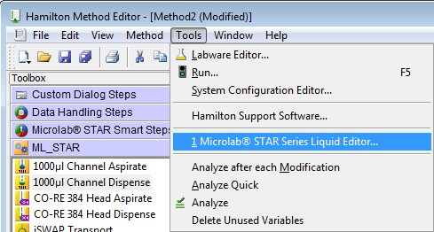

# CO-RE Liquid Editor‌

The Hamilton Co-RE Liquid Editor is a powerful tool designed for managing liquid handling processes in lab automation systems. The primary function of the editor is to define and manage **liquid classes**, which are sets of parameters that dictate how a pipette aspirates and dispenses liquids. These parameters ensure accurate and consistent pipetting, regardless of the type of liquid being handled.

<table data-header-hidden><thead><tr><th width="119"></th><th></th></tr></thead><tbody><tr><td></td><td>Access the CO-RE Liquid Editor‌ by double clicking the “Hamilton CO-RE Liquid Editor‌” Icon displayed on the desktop of the PC or select the “Start -> Programs -> HAMILTON -> MICROLAB STAR -> Hamilton CO-RE Liquid Editor‌”.</td></tr></tbody></table>

<figure><figcaption></figcaption></figure>

 

<figure><figcaption></figcaption></figure>

**Definition of Liquid Classes**

A **liquid class** is essentially a profile that configures a pipette for a specific liquid, tip type, and dispense mode. It determines how the pipette handles aspiration and dispensing for that particular liquid. The accuracy and precision of liquid handling depend on the proper selection and configuration of the liquid class for each pipetting task.

**Predefined vs. Custom Liquid Classes**

Hamilton's VENUS software comes with several **predefined liquid classes** for commonly used liquids like water, DMSO, glycerin, acetonitrile, ethanol, plasma, and serum. These predefined classes cover most standard applications, ensuring that users can perform liquid handling tasks without the need for extensive customization.

However, for specialized applications, users can create **custom liquid classes**. Custom classes allow the configuration of specific parameters to meet unique needs, ensuring flexibility and adaptability in liquid handling.

**Editing and Creating Liquid Classes**

To work with liquid classes, users can access the **Liquid Editor** from the VENUS software or the desktop shortcut. Upon opening the editor, a list of available liquid classes is displayed. Users can select an existing class or create a new one to match their requirements.

The **Liquid Editor** provides access to detailed parameters such as flow rate, air transport volume, blowout volume, swap speed, settling time, over-aspirate volume, clot retract height, stop flow rate, and more. Each of these parameters plays a crucial role in ensuring accurate liquid handling.

For example:

* **Flow Rate**: Controls how fast the liquid is aspirated or dispensed.
* **Air Transport Volume**: Adds a small volume of air at the end of aspiration to help move the liquid efficiently.
* **Blowout Volume**: Ensures all liquid is dispensed, especially when using the "Empty Tip" dispense mode.
* **Settling Time**: Allows the liquid to settle in the tip before it is dispensed.

These parameters can be adjusted to handle different liquid properties, such as viscosity or surface tension, ensuring the pipetting process is optimized for each unique application.

**Correction Curves and Calibration**

One of the advanced features of the Liquid Editor is the use of **correction curves**. Correction curves allow for adjustments to the volume being pipetted to account for factors like the air column above the liquid. This ensures that the correct volume is dispensed, regardless of liquid characteristics, resulting in highly accurate pipetting.

**Importing and Exporting Liquid Classes**

Liquid classes are stored in a database file and can be imported or exported as needed. This allows users to share configurations across different instruments or labs, ensuring consistency in liquid handling processes. Users can easily import custom liquid classes from other projects or export their configurations for use in other applications.

**Conclusion**

The Hamilton Co-RE Liquid Editor is an essential tool for laboratories using automated liquid handling systems. It allows users to fine-tune pipetting parameters for a wide range of liquids, ensuring high accuracy and consistency in every operation. Whether using predefined liquid classes or creating custom ones, the Liquid Editor offers the flexibility to handle any liquid handling task with precision.
