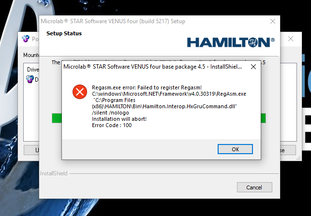
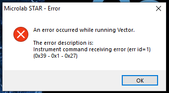

# Issues with Reinstallation

Make sure that the configuration of the instrument is done after installing, such as the location of the default waste, and the connection of the instrument succeeds on the system configuration editor.

When an incomplete uninstall and/or if .NET 3.5 is not fully installed you get this error:\

to resolve install .NET 3.5 and make sure this is installed as this is installed via the windows update menu seperately than the turn windows features on/off

***

When you have the device installed and venus installed you get this error (0x39 - 0x1 - 0x27)\

the resolution to this was that the instrument was on simulation mode, once this was turned off the communication came back
