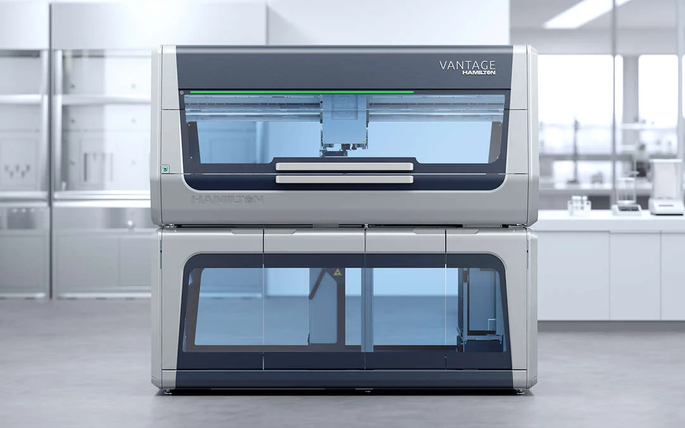

# Major Players in Liquid Handling Automation

Several major players dominate the liquid handling automation space, providing cutting-edge solutions for various workflows:

## **Integra Biosciences**

<figure><figcaption></figcaption></figure>

Integra is known for its user-friendly liquid handling systems, such as the Assist Plus and MINI 96. These devices allow labs to transition from manual to semi-automated systems, providing flexibility without compromising on performance.

## **Tecan**

<figure><figcaption></figcaption></figure>

Tecan offers a range of automated liquid handling systems, including the Fluent and Evo series. These systems are designed for high-throughput laboratories, providing advanced automation capabilities for complex workflows such as HTS or genomics research.

## **Hamilton Robotics**

<figure><figcaption></figcaption></figure>

Hamilton Robotics offers a wide range of customizable systems, such as the Microlab STAR and Vantage systems. These devices are ideal for laboratories that require precise, high-throughput liquid handling and advanced integration with other lab systems.

## **Opentrons**

<figure><figcaption></figcaption></figure>

Opentrons specializes in affordable, open-source robotic liquid handling systems. Their OT-2 system is a popular choice for small- and medium-sized labs looking to automate workflows like qPCR, ELISA, and sample prep for sequencing.

## **Agilent Technologies**

<figure><figcaption></figcaption></figure>

Agilent's Bravo liquid handling system offers multi-axis flexibility and is known for its versatility in applications such as drug discovery, genomics, and proteomics.
